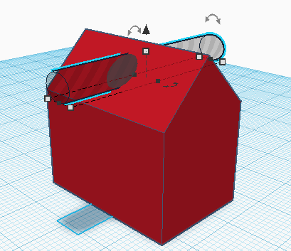

# Les 2: Groeperen
In de vorige les heb je een huisje gebouwd, maar deze bestond nog uit een los huis en dak.
In deze les leer je hoe je vormen samen kan voegen (*"groeperen"*) en ook hoe je gaten in vormen maakt.

Groeperen heb je nodig om ingewikkeldere vormen te maken dan de standaard vormen van TinkerCad. Als je twee vormen groepeerd worden ze één vorm. Plekken waar ze overlappen of elkaar raken komen dus aan elkaar vast te zitten.

Als voorbeeld nemen we het huisje van vorige keer. Sleep met de muis over zowel de *Box* als het *Roof* om beide te selecteren. (Je kan ook shift ingedrukt houden en beide vormen aan klikken)

Klik nu op de groepeer knop, dat is dit symbool:

Je ziet dat het huisje nu één vorm is, controleer of je nog een scheiding ziet tussen het dak en de rest van het huis.
Het kan namelijk zijn dat je dak net iets boven de rest van het huis zat, in plaats van er tegenaan. Als dat zo is, selecteer dan het huis en klik op de ongroepeer knop (deze zit naast de groepeer knop).
Nu kan je het dak naar beneden verplaatsen en de vormen opnieuw groeperen.

Stel dat we ons huisje zo mooi vinden dat we er een sleutelhanger van willen maken. Dan hebben we een gat nodig!
Om een rond gat te maken hebben we een *Cylinder* nodig, sleep er een op je werkveld.
Klik nu rechtsboven op het grijze rondje met *Hole* eronder.
De *Cylinder* wordt nu grijs en is een "gat". Dit betekend dat als je hem groepeerd met een andere vorm, hij het overlappende gedeelte weg haalt.

Maak de *Cylinder* nu de juiste vorm voor het sleutelhanger gat en zet hem op de juiste positie.

Als je het gat en huisje nu groepeerd, heb je een sleutelhanger!

**Opdracht:** Maak een mok.

*Tip:* Probeer eerst te bedenken uit wat voor vormen een mok eigenlijk bestaat (en wat voor gaten)!
