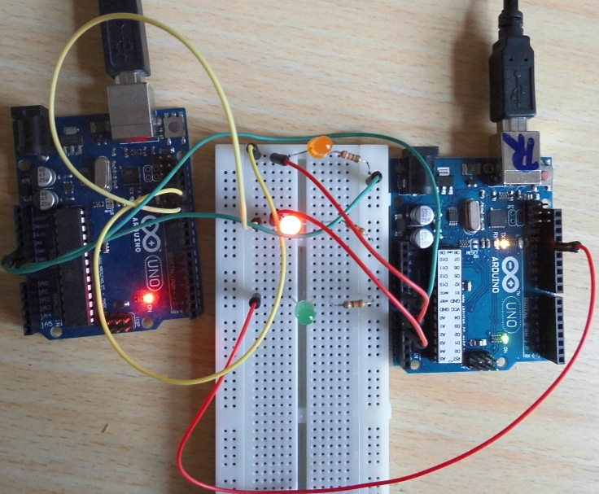
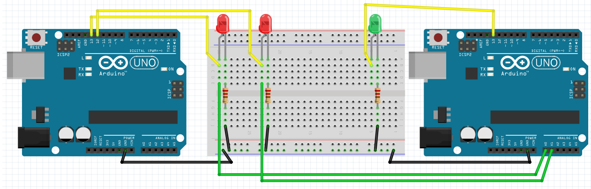
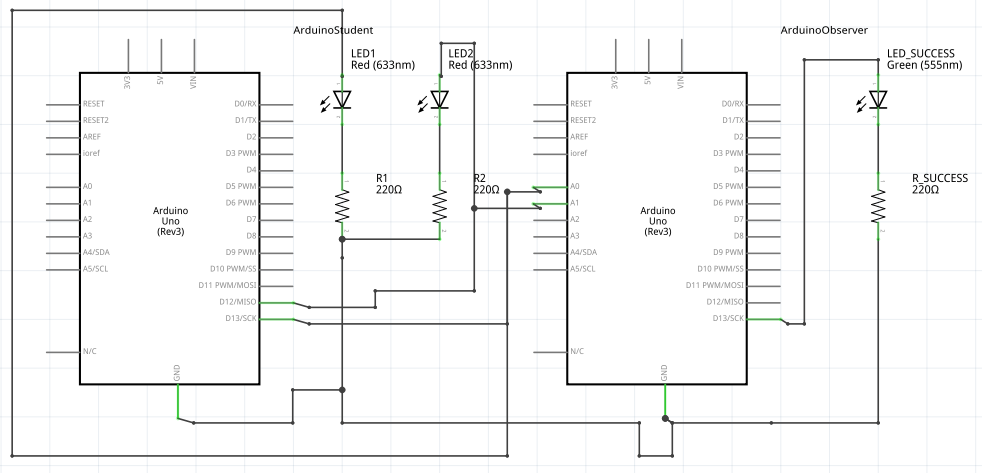
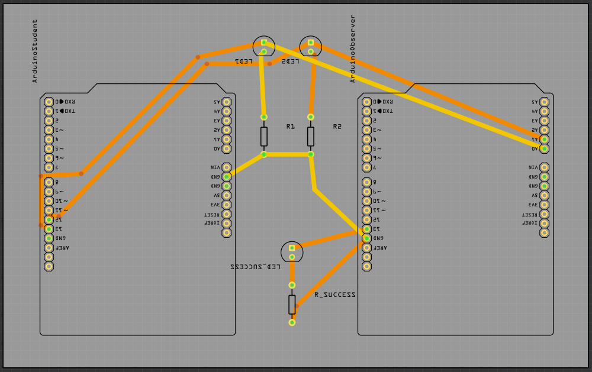

# Oefening 1

## Doel

De LEDjes om de seconde omstebeurt laten branden.

Als dit gelukt is, gaat het groene lampje vanzelf branden.

## Pinnnummers

 * Het linker rode LEDje zit op pin 13
 * Het rechter rode LEDje zit op pin 12

Het groene LEDje kun je niet aansturen.

## Extra informatie voor de begeleiders

Etsen:

 * [Trial1_etch_copper_bottom_mirror.pdf](Trial1_etch_copper_bottom_mirror.pdf)
 * [Trial1_etch_copper_bottom.pdf](Trial1_etch_copper_bottom.pdf)
 * [Trial1_etch_copper_top_mirror.pdf](Trial1_etch_copper_top_mirror.pdf)
 * [Trial1_etch_copper_top.pdf](Trial1_etch_copper_top.pdf)
 * [Trial1_etch_mask_bottom_mirror.pdf](Trial1_etch_mask_bottom_mirror.pdf)
 * [Trial1_etch_mask_bottom.pdf](Trial1_etch_mask_bottom.pdf)
 * [Trial1_etch_mask_top_mirror.pdf](Trial1_etch_mask_top_mirror.pdf)
 * [Trial1_etch_mask_top.pdf](Trial1_etch_mask_top.pdf)
 * [Trial1_etch_paste_mask_bottom_mirror.pdf](Trial1_etch_paste_mask_bottom_mirror.pdf)
 * [Trial1_etch_paste_mask_bottom.pdf](Trial1_etch_paste_mask_bottom.pdf)
 * [Trial1_etch_paste_mask_top_mirror.pdf](Trial1_etch_paste_mask_top_mirror.pdf)
 * [Trial1_etch_paste_mask_top.pdf](Trial1_etch_paste_mask_top.pdf)
 * [Trial1_etch_silk_bottom_mirror.pdf](Trial1_etch_silk_bottom_mirror.pdf)
 * [Trial1_etch_silk_bottom.pdf](Trial1_etch_silk_bottom.pdf)
 * [Trial1_etch_silk_top_mirror.pdf](Trial1_etch_silk_top_mirror.pdf)
 * [Trial1_etch_silk_top.pdf](Trial1_etch_silk_top.pdf)
