# 8 augustus 2014

In het begin zaten we nog boven:

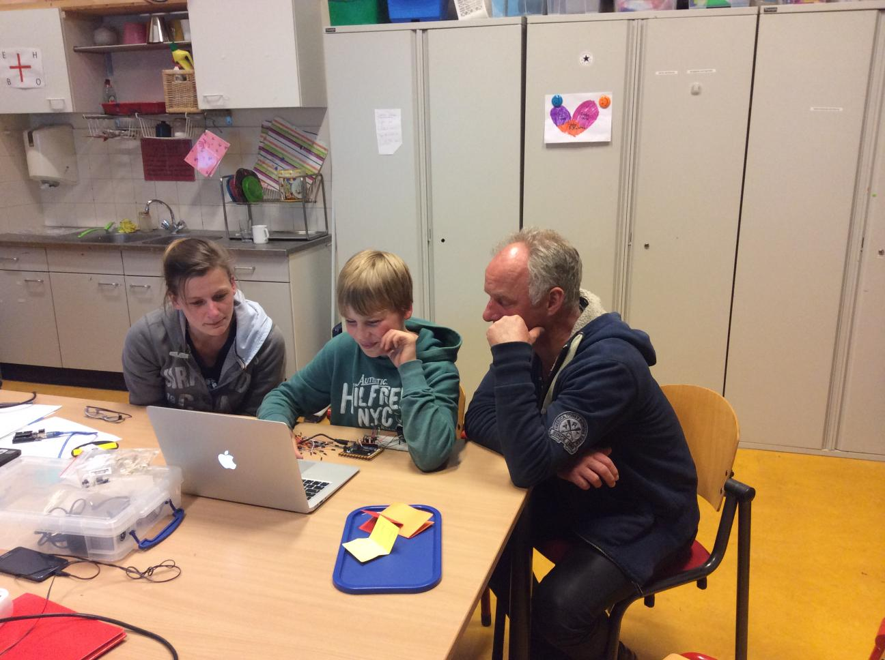

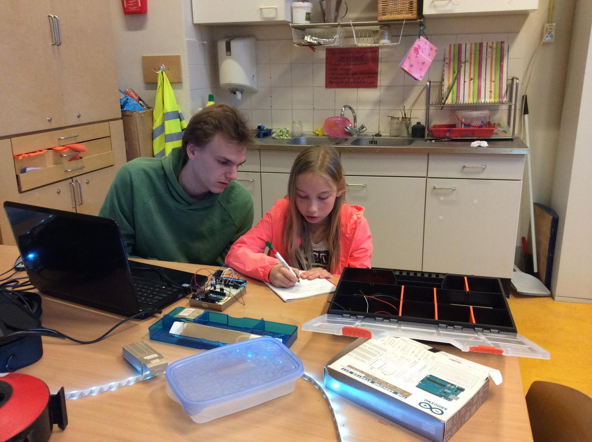

Elke leerling kreeg in het begin een logboek:

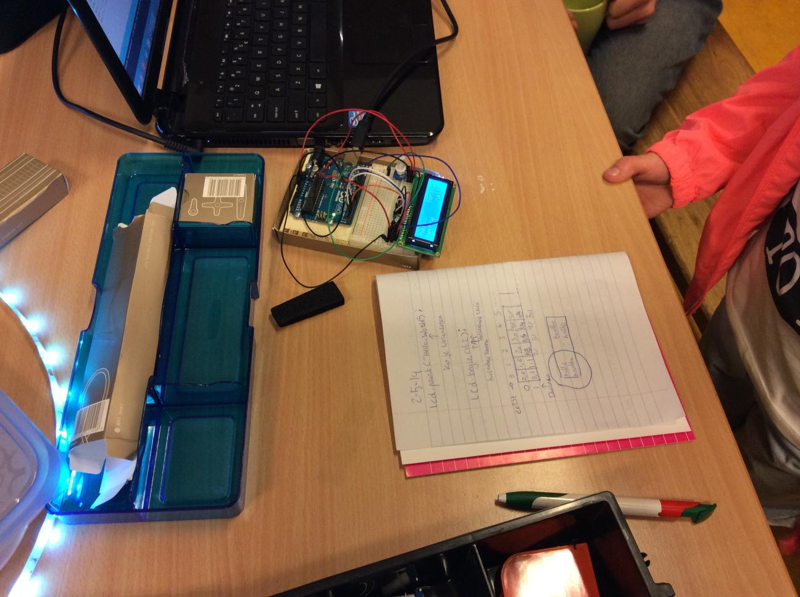

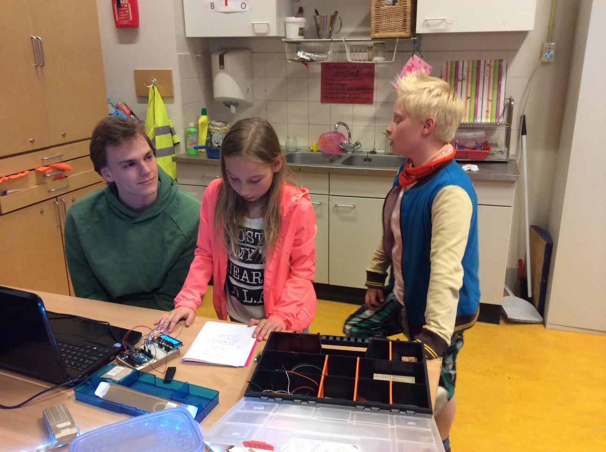

Een namaak of prototype van ArduinoInvaders en een PCB van de MysteryMachine: 

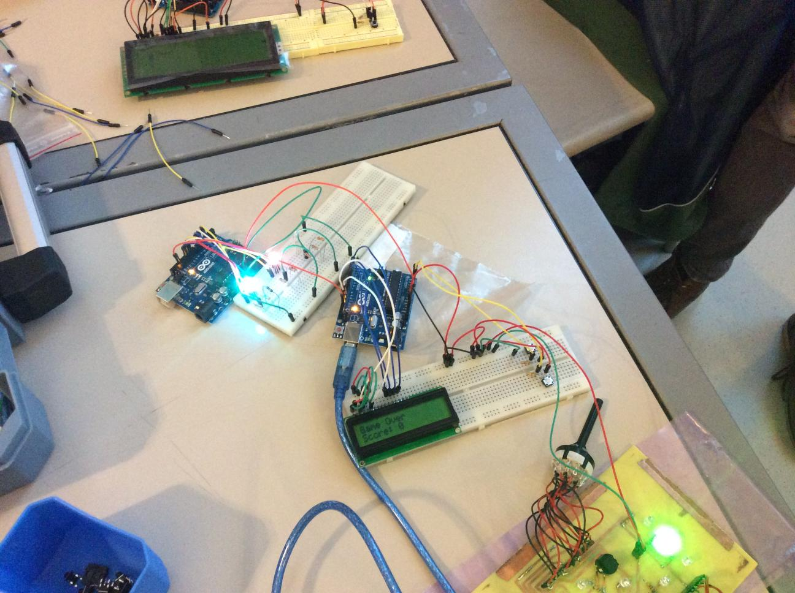

ArduinoInvaders met vier kolommen: 

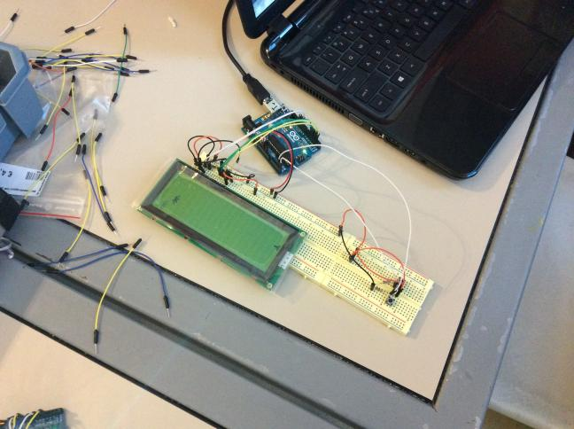

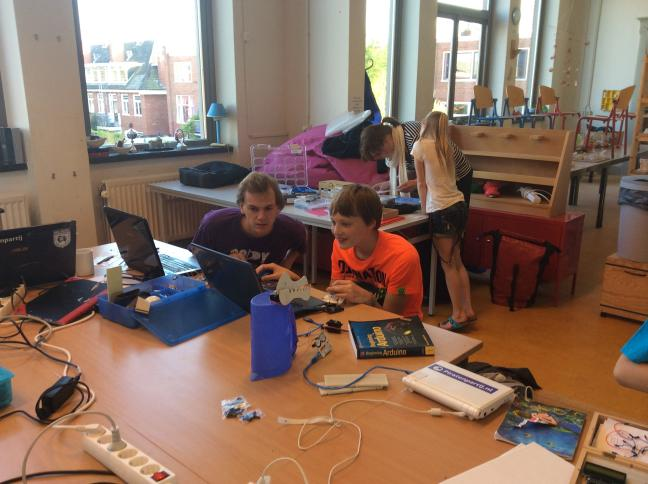

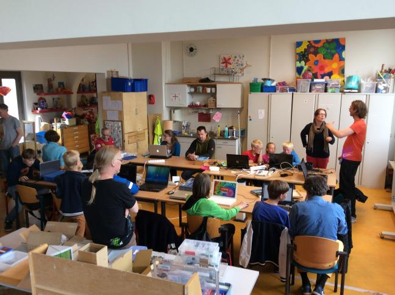

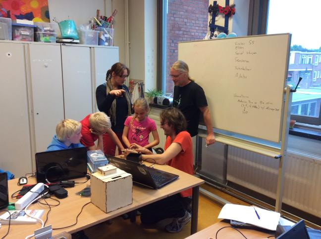

Boter-Kaas-en-Eieren PCB:

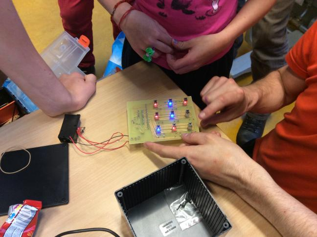

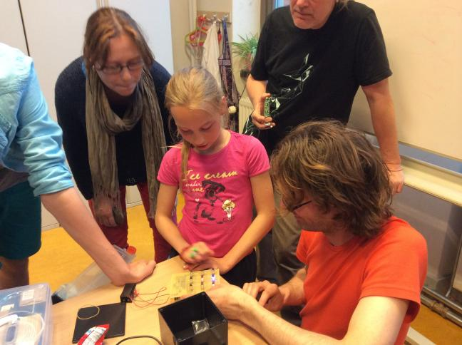

