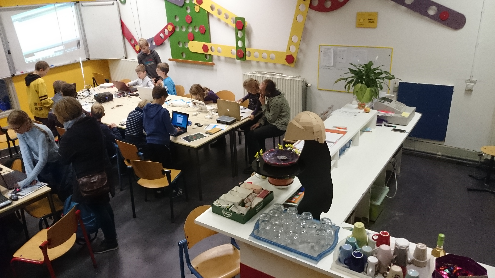

# Leerlingen

## Presentaties

Nieuwste eerst!

 * [Presentaties 15 december 2017](Presentatie20171215/README.md)
 * [Presentaties 16 december 2016](Presentatie20161216/README.md)
 * [Presentaties 31 juni 2016](Presentatie20160631/README.md)

Zo werken wij, en als we iets niet weten, vragen we het, als iemand het voor ons typt verwijdert hij dat ook gelijk weer en typen we het zelf weer om het goed te leren.We werken met een lesboek daarin staat ook een les om een robotautotje te maken dat is echt een hele coole auto.We staan ook op meerdere festivals, de kinderen mogen dan zelf aan de mensen die langskomen uitleggen hoe de  arduino werkt.

## Machines van leerlingen

 * [Joke Kort: Boter-Kaas-Eieren](https://github.com/richelbilderbeek/ArduinoTicTacToeMachine)
 * [Thijs van Beers: ArduinoInvaders](https://github.com/thijsvb/ArduinoInvaders)

