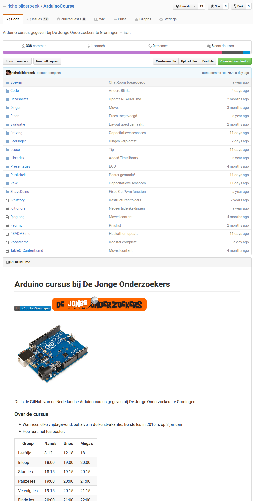

# Lesplan 'Introductie'

 * Datum: 9 september
 * Door: Richel

Lesdoelen:
 * Waar staat de GitHub van de cursus?
 * Hoe werkt de cursus?
 * Hoe start ik Arduino op een laptop van de cursus?
 * Hoe copy-paste ik?
 * Hoe zet ik een programm op de Arduino?
 * Wat is een programma?

# Waar staat de GitHub van de cursus?

18:15-18:25

 * Wat: GitHub kunnen vinden
 * Waarom: die zullen de leerlingen vaak nodig hebben
 * Expert: zelfstanding kunnen Googlen, bookmarken 



 * Zet de laptops aan. Google de cursus. 
 * Klaar? Lees de 'Veelgestelde vragen' alvast

18:40-18:50

# Hoe werkt de cursus?

 * Wat: de regels van de cursus kennen
 * Waarom: dan is het duidelijk hoe we met elkaar omgaan
 * Expert: naar deze regels handelen

 * Beantwoord de volgende vragen:
   * Hoeveel vrijwilligers zijn er?
   * Er komt een nieuwe leerling binnenlopen. Wat doen we?
   * Twee leerlingen willen samen iets maken. Waar kunnen ze het beste gaan zitten?
   * Een leerling geeft volgende week een spreekbeurt over Arduino en moet nog veel doen. Waar kan deze het best gaan zitten? 
   * Een leerling heeft een game opgezet. Richel vind dat goed. Hoe kan dat? 
   * Een leerling heeft een game opgezet. Richel vond dat eerst goed, maar na tien minuten niet meer. Hoe kan dat? 
   * Wat is de laatste les?
 * Klaar? Start Arduino alvast

# Hoe start ik Arduino?

18:50-19:10

Dit is afhankelijk van of de leerling een eigen laptop heeft.

 * [Arduino opstarten op cursus laptop](../Lessen/ArduinoOpstartenOpCursusLaptop/README.md)
 * [Arduino installeren op Linux](../Lessen/ArduinoInstallerenOpLinux/README.md)
 * [Arduino installeren op Windows](../Lessen/ArduinoInstallerenOpWindows/README.md)

 * Zoek op de GitHub naar de les 'Een mooi programma' en probeer Processing te starten
 * Gelukt? Help dan de anderen. Iedereen klaar? Start dan 'Een mooi programma'

 
# Hoe start ik een programma?

19:10-19:30

 * Zet de les op de beamer

```
void setup()
{
  size(256,256);  
}

void draw() 
{
  fill(mouseX, mouseY, mouseX + mouseY);
  ellipse(mouseX, mouseY, 50, 50);  
  fill(mouseY, mouseX, 255);
  ellipse(mouseY, mouseX, 50, 50);  
}
```

 * Doe de opdrachten op de pagina [EenMooiProgramma](../../LessenProcessing/EenMooiProgramma/README.md)

# Wat doet het programma?

19:45-20:10

 * Zet het voorbeeld programma op de beamer

```
void setup()
{
  size(256,256);  
}

void draw() 
{
  fill(mouseX, mouseY, mouseX + mouseY);
  ellipse(mouseX, mouseY, 50, 50);  
  fill(mouseY, mouseX, 255);
  ellipse(mouseY, mouseX, 50, 50);  
}
```

 * Oefen met het experimenteren met code
 * Op het bord: `fill(0 t/m 255, 0 t/m 255, 0 t/m 255);`
 * Laat de leerlingen uitvinden wat de code ongeveer doet

# Fouten

20:10-20:20

 * Zet het voorbeeld programma op de beamer

```
void setup()
{
  size(256,256);  
}

void draw() 
{
  fill(mouseX, mouseY, mouseX + mouseY);
  ellipse(mouseX, mouseY, 50, 50);  
  fill(mouseY, mouseX, 255);
  ellipse(mouseY, mouseX, 50, 50);  
}
```

 * Omstebeurt: een leerling verandert een teken, terwijl de ander wegkijkt. Dan probeert de ander de fout op te lossen. Dan andersom

# Informele toets

 * Met welke toetscominatie plak je?
 * Met welke toetscominatie knip je?
 * Met welke toetscominatie kopieer je?
 * Met welke toetscominatie start je je programma in Processing?
 * Wat is een programma?
 * Beschrijf wat dit programma doet:

```
void setup()
{
  size(320,200);  
}

void draw() 
{
  fill(0, 0, 0);
  ellipse(50, 100, 150, 200);  
}
```


## Antwoorden

### Met welke toetscominatie plak je?

Omschrijving|Punten
---|---
CTRL+P|1
Maximaal aantal punten|1


### Met welke toetscominatie knip je?

Omschrijving|Punten
---|---
CTRL+X|1
Maximaal aantal punten|1

### Met welke toetscominatie kopieer je?

Omschrijving|Punten
---|---
CTRL+C|1
Maximaal aantal punten|1

### Met welke toetscominatie start je je programma in Processing?

Omschrijving|Punten
---|---
CTRL+R|1
Maximaal aantal punten|1

### Wat is een programma?

Omschrijving|Punten
---|---
Een stuk tekst|2
Dat wat de computer moet doen|2
Een stuk tekst die de computer uitvoert|4
Maximaal aantal punten|4

### Beschrijf wat dit programma doet:

Omschrijving|Punten
---|---
Scherm is vierkant|0
Scherm is rechthoekig|1
Scherm is 320 pixels hoog en 200 breed|1
Scherm is 320 pixels breed en 200 hoog|2
Vulkleur wordt veranderd|1
Vulkleur wordt op zwart gezet|2
Er wordt een cirkel getekent|0
Er wordt een ovaal getekent|1
De ovaal staat 100 pixels naar rechts en 50 pixels omlaag|1
De ovaal staat 50 pixels naar rechts en 100 pixels omlaag|2
De ovaal is 150 pixels hoog en 200 pixels breed|1
De ovaal is 150 pixels breed en 200 pixels hoog|2
Maximaal aantal punten|8

### Eindscore

`Eindscore = 1 + (Aantal punten / 16) * 9`


