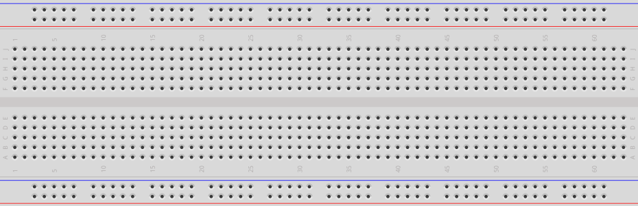

# Les 0: Breadboard

Een broodplank (ja, wij noemen dit een broodplank) helpt om
gemakkelijk elektrische schakelingen te bouwen.

In deze les leer je:

 * Welke gaatjes van een broodplank verbonden zijn
 * Hoe je dat kunt meten

## Broodplank

Een broodplank ziet er zo uit:

De gaatjes van een broodplank zijn op een bepaalde manier verbonden.
Dit gaan wij meten!

:heavy_exclamation_mark: Let goed op! Je kunt de Arduino hier stuk mee maken :heavy_exclamation_mark:

Maak deze meetopstelling na:

Je hebt nodig:

 * 1x Arduino Uno
 * 1x USB snoer
 * 1x laptop
 * 1x weerstand van 1000 Ohm (bruin-zwart-rood-goud)
 * 1x rood LEDje
 * 2x krokodillebekdraadjes
 * 2x draadbrugjes

Alleen dan:

 * Doe de een kant van de weerstand in het gat met `5V`. Klem een krokodillebek aan het andere pootje
 * Doe het korte pootje van het LEDje in het gat met `GND`. Doe een krokodillebekklem aan het andere pootje
 * Doe een draadbrug aan elke van de vrije krokodillebekken

:heavy_exclamation_mark: Laat een volwassene kijken of je het goed hebt gedaan, voordat je de Arduino spanning geeft :heavy_exclamation_mark:

 * Geef de Arduino spanning met een USB snoer naar een laptop
 * Doe de twee uiteindes van de draadbruggen tegen elkaar. Het lampje moet zeker gaan branden!

Hier zie je een broodplank, waarbij ik sommige gaten gemarkeerd heb:

 * Vind uit welke gaten met elkaar verbonden zijn. Doe dit door de draadeindes in verschillende gaten te steken. Hoe zitten de gaten verbonden in een broodplank?

