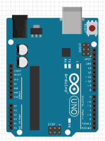
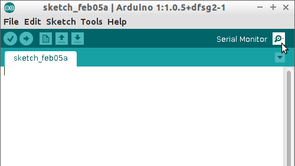
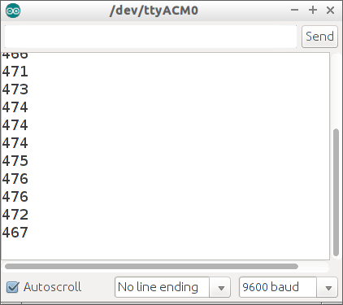
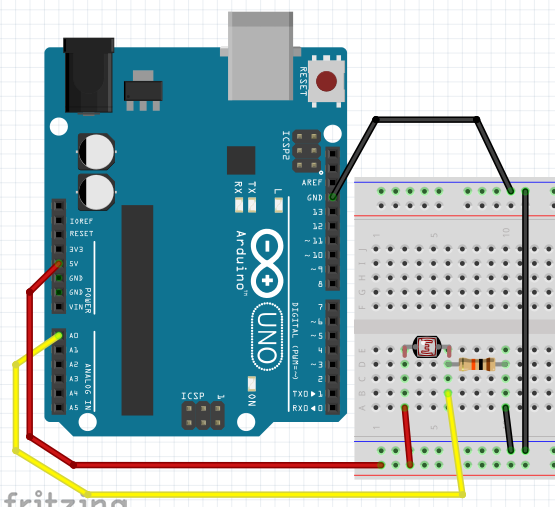
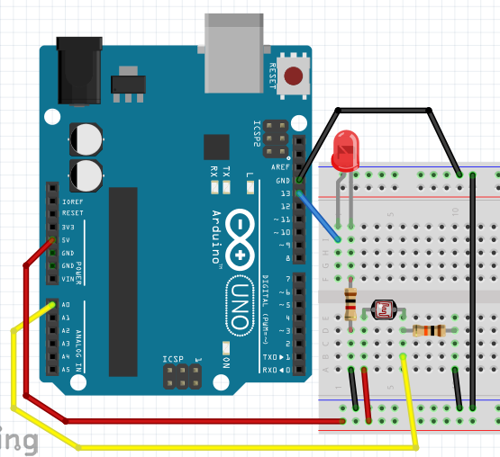

# 10. LDR

Met een LDR kun je licht meten. LDR betekent 'Light Dependent Resistor'.
Dit is Engels voor 'licht-afhankelijk weerstand'.

In deze les leer je:

 * Wat de seriele monitor is
 * Hoe je een LDR gebruikt

# Alleen Arduino aansluiten

Eerst sluiten we alleen een Arduino aan:



Ik denk dat dit wel moet lukken :-)

# Code: seriele monitor

```
void setup() 
{
  Serial.begin(9600);
}

void loop()
{
  Serial.println("Hallo");
  delay(1000);
}
```

Dit doet de code

 * In de `setup` functie gebeurt een ding:
   * `Serial.begin(9600)`: de seriele monitor stuurt 9600 bits ('nullen en enen') per seconde
 * In de `loop` functie gebeuren twee dingen:
   * `Serial.println("Hallo")`: de tekst 'Hallo' wordt naar de seriele monitor gestuurd
   * `delay(1000)`: wacht duizend milliseconden

## Opdrachten





 1. Upload het programma. In de Arduino IDE, klik rechtsboven op 'Seriele Monitor'. Wat zie je?
 2. Kun je de tekst veranderen naar 'Hallo Richel' (of je eigen naam?)
 3. Verander `Serial.println` naar `Serial.print`. Wat zie je?
 4. Verander de tekst `Serial.begin(9600)` naar `Serial.begin(4800)`. Wat zie je? Waarom?

## Oplossingen

 1. De seriele monitor laat elke second een extra regel zien, met de tekst 'Hallo'
 2. Verander de regel `Serial.println("Hallo");` naar `Serial.println("Hallo Richel");`
 3. De woorden komen na elkaar, in plaats van onder elkaar
 4. Nu laat de seriele monitor onleesbare tekst zien. Dit komt omdat de Arduino langzamer tekst
      stuur naar je computer (4800), dan je computer de tekst leest (9600)

# Aansluiten LDR zonder LED

Eerst sluiten we alleen een LDR aan:



Let op, het weerstandje is tienduizend Ohm (bruin-zwart-oranje-goud).

## Code: lezen FSR met seriele monitor

Met deze code meten we de waarde van de LDR:

```
void setup() 
{
  pinMode(A0, INPUT);
  Serial.begin(9600);
}

void loop()
{
  Serial.println(analogRead(A0));
  delay(100);
}
```

Dit doet de code

 * In de `setup` functie gebeuren twee dingen
   * `pinMode(A0, INPUT)`: de pin `A0` is een pin die leest, een input
   * `Serial.begin(9600)`: de seriele monitor stuurt 9600 bits ('nullen en enen') per seconde
 * In de `loop` functie gebeuren twee dingen
   * `Serial.println(analogRead(A0))`: lees de pin `A0` uit en schrijf deze naar de seriele monitor
   * `delay(100)`: wacht honderd milliseconden

## Opdrachten

 1. Upload het programma. In de Arduino IDE, klik rechtsboven op 'Seriele Monitor'. Wat zie je?
 2. Houd je vinger boven de LDR terwijl je de seriele monitor bekijkt. Wat zie je?
 3. Verander `Serial.println` naar `Serial.print`. Wat zie je?
 4. Verander de tekst `Serial.begin(9600)` naar `Serial.begin(4800)`. Wat zie je? Waarom?
 5. Haal de draad naar `A0` weg. Ja, haal de draad tussen `A0` en de LDR weg. 
      Kijk op de seriele monitor. Wat zie je?

## Oplossingen

 * 1. Je ziet een getal van nul tot 1024, afhankelijk van de waarde van de LDR
 * 2. Je zit de getallen veranderen
 * 3. Alle getallen komen na elkaar
 * 4. Nu laat de seriele monitor onleesbare tekst zien. Dit komt omdat de Arduino langzamer tekst
      stuur naar je computer (4800), dan je computer de tekst leest (9600)
 * 5. Nu zie je het getal willekeurig veranderen. Dit wordt een zwevende input genoemd

# Aansluiten LDR met LED

Nu sluiten we ook een LED aan:



Let op:

 * het weerstandje aan de LED is duizend Ohm (bruin-zwart-rood-goud).
 * het weerstandje aan de LDR is tienduizend Ohm (bruin-zwart-oranje-goud).

## Reageren op LDR

Nu gaan we het LEDje laten reageren op de LDR:

```
void setup() 
{
  pinMode(A0, INPUT);
  pinMode(13, OUTPUT);
}

void loop()
{
  if (analogRead(A0) < 512)
  {
    digitalWrite(13, HIGH);
  }
  else
  {
    digitalWrite(13, LOW);
  }
  delay(100);
}
```

Dit doet de code

 * In de `setup` functie gebeuren drie dingen:
   * `pinMode(A0, INPUT)`: de pin `A0` is een pin die leest, een input
   * `pinMode(13, OUTPUT)`: pin `13` is een pin waar stroom uitkomt, een output
 * In de `loop` functie gebeuren twee dingen:
   * Er zit een `if` statement in: als `analogRead(A0)` kleiner (`<`) is dan 512, wordt
     er spanning op pin `13` gezet (`digitalWrite(13, HIGH)`). Anders, wordt de spanning
     van pin `13` afgehaald (`digitalWrite(13, LOW)`)
   * `delay(100)`: wacht honderd milliseconden

## Opdracht

 * Wat gebeurt er als je `512` hoger zet? Wat gebeurt er als je `512` lager zet?
 * Zorg dat de seriele monitor ook `A0` meet en laat zien. Welk getal meet de FSR 
   in rust?
 * Zorg dat de seriele monitor het woord `AAN` laat zien als de LED aan gaat, en het
   woord `UIT` als de LED uit wordt gezet

## Oplossingen

 * Als `512` wordt veranderd naar een te hoog getal, is het lampje altijd aan, hoe hard/zacht je ook drukt.
   Als `512` wordt veranderd naar een te hoog getal, is het lampje altijd uit, hoe hard/zacht je ook drukt
 * Hiervoor gebruik je de code van de vorige opdracht: voeg in de `setup` function toe `Serial.begin(9600);`,
   in de `loop` functie voeg je `Serial.println(analogRead(A0));` toe. De waarde die je gaat zien is
   afhankelijk van de weerstand, LDR en hoeveelheid licht
 * Dit kan door `Serial.println("AAN");` in het eerste gedeelte van het `if` statement te zetten. 
   Zet `Serial.println("UIT");` in het tweede gedeelte van het `if` statement. 

```
void setup() 
{
  pinMode(A0, INPUT);
  pinMode(13, OUTPUT);
  Serial.begin(9600);
}

void loop()
{
  Serial.println(analogRead(A0));
  if (analogRead(A0) < 512)
  {
    digitalWrite(13, HIGH);
    Serial.println("AAN");
  }
  else
  {
    digitalWrite(13, LOW);
    Serial.println("UIT");
  }
  delay(100);
}
```

## Opdracht

 * Sluit een extra LEDje aan. Als de LDR in normaal licht is, moet er geen LEDje branden. 
   Als je de LDR een beetje donkerder maakt met je hand, gaat er een LEDje branden. 
   Als je de LDR helemaal donker maakt twee. Tip: gebruik twee `if` statements

## Oplossing

De getallen in de `if` statement moeten goed ingesteld worden.

```
void setup() 
{
  pinMode(A0, INPUT);
  pinMode(12, OUTPUT);
  pinMode(13, OUTPUT);
  Serial.begin(9600);
}

void loop()
{
  Serial.println(analogRead(A0));
  if (analogRead(A0) < 256)
  {
    digitalWrite(13, HIGH);
  }
  if (analogRead(A0) < 512)
  {
    digitalWrite(12, HIGH);
  }
  delay(100);
}
```

## Eindopdracht

 * Sluit drie LEDjes aan: een rode, gele en groene 
 * Als de LDR in het licht is, moet er geen LEDje branden. 
 * Als je de LDR een beetje verduisterd wordt, gaat het groene LEDje branden
 * Als je de FSR meer verduisterd wordt, gaan de groene en gele LEDjes branden
 * Als je de FSR helemaal verduisterd wordt, gaan alle LEDjes branden
