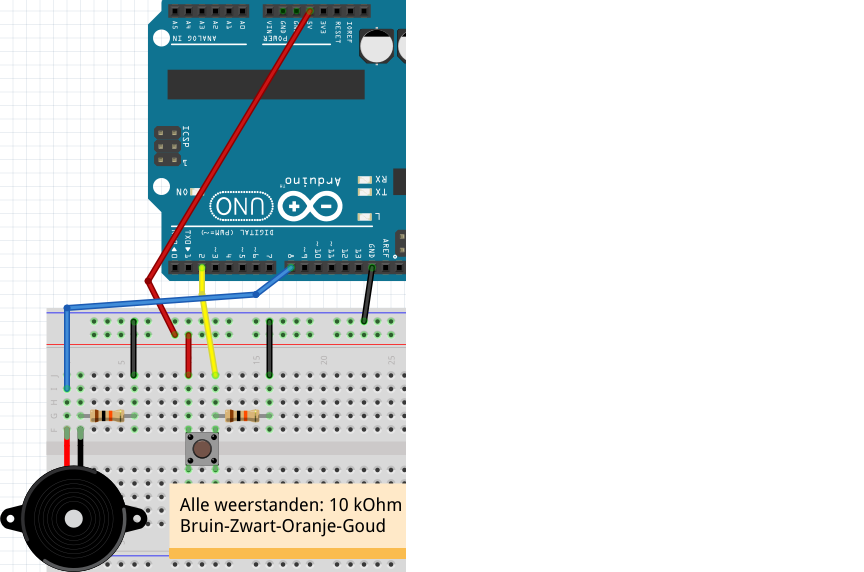
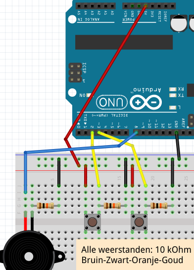
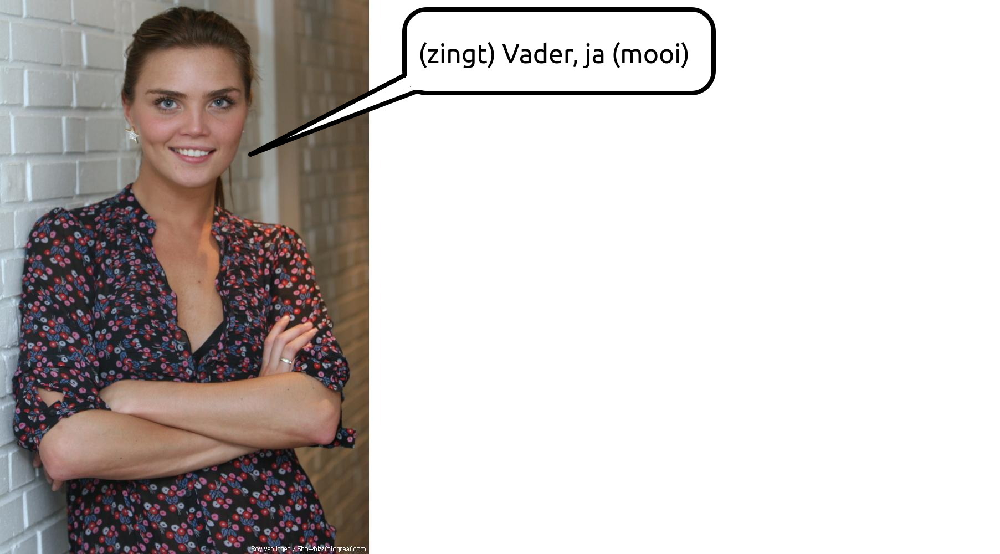
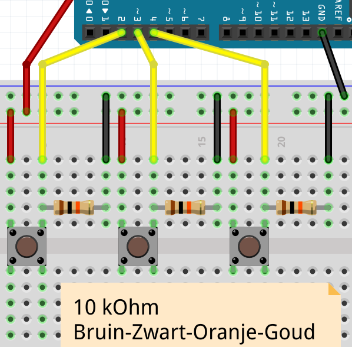
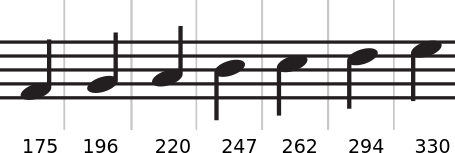
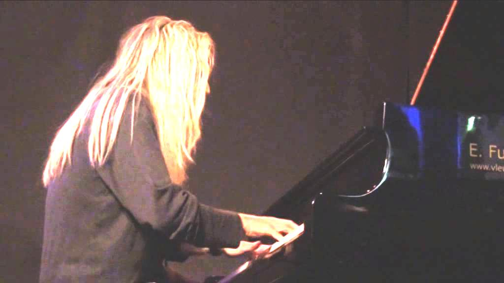

# Les 18: 7-Pin Piano

In deze les gaan we een simpele piano maken, die 7 pinnen gebruikt.


\pagebreak

## Les 18: 7-Pin Piano: Opdracht 1

Sluit figuur 'Een pin' aan.



Zet deze code op je Arduino:

```c++
const int speaker_pin = 8;
const int pin_1 = 2;

void setup()
{
  pinMode(speaker_pin, OUTPUT);
  pinMode(pin_1, INPUT);
}

void loop()
{
  if (digitalRead(pin_1) == LOW)
  {
    tone(speaker_pin, 175, 250);
    delay(250);
  }
}
```

We maken een piano. Dit is de eerste toets met een toonhoogte van 175 Hertz.
Maar er zit een fout in de code! Repareer de code.

\pagebreak

## Les 18: 7-Pin Piano: Oplossing 1

```c++
const int speaker_pin = 8;
const int pin_1 = 2;

void setup()
{
  pinMode(speaker_pin, OUTPUT);
  pinMode(pin_1, INPUT);
}

void loop()
{
  if (digitalRead(pin_1) == HIGH)
  {
    tone(speaker_pin, 175, 250);
    delay(250);
  }
}
```

 | Ah, `digitalRead` moet `HIGH` zijn, inplaats van `LOW`!
:-------------:|:----------------------------------------: 

 | Als de code het *wel* deed, heb je GND en 5V omgedraaid
:-------------:|:----------------------------------------: 

\pagebreak

## Les 18: 7-Pin Piano: Opdracht 2

Bouw een tweede toets erbij, op pin 3. 
Deze heeft ook een eigen weestandje nodig. 
Deze moet een toonhoogte krijgen van 196 Hertz.

 | Een tweede knop bouwen gaat net als de eerste
:-------------:|:----------------------------------------: 

 | De code voor de tweede knop gaat ook net als de eerste
:-------------:|:----------------------------------------: 

\pagebreak

## Les 18: 7-Pin Piano: Oplossing 2



```c++
const int speaker_pin = 8;
const int pin_1 = 2;
const int pin_2 = 3;

void setup()
{
  pinMode(speaker_pin, OUTPUT);
  pinMode(pin_1, INPUT);
  pinMode(pin_2, INPUT);
}

void loop()
{
  if (digitalRead(pin_1) == HIGH)
  {
    tone(speaker_pin, 175, 250);
    delay(250);
  }
  if (digitalRead(pin_2) == HIGH)
  {
    tone(speaker_pin, 196, 250);
    delay(196);
  }
}
```

\pagebreak

## Les 18: 7-Pin Piano: Opdracht 3

Bouw een derde toets erbij, op pin 4. 
Deze heeft ook een eigen weerstandje nodig. 
De toets moet een toonhoogte krijgen van 220 Hertz.



\pagebreak

## Les 18: 7-Pin Piano: Oplossing 3



```c++
const int speaker_pin = 8;
const int pin_1 = 2;
const int pin_2 = 3;
const int pin_3 = 4;

void setup()
{
  pinMode(speaker_pin, OUTPUT);
  pinMode(pin_1, INPUT);
  pinMode(pin_2, INPUT);
  pinMode(pin_3, INPUT);
}

void loop()
{
  if (digitalRead(pin_1) == HIGH)
  {
    tone(speaker_pin, 175, 250);
    delay(250);
  }
  if (digitalRead(pin_2) == HIGH)
  {
    tone(speaker_pin, 196, 250);
    delay(196);
  }
  if (digitalRead(pin_3) == HIGH)
  {
    tone(speaker_pin, 220, 250);
    delay(196);
  }
}
```

\pagebreak

## Les 18: 7-Pin Piano: Eindopdracht

Maak een piano van zeven toetsen. Zie figuur 'Frequenties' voor de andere getallen.




