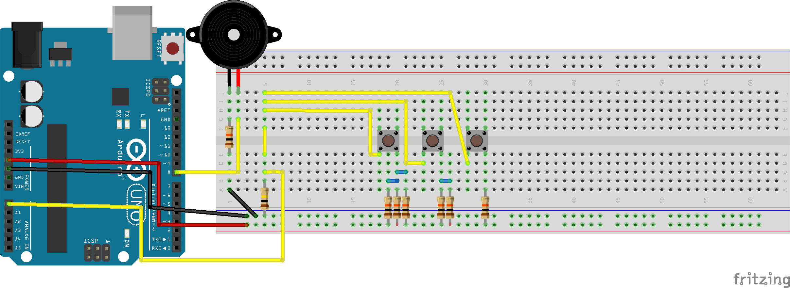
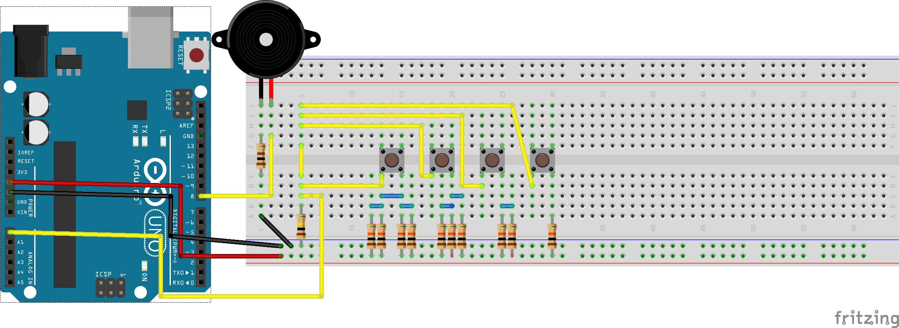
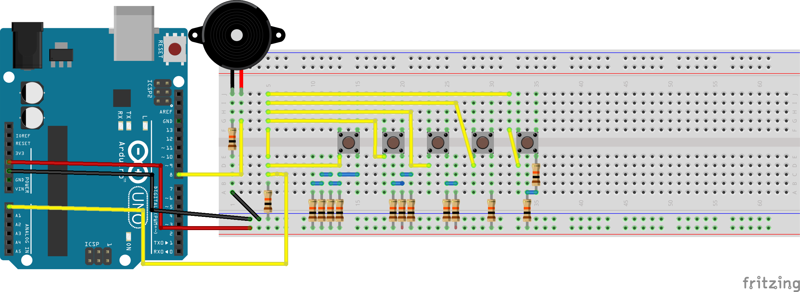
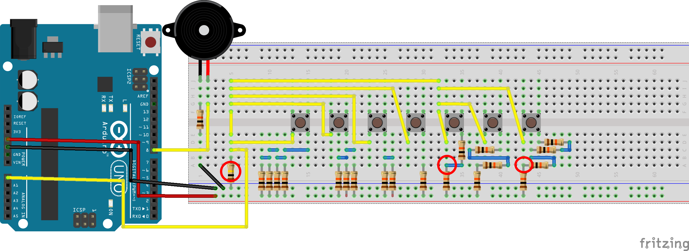

# Les 19: 1-pin-7-parallelle_weerstanden-piano

In deze les gaan we een simpele piano maken, die 1 pin gebruikt en 7 parallelle weerstanden.

We bouwen de piano stap voor stap op en testen elke stap apart.

Het uitlezen van de knoppen hebben we al eerder gezien in lesboekje 2, bladzijde 16.
Het afspelen van een geluidje hebben we al eerder gezien in lesboekje 3, bladzijde 17.

 | We beginnen met de middelste toets met frequentie 247. Dan bouwen we naar links 3 toetsen erbij. Daarna bouwen we rechts 3 toetsen erbij. De frequenties staan in dit plaatje,
:-------------:|:----------------------------------------: 

## Opdracht 1

Sluit de eerste knop aan volgens het plaatje. Zet de knop in het midden van je breadboard!


 | De 'Pull Down' weerstand zorgt dat pin 2 verbonden is met GND als de knop niet ingedrukt is
:-------------:|:----------------------------------------: 

Zet deze code op je Arduino:

```c++
const int speaker_pin = 8;
const int piano_pin = A0;

void setup()
{
  pinMode(speaker_pin, OUTPUT);
  pinMode(piano_pin, INPUT);
  Serial.begin(9600);
}

void loop()
{
  Serial.println(analogRead(piano_pin));
  if (analogRead(piano_pin) > 510)                          //bekijk de Seriële monitor !!
  {
    tone(speaker_pin, 247);
    delay(250);
    noTone(speaker_pin);
    delay(250);
  }
}
```

 | '>' betekent 'groter dan'. De waarde A0 is nooit precies een getal.In de seriële monitor lezen we het getal dat bij de knop hoort af en testen  dan op een getal dat daar net iets onder ligt.
:-------------:|:----------------------------------------: 

Krijg je een geluid als je op de knop drukt? Dan kun je door naar opdracht 2.

## Opdracht 2

Sluit een tweede knop aan **links** van de eerste, met twee weerstanden ervoor die parallel staan [dus 5k], zie plaatje.

 | Twee parallele weerstanden van 10k geeft een weerstand van 5k.
:-------------:|:----------------------------------------: 

 | Twee weerstanden van 10k in serie geeft een weerstand van 20k.
:-------------:|:----------------------------------------: 


 | Gebruik de seriële monitor om de waarde van de nieuwe knop te bepalen.
:-------------:|:----------------------------------------: 

 | De nieuwe waarde is hoger dan de waarde van de andere knop. Het nieuwe if-statement moet bovenaan komen.
:-------------:|:----------------------------------------: 

 | Welke frequentie krijgt de nieuwe knop?
:-------------:|:----------------------------------------: 

Gebruik deze code:

 | Is het nodig om de hele code opnieuwe in te voeren?
:-------------:|:----------------------------------------: 


```c++
int speaker_pin = 8;
int piano_pin = A0;
int sensorValue = 0;

void setup()
{
  pinMode(speaker_pin, OUTPUT);
  pinMode(piano_pin, INPUT);
  Serial.begin(9600);
}

void loop()
{
  sensorValue = (analogRead(piano_pin));
  Serial.println(sensorValue);
  if (sensorValue > 680)                          //bekijk de Seriële monitor !!
  {
    tone(speaker_pin, 220);
    delay(250);
    noTone(speaker_pin);
    delay(250);
  }
  else if (sensorValue > 510)                          //bekijk de Seriële monitor !!
  {
    tone(speaker_pin, 247);
    delay(250);
    noTone(speaker_pin);
    delay(250);
  }
}
```


## Opdracht 3

Bouw nu een derde toets, links van de vorige. 

Gebruik nu 3 parallele weerstanden.

 | Gebruik de seriële monitor om de waarde van de nieuwe knop te bepalen.
:-------------:|:----------------------------------------: 

 | Welke frequentie krijgt de nieuwe knop?
:-------------:|:----------------------------------------: 
## Oplossing 3



```c++
int speaker_pin = 8;
int piano_pin = A0;
int sensorValue = 0;

void setup()
{
  pinMode(speaker_pin, OUTPUT);
  pinMode(piano_pin, INPUT);
  Serial.begin(9600);
}

void loop()
{
  sensorValue = (analogRead(piano_pin));
  Serial.println(sensorValue);
  if (sensorValue > 820)                          //bekijk de Seriële monitor !!
  {
    tone(speaker_pin, 196);
    delay(250);
    noTone(speaker_pin);
    delay(250);
  }
  else if (sensorValue > 680)                          //bekijk de Seriële monitor !!
  {
    tone(speaker_pin, 220);
    delay(250);
    noTone(speaker_pin);
    delay(250);
  }
  else if (sensorValue > 510)                          //bekijk de Seriële monitor !!
  {
    tone(speaker_pin, 247);
    delay(250);
    noTone(speaker_pin);
    delay(250);
  }
}
```
## Opdracht 4

Bouw nu een vierde toets, links van de vorige. 

Gebruik nu 4 parallele weerstanden.

 | Gebruik de seriële monitor om de waarde van de nieuwe knop te bepalen.
:-------------:|:----------------------------------------: 

 | Welke frequentie krijgt de nieuwe knop?
:-------------:|:----------------------------------------: 

## Oplossing 4


```c++
int speaker_pin = 8;
int piano_pin = A0;
int sensorValue = 0;

void setup()
{
  pinMode(speaker_pin, OUTPUT);
  pinMode(piano_pin, INPUT);
  Serial.begin(9600);
}

void loop()
{
  sensorValue = (analogRead(piano_pin));
  Serial.println(sensorValue);
  if (sensorValue > 820)                          //bekijk de Seriële monitor !!
  {
    tone(speaker_pin, 175);
    delay(250);
    noTone(speaker_pin);
    delay(250);
  }
  else if (sensorValue > 680)                          //bekijk de Seriële monitor !!
  {
    tone(speaker_pin, 196);
    delay(250);
    noTone(speaker_pin);
    delay(250);
  }
  else if (sensorValue > 510)                          //bekijk de Seriële monitor !!
  {
    tone(speaker_pin, 220);
    delay(250);
    noTone(speaker_pin);
    delay(250);
  }
  else if (sensorValue > 510)                          //bekijk de Seriële monitor !!
  {
    tone(speaker_pin, 247);
    delay(250);
    noTone(speaker_pin);
    delay(250);
  }
}
```
## Opdracht 5

Bouw nu de 5e toets rechts van de vorige toetsen. Gebruik nu geen parallele weerstanden, maar 2 in serie geschakelde weerstanden van 10k Ohm.

 | Gebruik de seriële monitor om de waarde van de nieuwe knop te bepalen.
:-------------:|:----------------------------------------: 

 | Welke frequentie krijgt de nieuwe knop?
:-------------:|:----------------------------------------: 

De schakeling komt er zo uit te zien.



## Oplossing 5
```c++
int speaker_pin = 8;
int piano_pin = A0;
int sensorValue = 0;

void setup()
{
  pinMode(speaker_pin, OUTPUT);
  pinMode(piano_pin, INPUT);
  Serial.begin(9600);
}

void loop()
{
  sensorValue = (analogRead(piano_pin));
  Serial.println(sensorValue);
  if (sensorValue > 820)                          //bekijk de Seriële monitor !!
  {
    tone(speaker_pin, 175);
    delay(250);
    noTone(speaker_pin);
    delay(250);
  }
  else if (sensorValue > 680)                          //bekijk de Seriële monitor !!
  {
    tone(speaker_pin, 196);
    delay(250);
    noTone(speaker_pin);
    delay(250);
  }
  else if (sensorValue > 510)                          //bekijk de Seriële monitor !!
  {
    tone(speaker_pin, 220);
    delay(250);
    noTone(speaker_pin);
    delay(250);
  }
  else if (sensorValue > 410)                          //bekijk de Seriële monitor !!
  {
    tone(speaker_pin, 247);
    delay(250);
    noTone(speaker_pin);
    delay(250);
  }
  else if (sensorValue > 310)                          //bekijk de Seriële monitor !!
  {
    tone(speaker_pin, 262);
    delay(250);
    noTone(speaker_pin);
    delay(250);
  }
}
```
## Opdracht 6

Bouw nu de 6e toets rechts van de vorige toetsen. Gebruik ook nu geen parallele weerstanden, maar 3 in serie geschakelde weerstanden van 10k Ohm.

 | Gebruik de seriële monitor om de waarde van de nieuwe knop te bepalen.
:-------------:|:----------------------------------------: 

 | Welke frequentie krijgt de nieuwe knop?
:-------------:|:----------------------------------------: 

De schakeling komt er zo uit te zien.


## Oplossing 6
```c++
int speaker_pin = 8;
int piano_pin = A0;
int sensorValue = 0;

void setup()
{
  pinMode(speaker_pin, OUTPUT);
  pinMode(piano_pin, INPUT);
  Serial.begin(9600);
}

void loop()
{
  sensorValue = (analogRead(piano_pin));
  Serial.println(sensorValue);
  if (sensorValue > 820)                          //bekijk de Seriële monitor !!
  {
    tone(speaker_pin, 175);
    delay(250);
    noTone(speaker_pin);
    delay(250);
  }
  else if (sensorValue > 680)                          //bekijk de Seriële monitor !!
  {
    tone(speaker_pin, 196);
    delay(250);
    noTone(speaker_pin);
    delay(250);
  }
  else if (sensorValue > 510)                          //bekijk de Seriële monitor !!
  {
    tone(speaker_pin, 220);
    delay(250);
    noTone(speaker_pin);
    delay(250);
  }
  else if (sensorValue > 410)                          //bekijk de Seriële monitor !!
  {
    tone(speaker_pin, 247);
    delay(250);
    noTone(speaker_pin);
    delay(250);
  }
  else if (sensorValue > 310)                          //bekijk de Seriële monitor !!
  {
    tone(speaker_pin, 262);
    delay(250);
    noTone(speaker_pin);
    delay(250);
  }
    delay(250);
  }
  else if (sensorValue > 210)                          //bekijk de Seriële monitor !!
  {
    tone(speaker_pin, 294);
    delay(250);
    noTone(speaker_pin);
    delay(250);
  }
    delay(250);
  }

}
```
## Eindopdracht

Maak een piano van zeven toetsen af door nog 2 knoppen rechts bij te zetten.

 | Gebruik de seriële monitor om de waarde van de nieuwe knop te bepalen.
:-------------:|:----------------------------------------: 

 | Welke frequentie krijgt de nieuwe knop?
:-------------:|:----------------------------------------: 


## Eindoplossing

# De schakeling



# De code

```c++
int speaker_pin = 8;
int piano_pin = A0;
int sensorValue = 0;

void setup()
{
  pinMode(speaker_pin, OUTPUT);
  pinMode(piano_pin, INPUT);
  Serial.begin(9600);
}

void loop()
{
  sensorValue = (analogRead(piano_pin));
  Serial.println(sensorValue);
  if (sensorValue > 820)                          //bekijk de Seriële monitor !!
  {
    tone(speaker_pin, 175);
    delay(250);
    noTone(speaker_pin);
    delay(250);
  }
  else if (sensorValue > 680)                          //bekijk de Seriële monitor !!
  {
    tone(speaker_pin, 196);
    delay(250);
    noTone(speaker_pin);
    delay(250);
  }
  else if (sensorValue > 510)                          //bekijk de Seriële monitor !!
  {
    tone(speaker_pin, 220);
    delay(250);
    noTone(speaker_pin);
    delay(250);
  }
  else if (sensorValue > 410)                          //bekijk de Seriële monitor !!
  {
    tone(speaker_pin, 247);
    delay(250);
    noTone(speaker_pin);
    delay(250);
  }
  else if (sensorValue > 310)                          //bekijk de Seriële monitor !!
  {
    tone(speaker_pin, 262);
    delay(250);
    noTone(speaker_pin);
    delay(250);
  }
    delay(250);
  }
  else if (sensorValue > 210)                          //bekijk de Seriële monitor !!
  {
    tone(speaker_pin, 294);
    delay(250);
    noTone(speaker_pin);
    delay(250);
  }
    delay(250);
  }
  else if (sensorValue > 110)                          //bekijk de Seriële monitor !!
  {
    tone(speaker_pin, 330);
    delay(250);
    noTone(speaker_pin);
    delay(250);
  }
}
```
