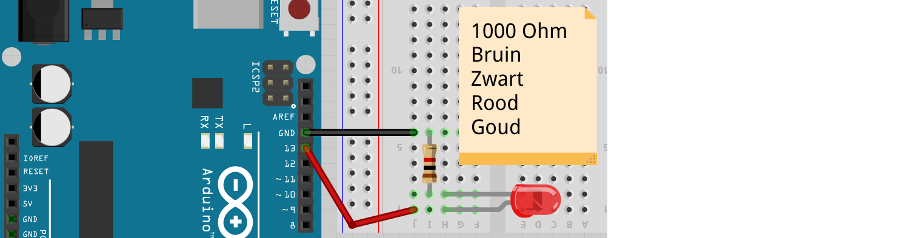
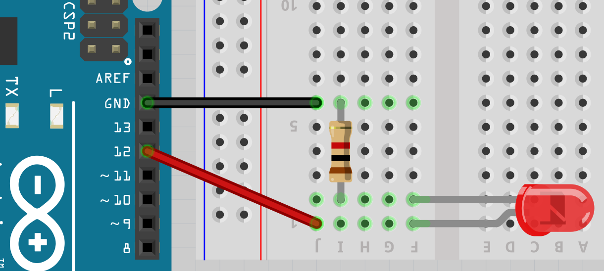
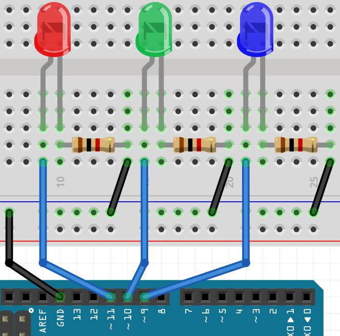

# Les 1b: Blink Blink Blink

Deze les heet 'Blink Blink Blink', omdat het de les Blink is, maar dan met drie lampjes.

## Blink 



Dit is de code van Blink op een andere manier:

```c++
const int pin_led = 13;

void setup() 
{
  pinMode(pin_led, OUTPUT);
}

void loop() 
{
  digitalWrite(pin_led, HIGH);
  delay(1000);
  digitalWrite(pin_led, LOW);
  delay(1000);
}
```

`pin_led` wordt een variabele genoemd: een stukje computergeheugen met een naam.

 | 
:-------------:|:----------------------------------------: 
`const int pin_led = 13;`|'Lieve computer, onthoud een heel getal met de naam `pin_led` met beginwaarde 13.'

## Opdracht

Sluit de LED aan op pin 12 en verander de code zodat deze gaat knipperen.

## Oplossing



```c++
const int pin_led = 12;

void setup() 
{
  pinMode(pin_led, OUTPUT);
}

void loop() 
{
  digitalWrite(pin_led, HIGH);
  delay(1000);
  digitalWrite(pin_led, LOW);
  delay(1000);
}
```

## Opdracht

Maak zelf een nieuwe variabele met de naam `wachttijd`. `wachttijd` is een heel getal met beginwaarde 1000.
Gebruik `wachttijd` in de regels met `delay`.

## Oplossing

```c++
const int pin_led = 12;
const int wachttijd = 1000;

void setup() 
{
  pinMode(pin_led, OUTPUT);
}

void loop() 
{
  digitalWrite(pin_led, HIGH);
  delay(wachttijd);
  digitalWrite(pin_led, LOW);
  delay(wachttijd);
}
```

 | Programmeurs gebruiken veel variabelen, omdat de code dan beter te snappen is.
:-------------:|:----------------------------------------: 

## Blink Blink Blink aansluiten

Nu is het tijd 'Blink Blink Blink' aan te sluiten:



 * Haal de USB snoer uit de computer, zodat de Arduino geen spanning meer heeft
 * Sluit de onderdelen aan zoals op de tekening

## Opdracht

Sluit 'Blink Blink Blink' aan. Hernoem de variable `pin_led` naar `pin_led_1`
en zorg dat 'ie de juiste beginwaarde heeft.

\pagebreak

## Oplossing

```c++
const int pin_led_1 = 11;
const int wachttijd = 1000;

void setup() 
{
  pinMode(pin_led_1, OUTPUT);
}

void loop() 
{
  digitalWrite(pin_led_1, HIGH);
  delay(wachttijd);
  digitalWrite(pin_led_1, LOW);
  delay(wachttijd);
}
```

## Opdracht

Maak een nieuwe variable `pin_led_2`. 
Laat dan eerst het eerste LEDje aan en uit gaan, laat dan het tweede LEDje aan en uit gaan.

## Oplossing

```c++
const int pin_led_1 = 11;
const int pin_led_2 = 10;
const int wachttijd = 1000;

void setup() 
{
  pinMode(pin_led_1, OUTPUT);
  pinMode(pin_led_2, OUTPUT);
}

void loop() 
{
  digitalWrite(pin_led_1, HIGH);
  delay(wachttijd);
  digitalWrite(pin_led_1, LOW);
  delay(wachttijd);
  digitalWrite(pin_led_2, HIGH);
  delay(wachttijd);
  digitalWrite(pin_led_2, LOW);
  delay(wachttijd);
}
```

## Opdracht

Maak een derde variabele `pin_led_3`. Laat nu steeds alle lampjes tegelijk knipperen: allemaal aan, dan allemaal uit.

\pagebreak

## Oplossing

```c++
const int pin_led_1 = 11;
const int pin_led_2 = 10;
const int pin_led_3 = 9;
const int wachttijd = 1000;

void setup() 
{
  pinMode(pin_led_1, OUTPUT);
  pinMode(pin_led_2, OUTPUT);
}

void loop() 
{
  digitalWrite(pin_led_1, HIGH);
  digitalWrite(pin_led_2, HIGH);
  digitalWrite(pin_led_3, HIGH);
  delay(wachttijd);
  digitalWrite(pin_led_1, LOW);
  digitalWrite(pin_led_2, LOW);
  digitalWrite(pin_led_3, LOW);
  delay(wachttijd);
}
```

## Eindopdracht

Laat de lampjes nu in een 'Knightrider patroon' gaan: 1-2-3-2. Er moet altijd precies een lampje branden.

 | Knightrider was een TV serie met een pratende auto.
:-------------:|:----------------------------------------: 


