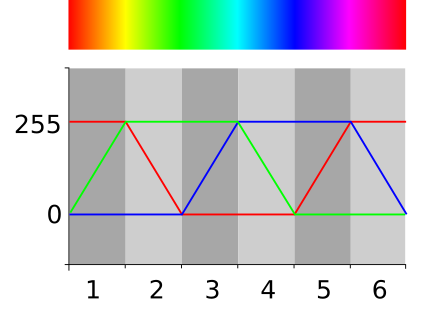
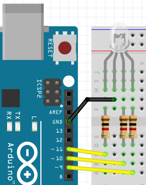

# Les 1c: Meer Kleur Fade Met For

Soms denk je 'Kan dit slimmer?'. Een for-loop is een manier om iets slimmer te doen!

## Regenboog

In deze les gaan we een regenboog programmeren!

Hier zie je hoe een regenboog werkt:

 

## Aansluiten

Sluit onderstaand schema aan:



Let op:

 * De langste pin van een RGB LED moet naar GND
 * Elke andere pin van een RGB LED moet een weerstandje krijgen van 1000 Ohm (bruin-zwart-rood-goud)
 * De pinnen van de LED moeten naar een pin waar een golfje (`~`) voor staat, want alleen deze pinnen kunnen dimmen

## Opdracht

Gebruik deze code:

```c++
const int pin_rood = 9;
const int pin_groen = 10;
const int pin_blauw = 11;

void setup()
{
  pinMode(pin_rood, OUTPUT);
  pinMode(pin_groen, OUTPUT);
  pinMode(pin_blauw, OUTPUT);
}

void loop()
{
  digitalWrite(pin_rood, HIGH);
  digitalWrite(pin_groen, HIGH);
  digitalWrite(pin_blauw, HIGH);
}
```

De getallen achter `pin_rood`, `pin_groen` en `pin_blauw` zijn fout. Zorg dat dit de goede getallen worden.
Hoe? Trek twee draden los en kijk welke kleur het LEDje krijgt. 

## Oplossing

Ha, dit mag je zelf uitvinden :-).

## For loop

We beginnen met deze code:

```c++
const int pin_rood  =  9; // Fout getal, zie vorige opdracht
const int pin_groen = 10; // Fout getal, zie vorige opdracht
const int pin_blauw = 11; // Fout getal, zie vorige opdracht

void setup()
{
  pinMode(pin_rood , OUTPUT);
  pinMode(pin_groen, OUTPUT);
  pinMode(pin_blauw, OUTPUT);
}

void loop()
{
  for (int i=0; i<256; ++i)
  {
    analogWrite(pin_rood, i);
    analogWrite(pin_groen, 0);
    analogWrite(pin_blauw, 255);
    delay(30);
  }
}
```

 | 
:-------------:|:----------------------------------------: 
`for (int i=0; i<256; ++i) { }`|'Lieve computer, laat een getal `i` lopen van 0 tot 256 in stapjes van 1.'
`analogWrite(9, 255)`|'Lieve computer, zet pin 9 vol aan.'
`analogWrite(9, 127)`|'Lieve computer, zet pin 9 half aan.'
`analogWrite(9, 0)`|'Lieve computer, zet pin 9 uit.'

## Opdracht

Kijk naar het eerste gedeelte, links, in figuur `Regenboog`.
De rode lijn staat daar op 255, de groene lijn gaat langzaam
van 0 naar 255 en de blauwe lijn staat bij nul.

Pas de code zo aan dat het lampje van rood naar geel (rood en groen) gaat.

## Oplossing

```c++
const int pin_rood  =  9; // Fout getal, zie vorige opdracht
const int pin_groen = 10; // Fout getal, zie vorige opdracht
const int pin_blauw = 11; // Fout getal, zie vorige opdracht

void setup()
{
  pinMode(pin_rood , OUTPUT);
  pinMode(pin_groen, OUTPUT);
  pinMode(pin_blauw, OUTPUT);
}

void loop()
{
  for (int i=0; i<256; ++i)
  {
    analogWrite(pin_rood, 255);
    analogWrite(pin_groen, i);
    analogWrite(pin_blauw, 0);
    delay(30);
  }
}
```

## Opdracht

Kijk naar het tweede gedeelte in figuur `Regenboog`.
De rode lijn gaat van 255 naar 0, de groene lijn staat op 255
en de blauwe lijn staat bij nul.

Pas de code zo aan dat het lampje van rood naar geel (rood en groen) gaat.

Tip: voeg deze code toe:

```c++
  for (int i=0; i<256; ++i)
  {
    analogWrite(pin_rood, 255 - i);
    analogWrite(pin_groen, 255);
    analogWrite(pin_blauw, 0);
    delay(30);
  }
``` 

## Oplossing

```c++
const int pin_rood  =  9; // Fout getal, zie vorige opdracht
const int pin_groen = 10; // Fout getal, zie vorige opdracht
const int pin_blauw = 11; // Fout getal, zie vorige opdracht

void setup()
{
  pinMode(pin_rood , OUTPUT);
  pinMode(pin_groen, OUTPUT);
  pinMode(pin_blauw, OUTPUT);
}

void loop()
{
  for (int i=0; i<256; ++i)
  {
    analogWrite(pin_rood, 255);
    analogWrite(pin_groen, i);
    analogWrite(pin_blauw, 0);
    delay(30);
  }
  for (int i=0; i<256; ++i)
  {
    analogWrite(pin_rood, 255 - i);
    analogWrite(pin_groen, 255);
    analogWrite(pin_blauw, 0);
    delay(30);
  }
}
```

## Eindopdracht

Maak nu de regenboog af.

