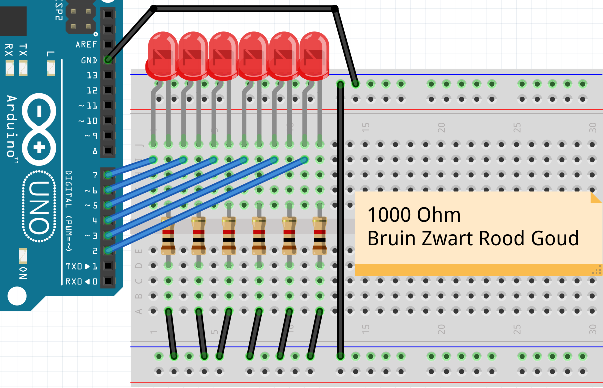
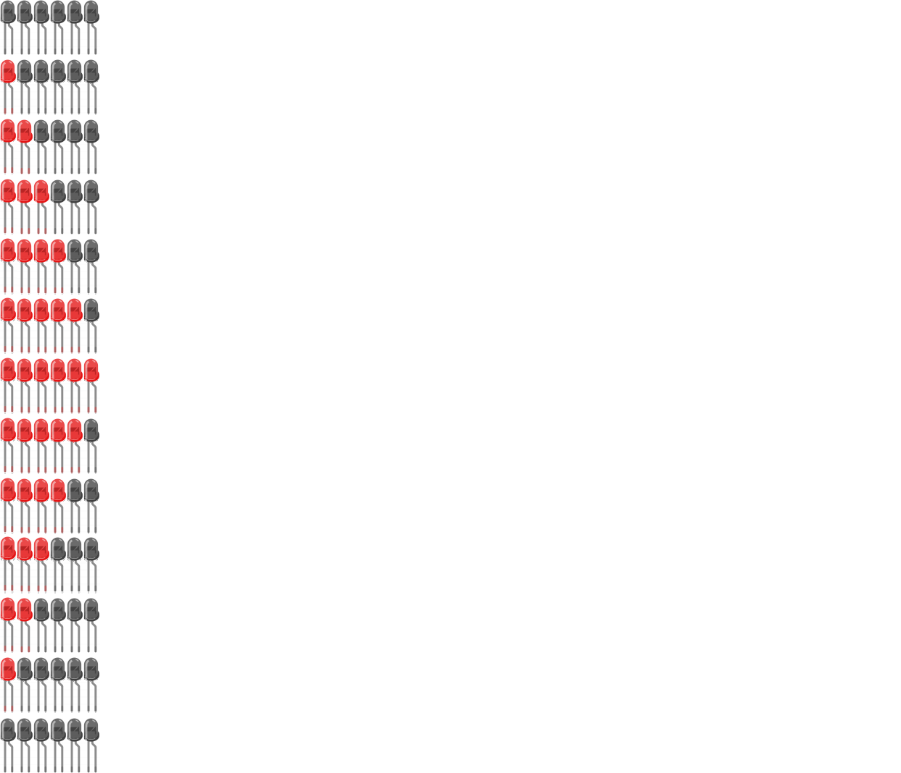

# Les 1d: For nog een keer

In deze les gebruiken we meer `for` loops.

## Intro

Bouw dit:



 | We gaan de LEDjes enkel aan en uit zetten, dus hoeven we geen pinnen met golfjes `~` te gebruiken
:-------------:|:----------------------------------------: 

\pagebreak

Programmeer dit:

```c++
void setup()
{
  pinMode(2, OUTPUT);
  pinMode(3, OUTPUT);
}

void loop()
{
  digitalWrite(2, HIGH);
  digitalWrite(3, HIGH);
  delay(1000);
  digitalWrite(2, LOW);
  digitalWrite(3, LOW);
  delay(1000);
}
```


## Opdracht 1

Verander het `setup` gedeelte naar een for loop.

 | Tip: gebruik deze code 
:--------------|:----------------------------------------: 
`  for (int i=2; i<4; ++i)` | 
`  {` |
`    pinMode(i, OUTPUT);` |
`  }` |
```

\pagebreak

## Oplossing 1

```c++
void setup()
{
  for (int i=2; i<4; ++i) 
  {
    pinMode(i, OUTPUT);
  }
}

void loop()
{
  digitalWrite(2, HIGH);
  digitalWrite(3, HIGH);
  delay(1000);
  digitalWrite(2, LOW);
  digitalWrite(3, LOW);
  delay(1000);
}
```

## Opdracht 2

Laat nu de LEDjes aan gaan met een for loop.

 | Tip: gebruik `digitalWrite(i, HIGH);`
:--------------|:----------------------------------------: 

\pagebreak

## Oplossing 2

```c++
void setup()
{
  for (int i=2; i<4; ++i) 
  {
    pinMode(i, OUTPUT);
  }
}

void loop()
{
  for (int i=2; i<4; ++i) 
  {
    digitalWrite(i, HIGH);
  }
  delay(1000);
  digitalWrite(2, LOW);
  digitalWrite(3, LOW);
  delay(1000);
}
```

## Opdracht 3

Laat nu de LEDjes uit gaan met een for loop

 | Tip: gebruik `digitalWrite(i, LOW);`
:--------------|:----------------------------------------: 

\pagebreak

## Oplossing 3

```c++
void setup()
{
  for (int i=2; i<4; ++i) 
  {
    pinMode(i, OUTPUT);
  }
}

void loop()
{
  for (int i=2; i<4; ++i) 
  {
    digitalWrite(i, HIGH);
  }
  delay(1000);
  for (int i=2; i<4; ++i) 
  {
    digitalWrite(i, LOW);
  }
  delay(1000);
}
```

## Opdracht 4

De zes lampjes zitten op pinnen 2 tot en met 7. 
Laat de for loops lopen van 2 tot 8. 
Als het goed is, gaan alle lampjes aan, dan alle lampjes uit.

 | Tip: je moet *drie* for loops aanpassen
:--------------|:----------------------------------------: 

\pagebreak

## Oplossing 4

```c++
void setup()
{
  for (int i=2; i<8; ++i) 
  {
    pinMode(i, OUTPUT);
  }
}

void loop()
{
  for (int i=2; i<8; ++i) 
  {
    digitalWrite(i, HIGH);
  }
  delay(1000);
  for (int i=2; i<8; ++i) 
  {
    digitalWrite(i, LOW);
  }
  delay(1000);
}
```

## Opdracht 5

Laat nu de lampjes omstebeurt aan en uit gaan, van links naar rechts.
Je hebt hiervoor een `for` loop nodig.

 | Je kunt tussen de accolades van een `for` loop meer regels zetten
:--------------|:----------------------------------------: 

 | Goed programmeurs zorgen dat alle code binnen de accolades van een `for` loop evenveel ingegesprongen is
:--------------|:----------------------------------------: 

\pagebreak

## Oplossing 5

```c++
void setup()
{
  for (int i=2; i<8; ++i) 
  {
    pinMode(i, OUTPUT);
  }
}

void loop()
{
  for (int i=2; i<8; ++i) 
  {
    digitalWrite(i, HIGH);
    delay(1000);
    digitalWrite(i, LOW);
    delay(1000);
  }
}
```

## Opdracht 6

Laat nu de lampjes omstebeurt aan en uit gaan, van rechts naar links.

 | Tip: gebruik niet `i`, maar `7 - i`.
:--------------|:----------------------------------------: 

\pagebreak

## Oplossing 6

```c++
void setup()
{
  for (int i=2; i<8; ++i) 
  {
    pinMode(i, OUTPUT);
  }
}

void loop()
{
  for (int i=2; i<8; ++i) 
  {
    digitalWrite(7 - i, HIGH);
    delay(1000);
    digitalWrite(7 - i, LOW);
    delay(1000);
  }
}
```

 | Als je een regel met `delay` weghaalt, krijg je al een heel ander patroon
:--------------|:----------------------------------------: 

\pagebreak

## Eindopdracht

Maak nu een op-en-neer-gaand patroon in de LEDjes:


