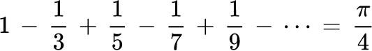
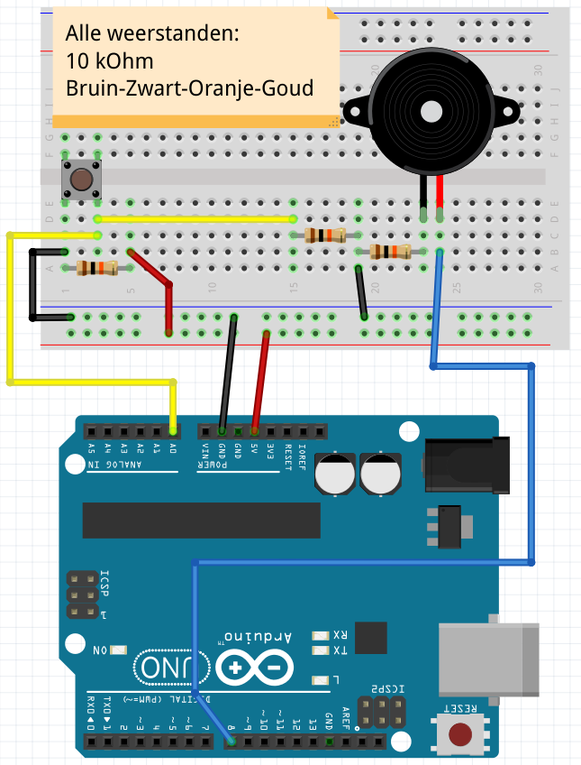
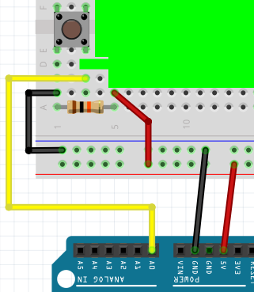
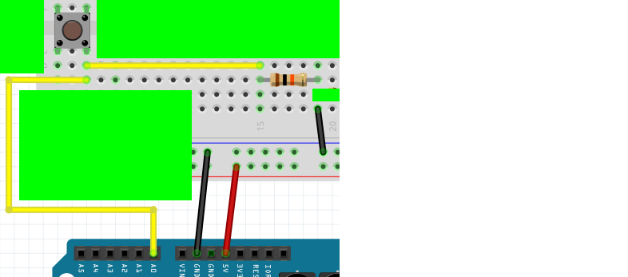
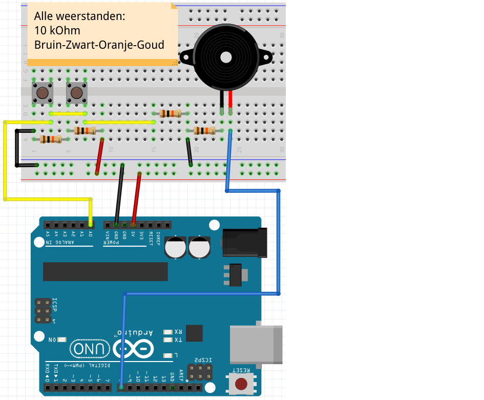
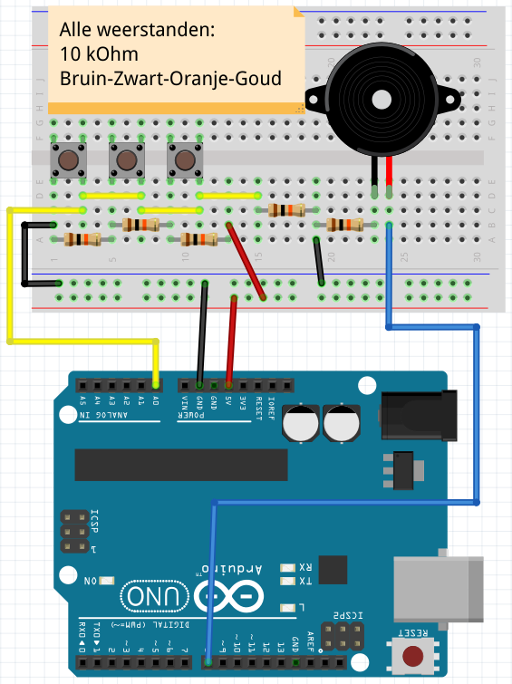
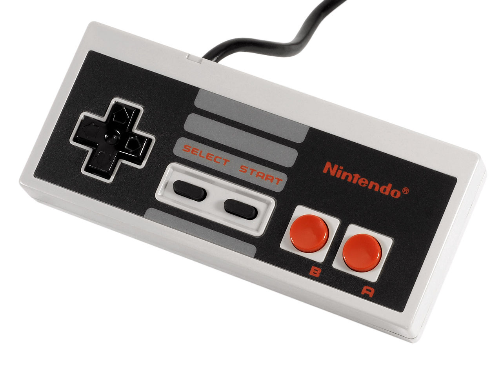
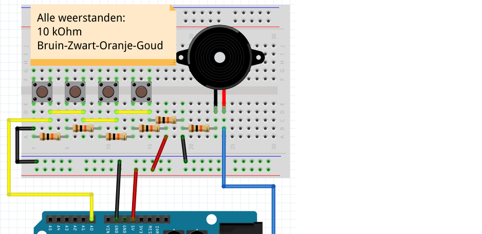

# Les 20: 1-Pin-7-Weerstanden-In-Serie-Piano

In deze les gaan we een piano maken die maar een pin nodig heeft en 8 weerstanden.



 | pi is een beroemd getal tussen de drie en vier
:-------------:|:----------------------------------------: 

 | Dit heeft niks met piano's te maken...
:-------------:|:----------------------------------------: 

\pagebreak

## Les 20: 1-Pin-7-Weerstanden-In-Serie-Piano: Opdracht 1

Bouw 'Opdracht 1' na:



Zet deze code op je Arduino:

```c++
const int speaker_pin = 8;
const int piano_pin = A0;

void setup()
{
  Serial.begin(9600);  
  pinMode(A0, INPUT);
}

void loop()
{
  const int piano_waarde = analogRead(piano_pin);
  Serial.println(piano_waarde);
  delay(100);
}

```

 * Welke waarde krijgt de Arduino als de knop is ingedrukt?
 * Welke waarde krijgt de Arduino als de knop niet is ingedrukt?

\pagebreak

## Les 20: 1-Pin-7-Weerstanden-In-Serie-Piano: Oplossing 1

Als de knop is ingedrukt krijg je waarde 0.
Als de knop niet is ingedrukt krijg je waarde 1023.





\pagebreak

## Les 20: 1-Pin-7-Weerstanden-In-Serie-Piano: Opdracht 2

Als de knop is ingedrukt, laat dan de piezo 250 milliseconden piepen op een frequentie van 175 Hertz.
Laat de Arduino aan het eind van `loop` 1 milliseconde wachten.

 | Als je dit niet meer weet, spiek dan bij de vorige les!
:-------------:|:----------------------------------------: 

\pagebreak

## Les 20: 1-Pin-7-Weerstanden-In-Serie-Piano: Oplossing 2

```c++
const int speaker_pin = 8;
const int piano_pin = A0;

void setup()
{
  Serial.begin(9600);  
  pinMode(A0, INPUT);
}

void loop()
{
  const int piano_waarde = analogRead(piano_pin);
  Serial.println(piano_waarde);
  if (piano_waarde < 150)
  {
    tone(speaker_pin, 175, 250);
    delay(250);
  }
  delay(1);
}
```

 | Oh ja, zo moest het!
:-------------:|:----------------------------------------: 

\pagebreak

## Les 20: 1-Pin-7-Weerstanden-In-Serie-Piano: Opdracht 3

Bouw het volgende na:



Programmeer dat de tweede knop een toon maakt van 196 Hertz.

\pagebreak

## Les 20: 1-Pin-7-Weerstanden-In-Serie-Piano: Oplossing 3

```c++
const int speaker_pin = 8;
const int piano_pin = A0;

void setup()
{
  Serial.begin(9600);  
  pinMode(A0, INPUT);
}

void loop()
{
  const int piano_waarde = analogRead(piano_pin);
  Serial.println(piano_waarde);
  if (piano_waarde < 150)
  {
    tone(speaker_pin, 175, 250);
    delay(250);
  }
  else if (piano_waarde < 300)
  {
    tone(speaker_pin, 196, 250);
    delay(250);
  }
  delay(1);
}
```

\pagebreak

## Les 20: 1-Pin-7-Weerstanden-In-Serie-Piano: Opdracht 4

Bouw het volgende na:



Programmeer dat de derde knop een toon maakt van 220 Hertz.

\pagebreak

## Les 20: 1-Pin-7-Weerstanden-In-Serie-Piano: Oplossing 4

```c++
const int speaker_pin = 8;
const int piano_pin = A0;

void setup()
{
  Serial.begin(9600);  
  pinMode(A0, INPUT);
}

void loop()
{
  const int piano_waarde = analogRead(piano_pin);
  Serial.println(piano_waarde);
  if (piano_waarde < 150)
  {
    tone(speaker_pin, 175, 250);
    delay(250);
  }
  else if (piano_waarde < 300)
  {
    tone(speaker_pin, 196, 250);
    delay(250);
  }
  else if (piano_waarde < 450)
  {
    tone(speaker_pin, 220, 250);
    delay(250);
  }
  delay(1);
}
```

\pagebreak

## Les 20: 1-Pin-7-Weerstanden-In-Serie-Piano: Opdracht 5

Bouw nu zelf een vierde knop. 

Programmeer dat de vierde knop een toon maakt van 247 Hertz.



\pagebreak

## Les 20: 1-Pin-7-Weerstanden-In-Serie-Piano: Oplossing 5



```c++
const int speaker_pin = 8;
const int piano_pin = A0;

void setup()
{
  Serial.begin(9600);  
  pinMode(A0, INPUT);
}

void loop()
{
  // ... vorige code hier
  else if (piano_waarde < 600)
  {
    tone(speaker_pin, 247, 250);
    delay(250);
  }
  delay(1);
}
```

\pagebreak

## Eindopdracht

Maak de piano af met zeven knoppen.
De laatste tonen zijn 262, 294 en 330 Hertz.


