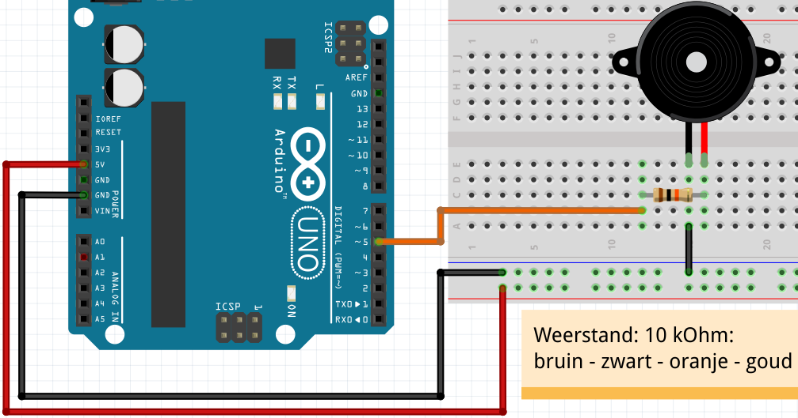
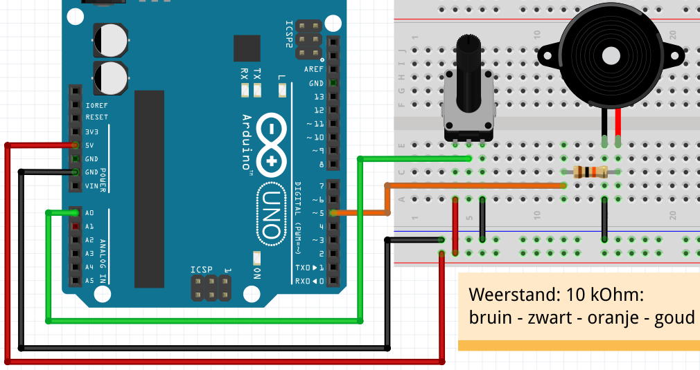

# 21: Theremin met potmeters

In deze les gaan we een theremin met potmeters maken.

## 21.?: opdracht: aansluiten piezo

 * Sluit een piezo aan op pin 5.
 * Gebruik een weerstand van tienduizend Ohm,
   kleurcode: bruin-zwart-oranje-goud

## 21.?: oplossing: aansluiten piezo



## 21.?: opdracht: de `volume` bibliotheek

Upload de volgende code:

```c++
#include "Volume.h"

Volume vol; // Piezo in pin 5

void setup()
{
  vol.begin();
}

void loop()
{
  const int toon_hoogte = 440;
  const int volume = 255;
  vol.tone(toon_hoogte, volume);
  vol.delay(10);
}
```

Doet de 'Volume' bibliotheek het niet, ga dan naar de les 'Volume installeren'.

## 21.?: opdracht: aansluiten potmeter

Sluit een potmeter aan op A0.

## 21.?: oplossing: aansluiten potmeter



## 21.?: opdracht: toon hoogte lineair

Lees de potmeter.

Gebruik:

```
const int input_toon_hoogte = /* lees de waarde van A0 */;
```

```
const int toon_hoogte = input_toon_hoogte;
```

## 21.?: oplossing: toon hoogte lineair

```c++
#include "Volume.h"

Volume vol; // Piezo in pin 5

void setup()
{
  pinMode(A0, INPUT);
  vol.begin();
}

void loop()
{
  const int input_toon_hoogte = analogRead(A0);
  const int toon_hoogte = input_toon_hoogte;
  const int volume = 255;
  vol.tone(toon_hoogte, volume);
  vol.delay(10);
}
```

## 21.?: opdracht: toonhoogte exponentieel

Vervang:

```
const int toon_hoogte = input_toon_hoogte;
```

door:

```c++
const int toon_hoogte = 110.0 * pow(2.0, 0.002 * input_toon_hoogte);
```

## 21.?: oplossing: toonhoogte exponentieel

```c++
#include "Volume.h"

Volume vol; // Piezo in pin 5

void setup()
{
  pinMode(A0, INPUT);
  vol.begin();
}

void loop()
{
  const int input_toon_hoogte = analogRead(A0);
  const int toon_hoogte = 110.0 * pow(2.0, 0.002 * input_toon_hoogte);
  const int volume = 255;
  vol.tone(toon_hoogte, volume);
  vol.delay(10);
}
```

## Eindopdracht

 * Sluit een tweeded potmeter aan op A1.

Gebruik:

```
const int input_volume = /* lees de waarde van A1 */;
```

Gebruik:


```
const int volume = 1.0 * pow(2.0, 0.0078125 * input_volume);
```

```c++
#include "Volume.h"

Volume vol; // Piezo in pin 5

void setup()
{
  pinMode(A0, INPUT);
  pinMode(A1, INPUT);
  vol.begin();
}

void loop()
{
  const int input_toon_hoogte = analogRead(A0);
  const int input_volume = analogRead(A1);
  const int toon_hoogte = 110.0 * pow(2.0, 0.002 * input_toon_hoogte);
  const int volume = 1.0 * pow(2.0, 0.0078125 * input_volume);
  vol.tone(toon_hoogte, volume);
  vol.delay(10);
}
```

