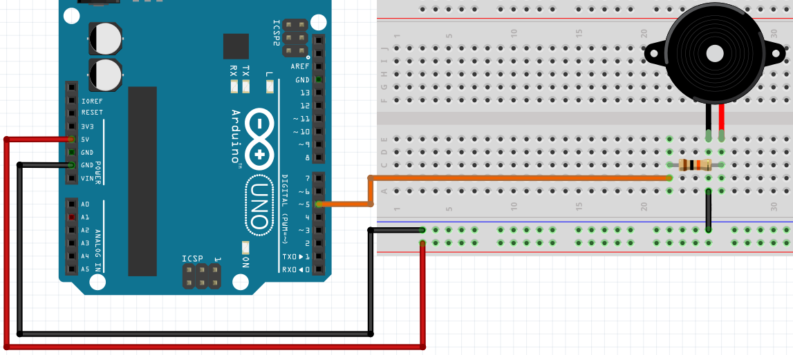
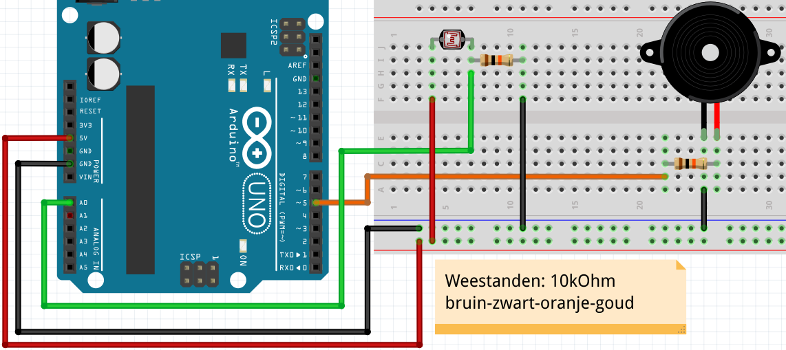

# 22: Theremin met LDRs

In deze les gaan we een theremin met LDRs maken.

\pagebreak

## 22.1: opdracht: aansluiten piezo

 * Sluit een piezo aan op pin 5.
 * Gebruik een weerstand van tienduizend Ohm,
   kleurcode: bruin-zwart-oranje-goud

\pagebreak

## 22.1: oplossing: aansluiten piezo



\pagebreak

## 22.2: opdracht: de `volume` bibliotheek

Upload de volgende code:

```c++
#include "Volume.h"

Volume vol; // Piezo in pin 5

void setup()
{
  vol.begin();
}

void loop()
{
  const int toon_hoogte = 440;
  const int volume = 255;
  vol.tone(toon_hoogte, volume);
  vol.delay(10);
}
```

Doet de 'Volume' bibliotheek het niet, ga dan naar de les 'Volume installeren'.

\pagebreak

## 22.3: opdracht: aansluiten LDR

Sluit een LDR aan op A0. 
Je hebt een LDR en een weerstand van 10k Ohm (bruin-zwart-oranje-goud) nodig. 

\pagebreak

## 22.3: oplossing: aansluiten LDR



\pagebreak

## 22.4: opdracht: toon hoogte lineair

Lees de LDR.

Gebruik:

```c++
const int input_toon_hoogte = /* lees de waarde van A0 */;
```

```c++
const int toon_hoogte = input_toon_hoogte;
```

\pagebreak

## 22.4: oplossing: toon hoogte lineair

```c++
#include "Volume.h"

Volume vol; // Piezo in pin 5

void setup()
{
  pinMode(A0, INPUT);
  vol.begin();
}

void loop()
{
  const int input_toon_hoogte = analogRead(A0);
  const int toon_hoogte = input_toon_hoogte;
  const int volume = 255;
  vol.tone(toon_hoogte, volume);
  vol.delay(10);
}
```

\pagebreak

## 22.5: opdracht: toonhoogte exponentieel

De toonhoogte klinkt nog niet mooi. 
Dat komt omdat hogere tonen steeds verder van elkaar af gaan zitten.
Met `pow` kunnen we een machtverheffing doen (wat dat ook is),
zodat we mooi door de tonen heen kunnen gaan.

Vervang:

```c++
const int toon_hoogte = input_toon_hoogte;
```

door:

```c++
const int toon_hoogte = 110.0 * pow(2.0, 0.002 * input_toon_hoogte);
```

\pagebreak

## 22.5: oplossing: toonhoogte exponentieel

```c++
#include "Volume.h"

Volume vol; // Piezo in pin 5

void setup()
{
  pinMode(A0, INPUT);
  vol.begin();
}

void loop()
{
  const int input_toon_hoogte = analogRead(A0);
  const int toon_hoogte = 110.0 * pow(2.0, 0.002 * input_toon_hoogte);
  const int volume = 255;
  vol.tone(toon_hoogte, volume);
  vol.delay(10);
}
```

\pagebreak

## 22.6: eindopdracht

 * Sluit een tweede LDR aan op A1.
 * Gebruik:

```c++
const int input_volume = /* lees de waarde van A1 */;
```

 * Gebruik:

```c++
const int volume = 1.0 * pow(2.0, 0.0078125 * input_volume);
```
