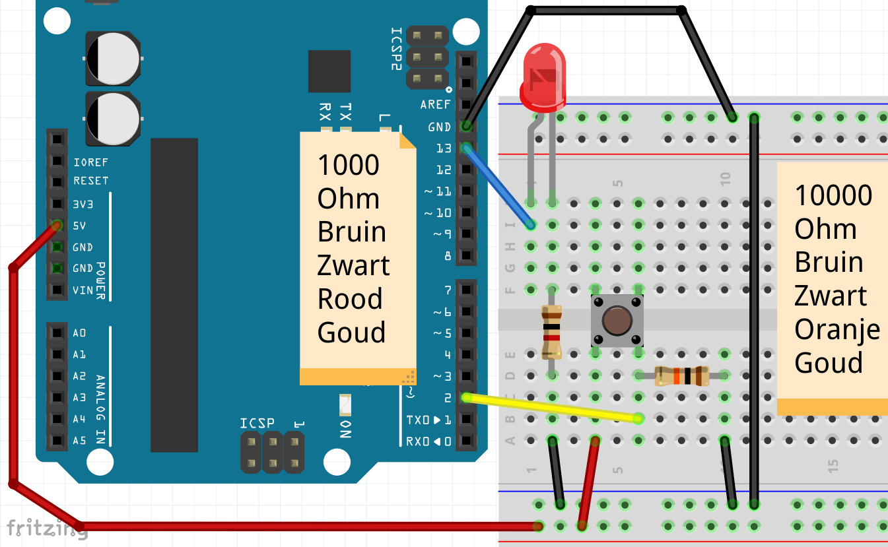
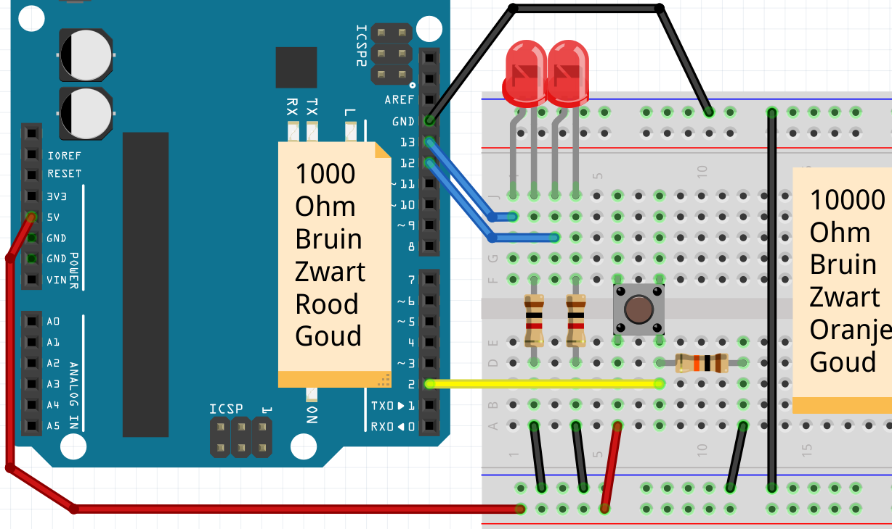

# 2. Knop if ... else


# Aansluiten



Let op, er zijn twee verschillende weerstanden:
 * Duizend Ohm, bruin-zwart-rood-goud
 * Tienduizend Ohm, bruin-zwart-oranje-goud

## Code

Hier is code om het lampje aan te laten gaan,
als de knop wordt ingedrukt:

```
void setup() 
{
  pinMode(13, OUTPUT);
  pinMode( 2, INPUT );
}

void loop()
{
  digitalWrite(13, digitalRead(2));
}
```

Merk op:
 * Pin `2` is een pin waar electriciteit in gaat. 
   Dat moet je in de `setup` functie zeggen
 * Met `digitalRead(2)` lees je pin `2` uit. Hier komt
   `HIGH` of `LOW` uit

## Vragen

 * 1. Als je de knop indrukt, gaat de lamp dan uit of aan?
 * 2. Er is een regel `pinMode( 2, INPUT )`. Waarom staat er een spatie voor de `2`? Mag die spatie weg?

## Oplossingen

 * 1. De knop gaat dan aan
 * 2. Er staat een spatie, omdat dit mooier eruit ziet met de regel erboven. De spatie mag weg. 

## if

Soms wil je kunnen zeggen: 'Lieve Arduino, als
er iets gebeurt, doe dan iets'. Dit doe je met een
`if`-statement. `if` is Engels voor 'als'

Hieronder staat code, dat als er spanning staat op pin 2,
pin 11 spanning krijgt:

```
if (digitalRead(2) == HIGH)
{
  digitalWrite(11, HIGH);
}
```

Je kunt ook zeggen wat de Arduino *anders* moet doen.

Hieronder staat code, dat als er spanning staat op pin 2,
pin 11 spanning krijgt, en dat *anders* pin 12 spanning krijgt:

```
if (digitalRead(2) == HIGH)
{
  digitalWrite(11, HIGH);
}
else
{
  digitalWrite(12, HIGH);
}
```

## Opdracht

Maak de code zo, dat:

 * als je op de knop drukt, dat het lampje aan gaat 
 * als je op de knop niet indrukt, dat het lampje uit gaat
 * vergeet niet: zet er een vertraging in van tien milliseconden 

## Oplossing

```
void setup() 
{
  pinMode(13, OUTPUT);
  pinMode( 2, INPUT );
}

void loop()
{
  if (digitalRead(2) == HIGH)
  {
    digitalWrite(13, HIGH);
  }
  else
  {
    digitalWrite(13, LOW);
  }
  delay(10);
}
```

## Opdracht 'Knop met twee LEDjes'

Sluit een tweede LEDje aan. Maak de code zo, dat:

 * als je op de knop drukt, dat het eerste lampje aan gaat en het tweede LEDje uit 
 * als je op de knop niet indrukt, dat het eerste lampje uit gaat en het tweede LEDje uit

## Oplossing 'Knop met twee LEDjes'

Figuur `Oplossing van 'Knop met twee LEDjes'` laat zien hoe je dit aan moet sluiten.



Dit is de code:

```
void setup() 
{
  pinMode(13, OUTPUT);
  pinMode(12, OUTPUT);
  pinMode( 2, INPUT );
}

void loop()
{
  if (digitalRead(2) == HIGH)
  {
    digitalWrite(12, LOW );
    digitalWrite(13, HIGH);
  }
  else
  {
    digitalWrite(12, HIGH);
    digitalWrite(13, LOW );
  }
  delay(10);
}
```

## Eindopdracht

Sluit een tweede knop aan. Maak de code zo, dat

 * als je op de eerste knop drukt, dat het eerste lampje aan gaat
 * als je de eerste knop niet indrukt, dat het eerste lampje uit gaat
 * als je op de tweede knop drukt, dat het tweede lampje uit gaat
 * als je de tweede knop niet indrukt, dat het tweede lampje aan gaat


