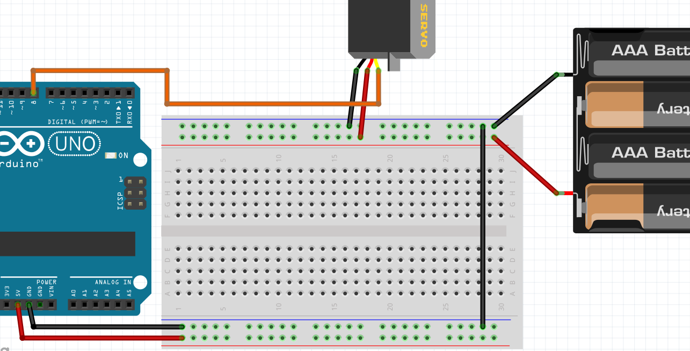
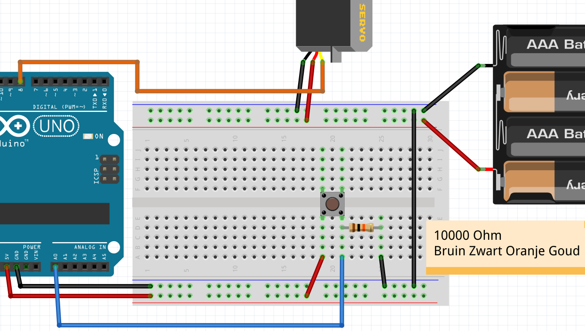
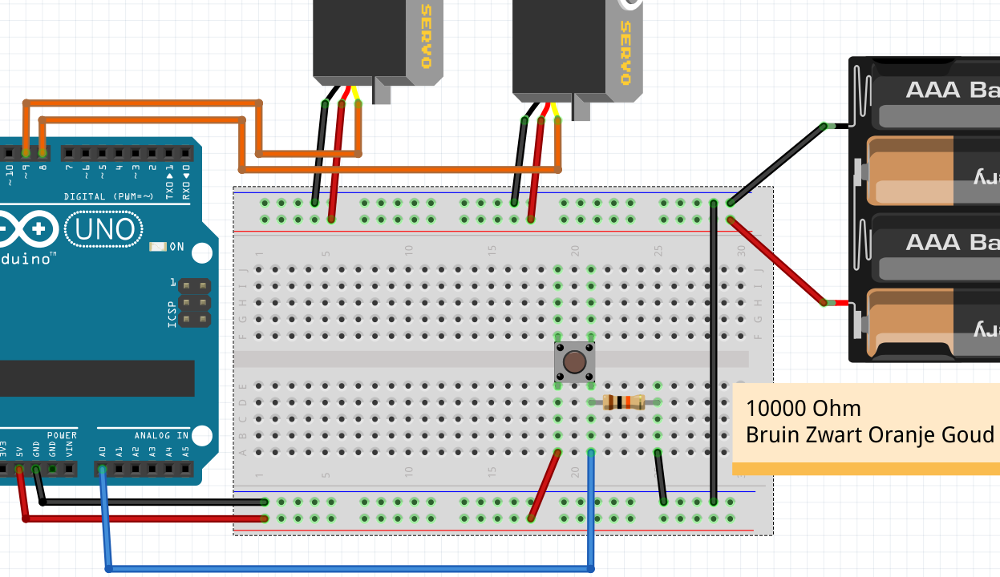

# 3. Meer servo motoren

In deze les gaan we meer servo motoren aansluiten.
Hiervoor hebben we ook batterijen nodig

## Servo motor op batterij met seriele monitor

### Aansluiten

Sluit een servo motor op batterij aan als op figuur 'Servo motor op batterij met seriele monitor'.



De draadjes van de servo hebben misschien andere kleuren:

 * Zwart of bruin: naar `GND`
 * Rood: naar `5V`
 * Geel of oranje: naar `8`

Vergeet niet de GND van de batterijen met de GND van de Arduino te verbinden.

### Code

Dit is dezelfde code als les `ServoSerial`:

```c++
#include <Servo.h>

Servo mijn_servo;

void setup()
{
  Serial.begin(9600);
  mijn_servo.attach(9);
}

void loop()
{
  if (Serial.available())
  {
    const int getal = Serial.parseInt();
    Serial.print("Ik zet de servo op ");
    Serial.println(getal);
    mijn_servo.write(getal);
    delay(1000);
  }
}
```

### Opdracht

 * Vind uit wat de minimum en maximumwaarde is van de servo

## Servo motor op batterij met knop

### Aansluiten

Sluit nu een drukknop erbij aan, zoals figuur 'Servo motor op batterij met knop'.



De weerstand moet tienduizend Ohm zijn: bruin-zwart-orange-goud.

### Code

Met deze code kan de servo op de knop reageren:

```c++
#include <Servo.h>

Servo mijn_servo;

void setup() 
{
  mijn_servo.attach(8);
  pinMode(A0, INPUT);
}

void loop()
{
  if (analogRead(A0) < 512)
  {
    mijn_servo.write(45); //Minimumwaarde
  }
  else
  {
    mijn_servo.write(135); //Maximumwaarde
  }
  delay(100);
}
```

### Opdracht

 * Pas de code zo aan dat de servo perfect beweegt

### Oplossing

Dezelfde code, behalve:

  * de 45 is vervangen door de minimumwaarde van de servo
  * de 135 is vervangen door de maximumwaarde van de servo

## Servo motoren op batterij met knop

### Aansluiten

Sluit nu een extra servo motor, zoals figuur 'Servo motoren op batterij met knop'.



### Opdracht

 1. Vind uit wat de minimum en maximumwaarde is van de nieuwe servo
 2. Pas de code zo aan dat allebij de servo's perfect *tegenovergesteld* bewegen.
    Dus als de knop los is, staat de ene servo op minimum en andere op maximum.
    Als de knop ingedrukt wordt, wisselt dit

### Oplossingen

 1. Dit kan door de eerste code weer te gebruiken. 
    Je kunt in de code de pin van de servo aanpassen, 
    of de servo tijdelijk in de pin van de eerste servo steken
 2. Zie deze code:

```c++
#include <Servo.h>

Servo mijn_servo_1;
Servo mijn_servo_2;

void setup() 
{
  mijn_servo_1.attach(8);
  mijn_servo_2.attach(9);
  pinMode(A0, INPUT);
}

void loop()
{
  if (analogRead(A0) < 512)
  {
    mijn_servo_1.write( 45); //Minimumwaarde 1
    mijn_servo_2.write(125); //Maximumwaarde 2
  }
  else
  {
    mijn_servo_1.write(135); //Maximumwaarde 1
    mijn_servo_2.write( 35); //Minimumwaarde 2
  }
  delay(100);
}
```

## Eindopdracht

Sluit nu een tweede knop aan. 
Als de eerste knop ingedrukt wordt, moet de eerste servo naar maximumstand gaan.
Als *ook* de tweede knop ingedrukt wordt, moet de tweede servo naar maximumstand gaan.


