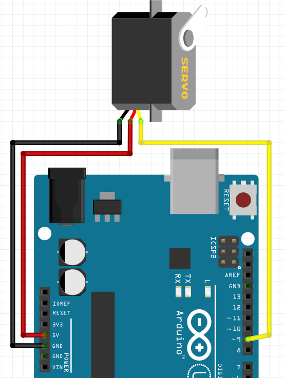

# 3. Servo motor


# Aansluiten



De draadjes van de servo hebben misschien andere kleuren:

 * Zwart of bruin: naar `GND`
 * Rood: naar `5V`
 * Geel of oranje: naar `9`

## Code

Hier is code om de servo heen en weer te laten gaan:

```
#include <Servo.h>

Servo mijn_servo;

void setup()
{
  mijn_servo.attach(9);
}

void loop()
{
  mijn_servo.write(45); // Eerste getal
  delay(1000);
  mijn_servo.write(135); // Tweede getal
  delay(1000);
}
```

## Opdracht

 * Beweegt de servo met deze code? 
 * Verander het eerste en tweede getal volgens onderstaande tabel. Wat zie je gebeuren?

---|---|---|---|---|---
Eerste getal| 45|  0|-45| 90|135|
Tweede getal|135| 90| 45|180|225|

 * Kies twee getallen waarbij de servo heen en weer draait zonder schokken. Kun je de servo verder laten draaien?

## Oplossingen

 * 1. Dit is afhankelijk van de servo: of de servo gaat heen en weer draaien, of de servo gaat schokken
 * 2. Of de servo gaat heen en weer draaien, of de servo gaat schokken
 * 3. Ja, je kunt de servo verder laten draaien. Een servo kan 135 graden draaien


## Eindopdracht


