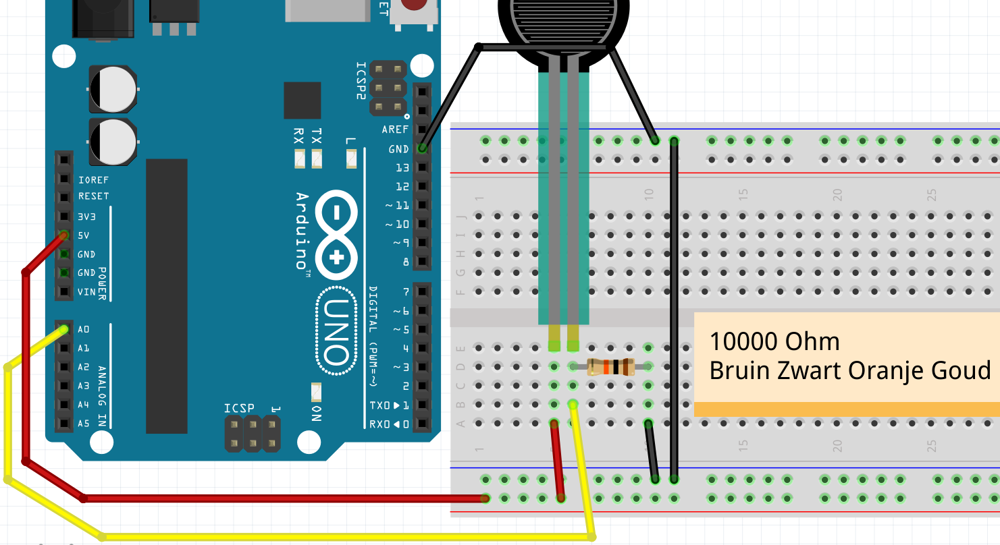
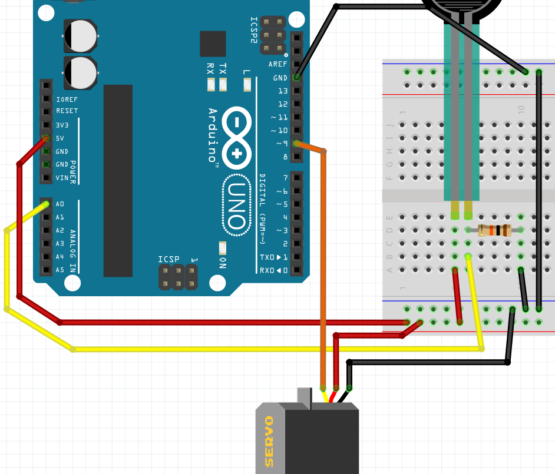

# 4. FSR met servo

In deze les sturen we een servo aan met een FSR.

## Aansluiten FSR zonder servo

Eerst sluiten we alleen een FSR aan:



 | Is er geen FSR? gebruik dan een LDR
:-------------:|:----------------------------------------: 

\pagebreak

## Code: lezen FSR met seriele monitor

Met deze code meten we de waarde van de FSR:

```c++
void setup() 
{
  pinMode(A0, INPUT);
  Serial.begin(9600);
}

void loop()
{
  Serial.println(analogRead(A0));
  delay(100);
}
```

 | Vergeten wat dit doet? Zie les `9. LDR`
:-------------:|:----------------------------------------: 

## Opdrachten 1

 1. Upload het programma. In de Arduino IDE, klik rechtsboven op 'Seriele Monitor'. Wat zie je?
 2. Druk de FSR in met je vingers (of, met een LDR: houd je vinger boven de LDR) 
      terwijl je de seriele monitor bekijkt. Wat zie je?
 3. Verander `Serial.println` naar `Serial.print`. Wat zie je?
 4. Verander de tekst `Serial.begin(9600)` naar `Serial.begin(4800)`. Wat zie je? Waarom?
 5. Haal de draad naar `A0` weg. Ja, haal de draad tussen `A0` en de LDR weg. 
      Kijk op de seriele monitor. Wat zie je?

\pagebreak

## Oplossingen 1

 1. Je ziet een getal van nul tot 1024, afhankelijk van de waarde van de FSR
 2. Je zit de getallen veranderen
 3. Alle getallen komen na elkaar
 4. Nu laat de seriele monitor onleesbare tekst zien. Dit komt omdat de Arduino langzamer tekst
      stuur naar je computer (4800), dan je computer de tekst leest (9600)
 5. Nu zie je het getal willekeurig veranderen. Dit wordt een zwevende input genoemd

## Aansluiten FSR met servo

Nu sluiten we ook een servo aan. Als je wilt spieken: zie figuur 'Aansluiten FSR met servo'.



\pagebreak

### Reageren op FSR

Nu gaan we de servo laten reageren op de FSR:

Gebruik deze code:

```c++
#include <Servo.h>

Servo mijn_servo;

void setup() 
{
  Serial.begin(9600);
  mijn_servo.attach(9);
  pinMode(A0, INPUT);
}

void loop()
{
  mijn_servo.write(
    map(analogRead(A0),0,1024,45,135)
  );
  delay(100);
}
```

 | Vergeten wat dit doet? Zie les `4. Meer Servo Motoren`
:-------------:|:----------------------------------------: 

### Eindopdracht

Zorg dat de servo perfect reageert op de FSR. 
Je zult zelf de minimum en maximumwaarde uit moeten vinden.

