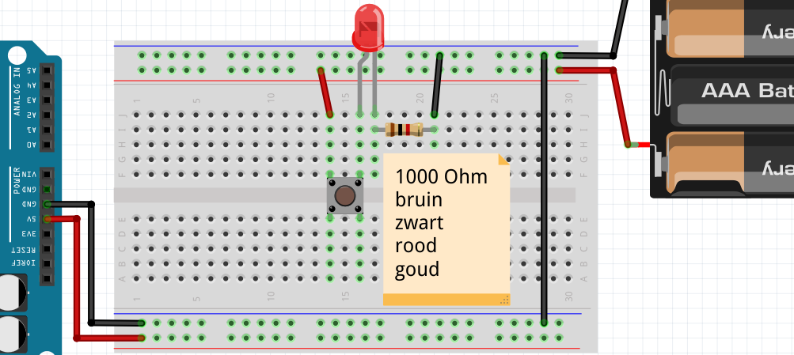
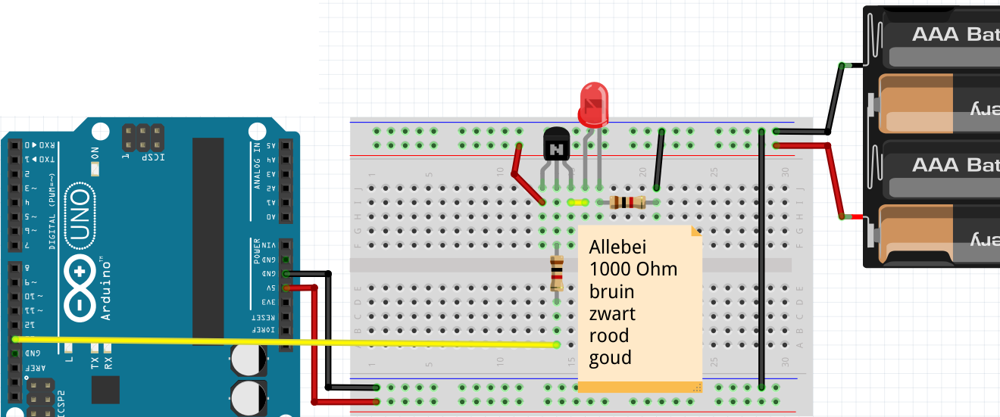
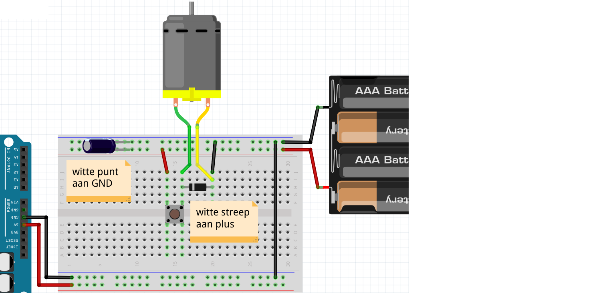
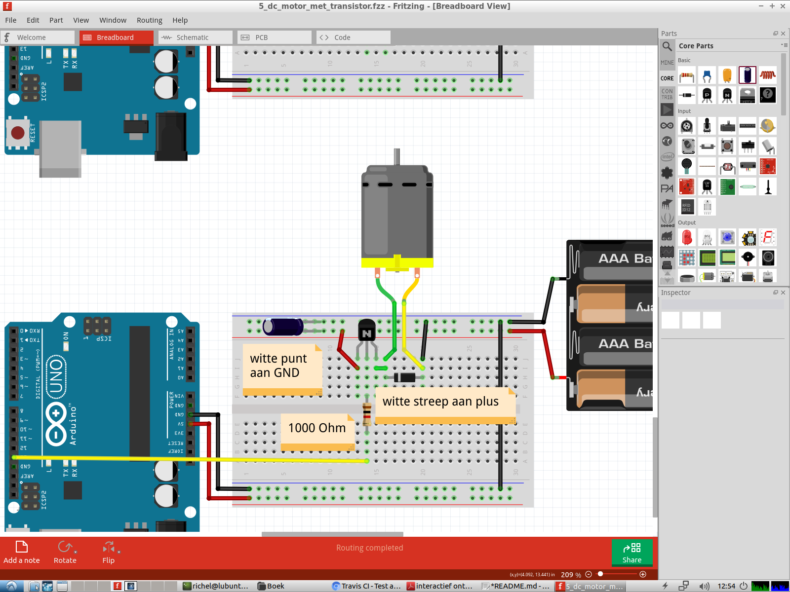

# 5. DC Motor met Transistor

Deze les leren we 

 * wat een transistor is 
 * hoe je een transistor gebruikt 
 * wat een DC motor is
 * hoe je een DC motor gebruikt

## Waarschuwing

Haal deze les *altijd* de USB snoer uit je computer als je een schakeling
aan sluit. Anders gaat de computer misschien stuk.

## LED met drukknop

Haal de USB uit de computer. 
Sluit dan figuur 'LED met drukknop' aan. 
Doe op het eind de USB weer in de computer.

### Vragen

 1. Wat doet deze schakeling?
 2. Wie levert de electriciteit voor het LEDje: de batterijen of de Arduino? Waarom?
 3. Hoe moet je de Arduino programmeren?
 4. Hoe werkt de schakeling?

### Oplossingen

 1. Als je het knopje indrukt, gaat het lampje branden
 2. De batterijen, omdat de plus van de batterijen aangesloten is op de plus van het LEDje
 3. Hoe je de Arduino ook programmeert, de schakeling gedraagt zich altijd hetzelfde
 4. Als je de knop indrukt, kan er stroom gaan lopen door de knop en het LEDje. Daardoor gaat het LEDje branden

## LED met transistor

Een transistor is een soort drukknop.
In plaats dat je een transistor met je vinger indrukt,
zet je er electrische spanning op.
Als er spanning op staat, dan kan er stroom door de transistor.

Haal de USB uit de computer. 
Sluit figuur 'LED met transistor' aan.
Doe op het eind de USB weer in de computer.

Upload de code van 'Blink' op de Arduino.

### Vragen

 1. Wat doet deze schakeling?
 2. Wie levert de electriciteit voor het LEDje: de batterijen of de Arduino? Waarom?
 3. Hoe werkt de schakeling?

### Oplossingen

 1. Als de Arduino spanning op pin 13 zet, gaat het lampje branden
 2. De batterijen, omdat de plus van de batterijen aangesloten is op de plus van het LEDje
 3. Als de Arduino spanning zet op de middelste pin van de transistor, 
    kan er stroom gaan lopen door de transistor (van linker naar rechterpin) en het LEDje. 
    Daardoor gaat het LEDje branden

## DC motor met drukknop

Een DC motor is een motor die beide kanten rond kan draaien. DC is een Engelse
afkorting voor 'Direct Current': gelijkspanning. Daarom wordt een DC motor
ook een gelijkspanningsmotor genoemd. De Arduino, maar ook batterijen, leveren
gelijkspanning.

Er zijn twee nieuwe componenten:

 * Diode (zie figuur 'Diode'): een eenrichtingsweg voor electriciteit
 * Condensator (zie figuur 'Condensator'): een soort batterij die snel op- en ontlaad

Deze componenten zijn nodig omdat een DC motor ook electriciteit kan maken (!).

Haal de USB uit de computer. 
Sluit figuur 'DC motor met drukknop' aan.
Doe op het eind de USB weer in de computer.

### Vragen

 1. Wat doet deze schakeling?
 2. Wie levert de electriciteit voor het LEDje: de batterijen of de Arduino? Waarom?
 3. Hoe moet je de Arduino programmeren?
 4. Hoe werkt de schakeling?

### Oplossingen

 1. Als je het knopje indrukt, gaat het motortje draaien
 2. De batterijen, omdat de plus van de batterijen aangesloten is op de plus van het LEDje
 3. Hoe je de Arduino ook programmeert, de schakeling gedraagt zich altijd hetzelfde
 4. Als je de knop indrukt, kan er stroom gaan lopen door de knop en het motortje. Daardoor gaat het motortje draaien

## DC motor met transistor

Haal de USB uit de computer. 
Sluit figuur 'DC motor met transistor' aan.
Doe op het eind de USB weer in de computer.

Upload de code van 'Blink' op de Arduino.

### Vragen

 1. Wat doet deze schakeling?
 2. Wie levert de electriciteit voor het LEDje: de batterijen of de Arduino? Waarom?
 3. Hoe werkt de schakeling?

### Oplossingen

 1. Als de Arduino spanning op pin 13 zet, gaat het motortje draaien
 2. De batterijen, omdat de plus van de batterijen aangesloten is op de plus van het LEDje
 3. Als de Arduino spanning zet op de middelste pin van de transistor, 
    kan er stroom gaan lopen door de transistor (van linker naar rechterpin) en het motortje. 
    Daardoor gaat het motortje draaien
