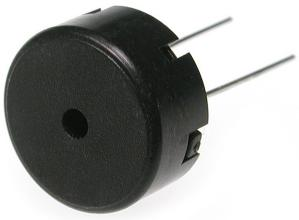

# Muziek tone

In deze les leer je hoe je geluid maakt met de Arduino.
Dit doen we met een piezo (spreek uit: 'pie-jee-zo') speakertje.



## Aansluiten

Zie figuur 'Muziek tone aansluiten' hoe je een piezo aansluit


## Code

```c++
void setup()
{
  pinMode(8, OUTPUT);
}

void loop()
{
  tone(8,220); //A
  delay(900);
  noTone(8);
  delay(100);
}
```

In deze code is nieuw:

 * `tone(8,220)`: speel op pin `8` een toon met toonhoogte 220 Hertz. Dit is de toon `A`.
 * `noTone(8)`: stop met het spelen van een toon op pin `8`

De code laat 900 milliseconden de toon A horen, en heeft dan 100 milliseconden rust. 

## Opdracht

 1. Wat is de laagste toonhoogte die je kunt krijgen? Kan iedereen dit horen?
 2. Wat is de hoogste toonhoogte die je kunt krijgen? Kan iedereen dit horen? Let op: als iemand er last van heeft, doe deze opdracht dan niet

## Oplossing

 1. De laagste toon is 1 Hertz (bij 0 Hertz krijg je onzin). Die kan iedereen nog horen. Hieronder staat de code

```c++
void setup()
{
  pinMode(8, OUTPUT);
}

void loop()
{
  tone(8,1);
  delay(900);
  noTone(8);
  delay(100);
}
```
 
 2. De hoogste toon is 32767 Hertz. Die kan iedereen nog horen. Hieronder staat de code

```c++
void setup()
{
  pinMode(8, OUTPUT);
}

void loop()
{
  tone(8,32767);
  delay(900);
  noTone(8);
  delay(100);
}
```

## Opdracht

We gaan nu muziek maken! Programmeer het volgende liedje:

 * De eerste toon is 131 Herz
 * De tweede toon is 147 Herz
 * De derde toon is 165 Herz
 * De vierde toon is 131 Herz
 * Alle tonen duren 400 milliseconden
 * Na elke toon is er 100 milliseconden stilte

## Oplossing

```c++
void setup()
{
  pinMode(8, OUTPUT);
}

void loop()
{
  tone(8,131); delay(400); noTone(8); delay(100);
  tone(8,147); delay(400); noTone(8); delay(100);
  tone(8,165); delay(400); noTone(8); delay(100);
  tone(8,131); delay(400); noTone(8); delay(100);
}
```

## Eindopdracht 

Maak het liedje iets verder af. Er komen drie tonen bij:

 * De vijfde toon is 165 Herz
 * De zesde toon is 175 Herz
 * De zevende toon is 196 Herz
 * Ook de vijfde en zesde toon duren 400 milliseconden
 * De zevende toon duurt 900 milliseconden
 * Na elke toon is er 100 milliseconden stilte
