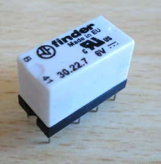

# 7. DC Motor Met Relais

Deze les leren we 

 * wat een relais is
 * hoe je een motor in twee richtingen kunt laten draaien

## Waarschuwing

Haal deze les *altijd* de USB snoer uit je computer als je een schakeling
aan sluit. Anders gaat de computer misschien stuk.

## LED met transistor

Een transistor is een soort drukknop.
In plaats dat je een transistor met je vinger indrukt,
zet je er electrische spanning op.
Als er spanning op staat, dan kan er stroom door de transistor.

Haal de USB uit de computer. 
Sluit figuur 'LED met transistor' aan.
Doe op het eind de USB weer in de computer.

Upload de code van 'Blink' op de Arduino.

### Vragen

 1. Wat doet deze schakeling?
 2. Welke Arduino pin levert de electriciteit voor het LEDje: pin 13 of 5V? Waarom?
 3. Hoe werkt de schakeling?

### Oplossingen

 1. Als de Arduino spanning op pin 13 zet, gaat het lampje branden
 2. De 5V levert de electriciteit voor het lampje: deze gaat de linker pin van de transistor in,
    verder door de rechter pin en dan door het lampje. Pin 13 zorgt er enkel voor dat dat kan.
 3. Als de Arduino spanning zet op de middelste pin van de transistor, 
    kan er stroom gaan lopen door de transistor (van linker naar rechterpin) en het LEDje. 
    Daardoor gaat het LEDje branden

## Relais

Een relais (spreek uit: 'relleh') is, net als een transistor, een soort drukknop, die electronisch
ingedrukt kan worden. Het verschil met de transistor is dat de twee electronische
stromen elkaar nergens tegen komen.

Haal de USB uit de computer. 
Sluit figuur 'Een eenzaam relais' aan.
Doe op het eind de USB weer in de computer.

Upload de code van 'Blink' op de Arduino.

### Vragen

 1. Wat hoor je? Als je niks hoort, heb je de schakeling fout aangesloten!
 2. Welke Arduino pin levert de electriciteit voor het relais: pin 13 of 5V? Waarom?

### Oplossingen

 1. Elke second hoor je een tik
 2. De 5V levert de electriciteit voor het relais: deze gaat de linker pin van de transistor in,
    verder door de rechter pin en dan door het lampje. Pin 13 zorgt er enkel voor dat dat kan.

## Relais met LEDjes

We gaan nu kijken, wat een relais doet.

Haal de USB uit de computer. 
Sluit figuur 'Relais met LEDs' aan.
Doe op het eind de USB weer in de computer.

Upload de code van 'Blink' op de Arduino.

### Vragen

 1. Wat zie je?
 2. Welke Arduino pin levert de electriciteit voor het LEDs: pin 13 of 5V? Waarom?
 3. Hoe kan het dat er maar een weerstand nodig is voor twee LEDjes?

### Oplossingen

 1. Elke second hoor je een tik en gaat een andere kleur LED branden
 2. De 5V levert de electriciteit voor de LEDs: deze gaat de tweede pin van het relais in,
    en komt dan uit de derde of vierde pin
 3. Omdat er stroom komt uit *of* de derde *of* de vierde pin, gaat er altijd precies een LEDje
    branden. Dan is een weerstand genoeg

## Relais met DC motor

Nu komt de magie!

Haal de USB uit de computer. 
Sluit figuur 'Relais met DC motor' aan.
Doe op het eind de USB weer in de computer.

Upload de code van 'Blink' op de Arduino.

### Vragen

 1. Wat zie je?
 

 2. Figuur 'Werking' laat zien hoe het kan dat de motor steeds een andere
    kant op gaat. Probeer jezelf uit te leggen hoe het werkt

### Oplossingen

 1. De motor gaat een seconde de eene kant op, dan een seconde de andere kant
 2. Als de relais aan staat, zijn de relaispinnen 2-3 en 6-7 verbonden. Is de relais
    uit, dan is 2-4 en 6-8 verbonden. Als je de draden volgt, zie je hierdoor dat de eene
    keer de linker kant van de motor op de plus komt, de andere keer op de min kant

## Eindopdracht

 * Laat de motor reageren op een LDR: als er geen licht is, moet de motor linksom draaien, anders rechtsom
