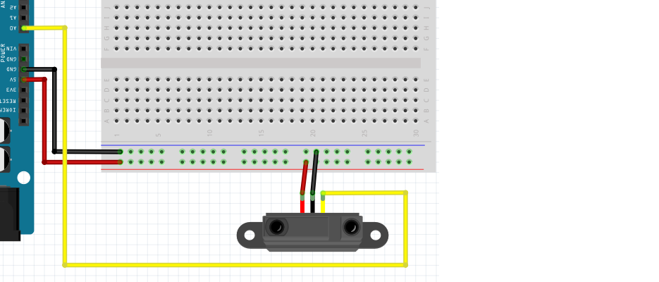
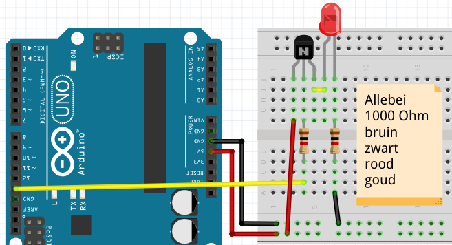
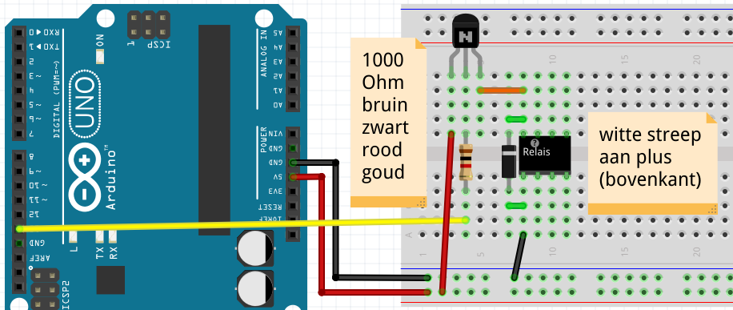
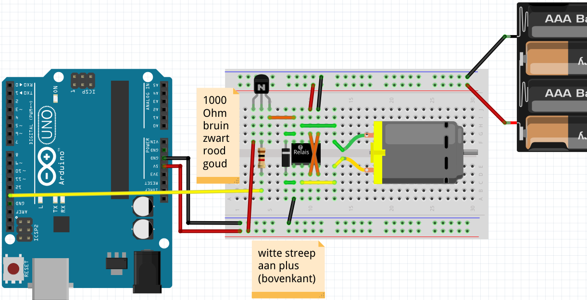
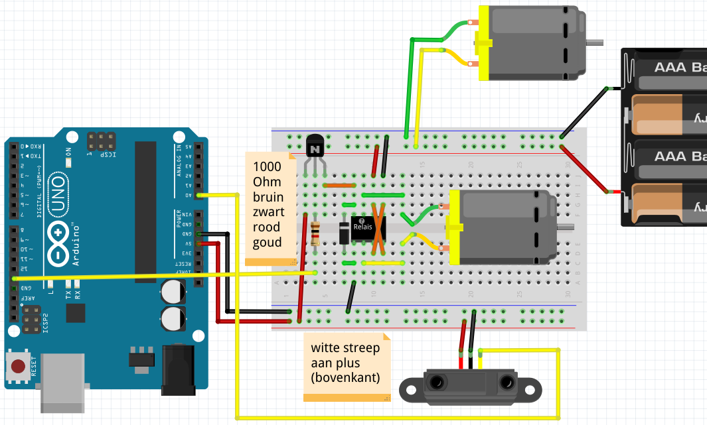

# 8. Infrarood Sensor Obstakel Ontwijkend Object

Deze les leren we 

 * hoe je een autootje maakt die dingen ontwijkt

## Waarschuwing


Haal deze les *altijd* de USB snoer uit je computer als je een schakeling
aan sluit. Anders gaat de computer misschien stuk.

## Infrarood Sensor



Sluit figuur 'Infrarood sensor' aan.

## Vragen

 1. Welke code moet je op de Arduino zetten?
 2. Hoe weet je dat het gelukt is?
 3. Worden de getallen hoog of laag als je dichterbij komt?

## Oplossing

 1. Code van de lessen met een sensor, bijvoorbeeld onderstaande code van les '4. FSR':

```c++
void setup() 
{
  pinMode(A0, INPUT);
  Serial.begin(9600);
}

void loop()
{
  Serial.println(analogRead(A0));
  delay(100);
}
```

 2. Als de sensorwaarde duidelijk reageert op een hand die ervoor heen en weer wordt bewogen
 3. Hoe dichterbij je komt, hoe lager de getallen worden

## LED met transistor

Een transistor is een soort drukknop.
In plaats dat je een transistor met je vinger indrukt,
zet je er electrische spanning op.
Als er spanning op staat, dan kan er stroom door de transistor.



Haal de USB uit de computer. 
Sluit figuur 'LED met transistor' aan.
Doe op het eind de USB weer in de computer.

Upload de code van 'Blink' op de Arduino.

### Vragen

 1. Hoe weet je dat dit gelukt is?

### Oplossingen

 1. Als de LED knippert

## Relais



Haal de USB uit de computer. 
Sluit figuur 'Een eenzaam relais' aan.
Doe op het eind de USB weer in de computer.

Upload de code van 'Blink' op de Arduino.

### Vragen

 1. Hoe weet je dat dit gelukt is?

### Oplossingen

 1. Als je elke second een tik hoort

## Relais met DC motor



Haal de USB uit de computer. 
Sluit figuur 'Relais met DC motor' aan.
Doe op het eind de USB weer in de computer.

Upload de code van 'Blink' op de Arduino.

### Vragen

 1. Hoe weet je dat dit gelukt is?

### Oplossingen

 1. Als de motor elke second van richting verandert

## Eindopdracht



 * Maak de schakeling af, volgens figuur 'Eindopdracht'
 * Programmeer de code zelf: als er niks voor de sensor zit, moet de auto vooruit gaan. Anders moet de auto draaien

