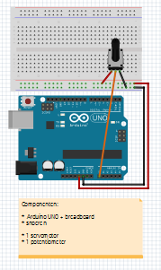

# Arduino en Processing

In de les leren we hoe een Arduino 
laten praten met Processing.

Dit gaat in twee stappen:

 * De Arduino moet praten met je computer
 * Processing moet iets doen met dit gepraat

## De Arduino laten praten

We gaan de Arduino laten zeggen wat de stand
is van een potmeter.

Zo sluit je de potmeter aan:



Dit zijn de aansluitingen:

 * `5V`: de vijf volt pin moet naar de ene kant van de potmeter
 * `GND`: de aarde moet naar de andere kant van de potmeter
 * `A0`: afhankelijk van de stand van de potmeter, komt er nul tot vijf volt op `A0` te staan

Dit is de code voor op je Arduino:

```
void setup() 
{
  Serial.begin(9600);
}

void loop() 
{
  Serial.write(analogRead(A0) / 4);
  delay(10);
}
```

De zin 'praten met de computer' is nu niet meer precies genoeg. 
Beter is om te zeggen dat de Arduino tekens doorstuurt via
de seriele kabel (in dit geval: via je USB kabel).  

Dit doet de code:

 * `void setup() {}`: de `setup` functie is een functie die een keer wordt gedaan bij het opstarten. Wat er gebeurt staat tussen de accolades
 * `Serial.begin(9600)`: de Arduino zal 9600 karakters per seconde doorsturen door de seriele kabel
 * `void loop() {}`: de `loop` functie is een functie die de hele tijd wordt gedaan na het opstarten. Wat er gebeurt staat tussen de accolades
 * `Serial.write(analogRead(A0) / 4)`: dit doe ik in stukjes:
    * `Serial.write()`: stuur een teken naar de seriele kabel
    * `analogRead(A0)`: meet de spanning op pin `A0`. Een spanning van 5 volt wordt het getal `1023`   
    * `analogRead(A0) / 4`: meet de spanning op pin `A0` en deel deze door vier. Een spanning van 5 volt wordt hierdoor getal `255`, dit is een handig getal om in Processing te gebruiken.   
    * `Serial.write(analogRead(A0) / 4)`: meet de spanning op pin `A0`, deel deze door vier en stuur dat getal door de seriele kabel 
 * `delay(10)`: wacht tien milliseconden

## Opdrachten

 * Sluit het stroomschema zoals het plaatje
 * Zet de code op je Arduino
 * Start de code en klink op de `Serial Monitor` knop rechtsboven. Wat zie je? Zorg dat de Arduino de voorletter van je voornaam doorstuurt
 * Als je niets ziet, kijk dan of de het getal rechtsonder in de Serial Monitor wel op `9600` staat!

## Processing laten luisteren

Als je nog geen Processing hebt, download het dan [hier!](https://processing.org/download)

Dit is de code voor Processing:

```
import processing.serial.*;
Serial poort;

void setup(){
  println(Serial.list());
  poort = new Serial(this, Serial.list()[0], 9600);
}

void draw(){

}
```
