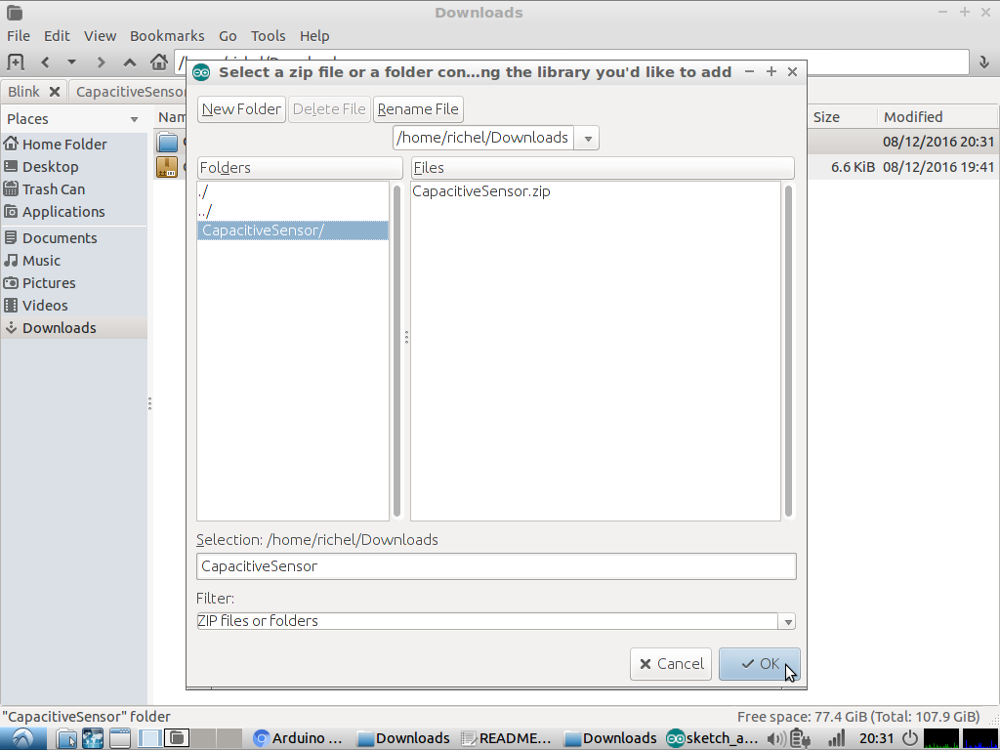
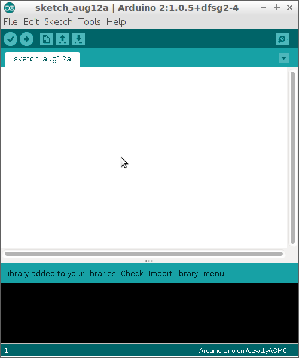

# Capacitatieve sensoren

Als je wilt dat je Arduino reageert op aanraking,
kun je een drukknop gebruiken. Maar misschien zoek
je wel iets (nog) simpelers. Dan maak je een
capacitatieve sensor, met twee weerstandjes.

## Stroomschema


Om een capacitatieve sensor te maken heb je twee
weerstandjes nodig:

 * Duizend Ohm (bruin, zwart, rood, goud)
 * Een miljoen Ohm (bruin, zwart, groen, goud)

Tussen de twee weerstanden in kun je drukken en dan 
merkt de Arduino dat. Op het stroomschema staat er
een weerstand van nul Ohm getekent.

## Voorbereiden

Om de code te kunnen laten werken, heb je een bibliotheek nodig.
In het Engels heet dat een bibliotheek een 'library'.
De bibliotheek die je nodig hebt heet 'CapacitiveSensor'.
Je kunt de bibliotheek vinden door te Googlen op `Arduino Capacitive Sensing Library`.
De pagina die je nodig hebt is van [Arduino Playground](http://playground.arduino.cc/Main/CapacitiveSensor?from=Main.CapSense). 

 * Download de bibliotheek. Dit is een `.zip` bestand. Bij mij heet deze `arduino-libraries-CapacitiveSensor-0.5-0-g7684dff.zip`, maar het kan ook iets anders zijn
 * Ga naar de Downloads folder
 * Pak het bestand uit: klik op het bestand met de recht muisknop en kies 'Alles uitpakken' 
   (of iets dergelijks). Je krijgt een dan folder met een naam als 
   `arduino-libraries-CapacitiveSensor-0.5-0-g7684dff`
 * Verander de naam van de folder naar `CapacitiveSensor`
 * Klik in de Arduino IDE op `Sketch | Import Library | Add Library`


 * Klik op de *folder* en op OK



 * Nu is de bibliotheek geinstalleerd:



## Code

Als de bibliotheek is geinstalleerd, kunnen we een capacitatieve sensor maken:

```
#include <CapacitiveSensor.h>

/*
  2                             4 
  |  +--------+     +--------+  |
  +--+ R1     +--+--+ R2     +--+
     +--------+  |  +--------+ 
                 X          

  
  2: Arduino pin 2, de sensor pin
  4: Arduino pin 4, de hulp pin
  R1: weerstand van duizend Ohm (bruin-zwart-rood-goud)
  R2: weerstand van minstens een miljoen Ohm (bruin-zwart-groen-goud)
  X: Hier kun je de draad aanraken
 
*/

const int pin_sensor = 2;
const int pin_hulp   = 4;
const int pin_led    = 13;

CapacitiveSensor mijn_cap_sensor = CapacitiveSensor(pin_hulp,pin_sensor);        

void setup()                    
{
  pinMode(pin_led,OUTPUT);
  Serial.begin(9600);
}

void loop()                    
{
  //Hoe hoger 'samples', hoe nauwkeuriger de sensor meet
  const int samples = 30;

  //Meet de waarde van de sensor
  const int waarde = mijn_cap_sensor.capacitiveSensor(samples);

  //Laat de waarde zien in de Serial Monitor
  Serial.println(waarde);

  //De drempelwaarde bepaalt wanneer het programma denkt dat je de sensor aanraakt
  // - te laag: dan zal het programma vaker denken dat je de sensor aanraakt, terwijl je dat niet doet
  // - te hoog: dan zal het programma minder vaak denken dat je de sensor aanraakt, terwijl je dat wel doet
  const int drempelwaarde = 100;
  
  //Als je de sensor aanraakt, gaat het LEDje op pin 'pin_led' branden
  digitalWrite(pin_led,waarde >= drempelwaarde ? HIGH : LOW);

  delay(100);
}
```

Dit is wat alles betekent:

 * `const int pin_sensor = 2`: Hiermee zeg je: 'Lieve Arduino, onthoudt een heel getal (`int`). Ik noem dat hele getal `pin_sensor`. De begin waarde van `pin_sensor` is twee. `pin_sensor` kan niet veranderen (`const`)'
 * `const int pin_hulp = 4`: Hiermee zeg je: 'Lieve Arduino, onthoudt een heel getal (`int`). Ik noem dat hele getal `pin_hulp`. De begin waarde van `pin_hulp` is vier. `pin_hulp` kan niet veranderen (`const`)'
 * `const int pin_led = 13`: Hiermee zeg je: 'Lieve Arduino, onthoudt een heel getal (`int`). Ik noem dat hele getal `pin_led`. De begin waarde van `pin_led` is dertien. `pin_led` kan niet veranderen (`const`)'
 * `CapacitiveSensor mijn_cap_sensor = CapacitiveSensor(pin_hulp,pin_sensor)`: Hiermee zeg je: 'Lieve Arduino, onthoudt een CapacitiveSensor. Ik noem die CapacitiveSensor `mijn_cap_sensor`. De begin waarde van `mijn_cap_sensor` is `CapacitiveSensor(pin_hulp,pin_sensor)`'.
 * `void setup() {}`: de `setup` function zorgt ervoor dat alles tussen de accolades (`{` en `}`) een keer gedaan wordt
 * `pinMode(pin_led, OUTPUT)`: 'Lieve Arduino, het soort pin (`pinMode`) dat `pin_led` is, is een uitgang (`OUTPUT`)'	
 * `Serial.begin(9600)`: 'Lieve Arduino, praat met een snelheid van 9600 tekens per seconde met de seriele monitor'
 * `void loop() {}`: de `function` function zorgt ervoor dat alles tussen de accolades (`{` en `}`) de rest van de tijd herhaald wordt
 * `const int samples = 30`: Hiermee zeg je: 'Lieve Arduino, onthoudt een heel getal (`int`). Ik noem dat hele getal `samples`. De begin waarde van `samples` is dertig. `samples` kan niet veranderen (`const`)'
 * `const int waarde = mijn_cap_sensor.capacitiveSensor(samples)`: Hiermee zeg je: 'Lieve Arduino, onthoudt een heel getal (`int`). Ik noem dat hele getal `waarde`. De begin waarde van `waarde` is wat je leest uit de capacitatieve sensort (`mijn_cap_sensor.capacitiveSensor(samples)`). `waarde` kan niet veranderen (`const`)'
 * `Serial.println(waarde)`: 'Lieve Arduino, laat de waarde van `waarde` op de seriele monitor zien'
 * `const int drempelwaarde = 100`: Hiermee zeg je: 'Lieve Arduino, onthoudt een heel getal (`int`). Ik noem dat hele getal `drempelwaarde`. De begin waarde van `drempelwaarde` is honderd. `drempelwaarde` kan niet veranderen (`const`)'
 * `digitalWrite(pin_led,waarde >= drempelwaarde ? HIGH : LOW)`: 'Lieve Arduino, schrijf een `HIGH` of `LOW` (`digitalWrite`) naar de pin `pin_led`. Als `waarde` groter of gelijk is (`>=`) als  `drempelwaarde`, dan is dat `HIGH`, anders is het `LOW`'
 * `delay(100)`: 'Lieve Arduino, je mag honderd milliseconden wachten'

## Vragen

 * Bouw het schema en opload de code. Test de machine. Wat doet de machine?
 * In de code, verander de waarde van `drempelwaarde`. Wat gebeurt er?
 * In de code, verander de waarde van `samples`. Wat gebeurt er?
 * Vervang de weerstand van een miljoen Ohm door een weerstand van tien miljoen Ohm (bruin, zwart, blauw, goud). Wat doet de machine anders? Wat is nu een goede waarde voor `drempelwaarde` en `samples`?
 * Haal de adapter uit je laptop. Wat doet de machine?

## Verder

Je zou nu kunnen doen:

 * [Capacitatieve sensoren 2](../CapacitatieveSensoren2/README.md)


