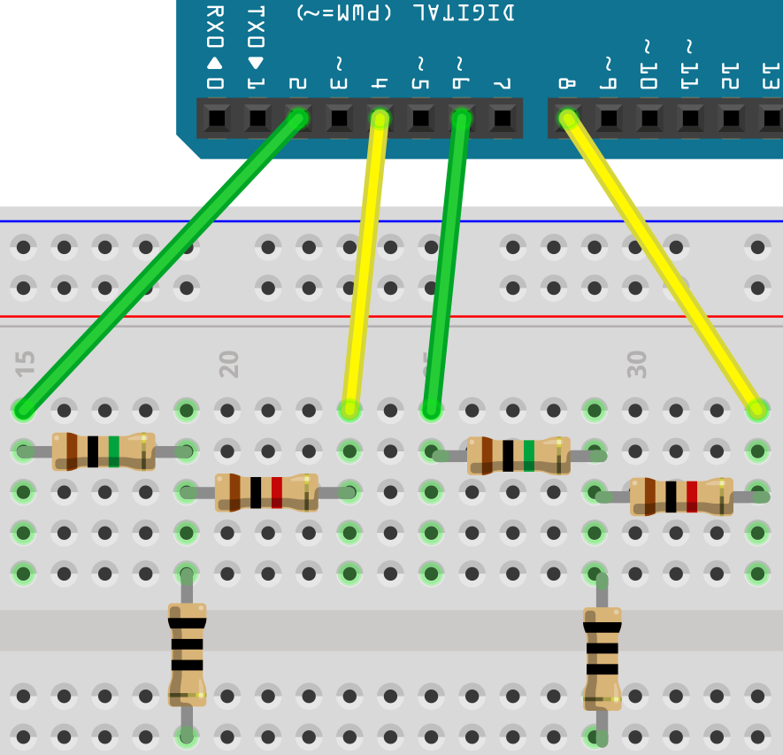
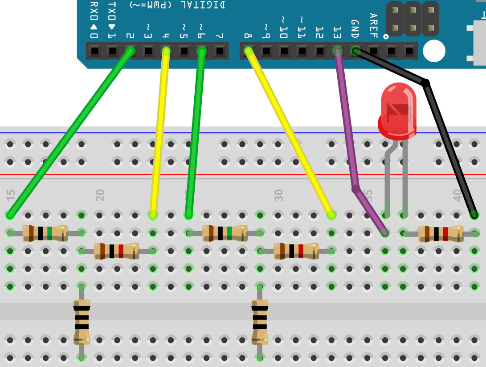
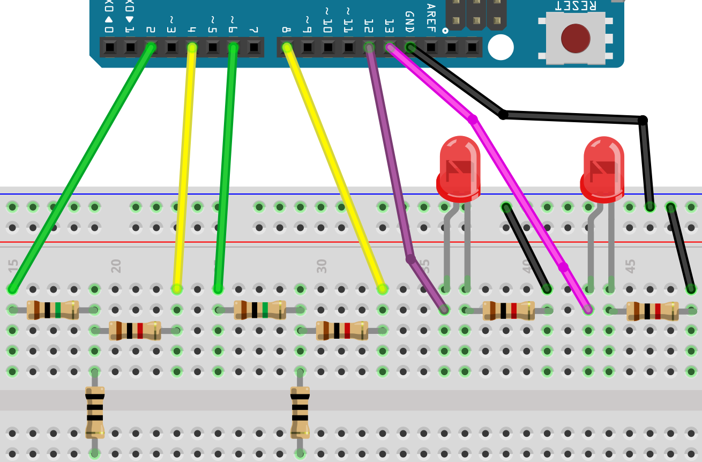
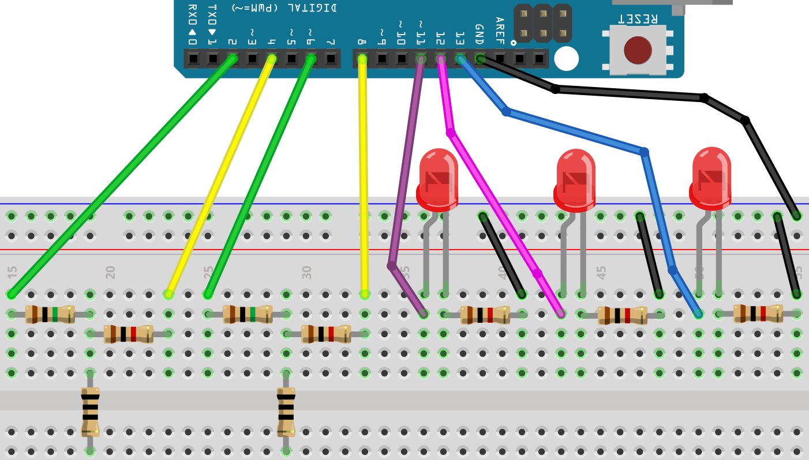

# Capacitieve sensoren les 2

Als je meerdere capacitieve sensoren aan wilt sluiten,
kun je twee pinnen per sensor gebruiken.

In deze les gaan we dat doen.

## Opdracht

Sluit een capacitive sensoren aan:



Nu kunnen we de capacitieve sensoren uitlezen:

```c++
#include <CapacitiveSensor.h>

const int pin_sensor_1 = 2;
const int pin_hulp_1   = 4;
const int pin_sensor_2 = 6;
const int pin_hulp_2   = 8;

CapacitiveSensor mijn_cap_sensor_1 = CapacitiveSensor(pin_hulp_1, pin_sensor_1);        
CapacitiveSensor mijn_cap_sensor_2 = CapacitiveSensor(pin_hulp_2, pin_sensor_2);        

void setup()                    
{
  Serial.begin(9600);
}

void loop()                    
{
  const int aantal_metingen = 30;
  const int waarde_1 = mijn_cap_sensor_1.capacitiveSensor(aantal_metingen);
  const int waarde_2 = mijn_cap_sensor_2.capacitiveSensor(aantal_metingen);

  Serial.print("1: ");
  Serial.print(waarde_1);
  Serial.print(", 2: ");
  Serial.println(waarde_2);
  delay(100);
}
```

\pagebreak

Sluit de capacitieve sensoren aan en upload de code. Bekijk de Seriele Monitor.
Controleer dat alles werkt.

\pagebreak

## Opdracht 1

Sluit een LEDje aan, dat aan gaat als je de linker knop indrukt

## Oplossing 1



```c++
#include <CapacitiveSensor.h>

const int pin_sensor_1 = 2;
const int pin_hulp_1   = 4;
const int pin_sensor_2 = 6;
const int pin_hulp_2   = 8;
const int pin_led      = 13;
CapacitiveSensor mijn_cap_sensor_1 = CapacitiveSensor(pin_hulp_1, pin_sensor_1);        
CapacitiveSensor mijn_cap_sensor_2 = CapacitiveSensor(pin_hulp_2, pin_sensor_2);        

void setup()                    
{
  pinMode(pin_led, OUTPUT);
}

void loop()                    
{
  const int aantal_metingen = 30;
  const int waarde_1 = mijn_cap_sensor_1.capacitiveSensor(aantal_metingen);
  const int waarde_2 = mijn_cap_sensor_2.capacitiveSensor(aantal_metingen);

  if (waarde_1 > 50)
  {
    digitalWrite(pin_led, HIGH);
  }
  else
  {
    digitalWrite(pin_led, LOW);
  }
  delay(100);
}
```

## Opdracht 2

Sluit een tweede LEDje aan, dat aan gaat als je de rechter knop indrukt

## Oplossing 2



```c++
#include <CapacitiveSensor.h>

const int pin_sensor_1 = 2;
const int pin_hulp_1   = 4;
const int pin_sensor_2 = 6;
const int pin_hulp_2   = 8;
const int pin_led_1    = 12;
const int pin_led_2    = 13;
CapacitiveSensor mijn_cap_sensor_1 = CapacitiveSensor(pin_hulp_1, pin_sensor_1);        
CapacitiveSensor mijn_cap_sensor_2 = CapacitiveSensor(pin_hulp_2, pin_sensor_2);        

void setup()                    
{
  pinMode(pin_led_1, OUTPUT);
  pinMode(pin_led_2, OUTPUT);
}

void loop()                    
{
  const int aantal_metingen = 30;
  const int waarde_1 = mijn_cap_sensor_1.capacitiveSensor(aantal_metingen);
  const int waarde_2 = mijn_cap_sensor_2.capacitiveSensor(aantal_metingen);

  if (waarde_1 > 50)
  {
    digitalWrite(pin_led_1, HIGH);
  }
  else
  {
    digitalWrite(pin_led_1, LOW);
  }
  if (waarde_2 > 50)
  {
    digitalWrite(pin_led_2, HIGH);
  }
  else
  {
    digitalWrite(pin_led_2, LOW);
  }
  delay(100);
}
```

## Opdracht 3

Sluit een derde LEDje aan.
Nu brand er maar een LEDje tegelijk.
Als je op de rechter knop drukt, gaat de LED rechts van de huidige branden.
Het licht gaat rond: brandt de rechter LED en druk je op rechts, dan gaat de linker LED branden.

Tips:

Maak helemaal bovenaan een extra variabele aan:

```c++
int welke_led = 1;
```

(1 is de linker LED, 2 de middelse, 3 de rechter)

Laat de juiste LED branden:

```c++
if (welke_led == 1)
{
  digitalWrite(pin_led_1, HIGH);
}
```

Als op de rechter knop wordt gedrukt, wordt `welke_led` een hoger:

```c++
if (waarde_2 > 50)
{
  welke_led = welke_led + 1;
}
```

Als `welke_led` vier wordt, zet `welke_led` dan terug naar een:

```c++ 
if (welke_led == 4)
{
  welke_led = 1;
}
```


## Oplossing 3



```c++
#include <CapacitiveSensor.h>

const int pin_sensor = 6;
const int pin_hulp   = 8;
const int pin_led_1  = 11;
const int pin_led_2  = 12;
const int pin_led_3  = 13;
CapacitiveSensor mijn_cap_sensor = CapacitiveSensor(pin_hulp, pin_sensor);        
int welke_led = 1;

void setup()                    
{
  pinMode(pin_led_1, OUTPUT);
  pinMode(pin_led_2, OUTPUT);
  pinMode(pin_led_3, OUTPUT);
}

void loop()                    
{
  const int aantal_metingen = 30;
  const int waarde = mijn_cap_sensor.capacitiveSensor(aantal_metingen);
  if (waarde > 50)
  {
    welke_led = welke_led + 1;
  }
  if (welke_led == 4)
  {
    welke_led = 1;  
  }
  digitalWrite(pin_led_1, LOW);
  digitalWrite(pin_led_2, LOW);
  digitalWrite(pin_led_3, LOW);
  if (welke_led == 1)
  {
    digitalWrite(pin_led_1, HIGH);
  }
  if (welke_led == 2)
  {
    digitalWrite(pin_led_2, HIGH);
  }
  if (welke_led == 3)
  {
    digitalWrite(pin_led_3, HIGH);
  }
  delay(100);
}
```

## Eindopdracht

 * Laat het brandende LEDje nu de andere kant op lopen met de linker knop

