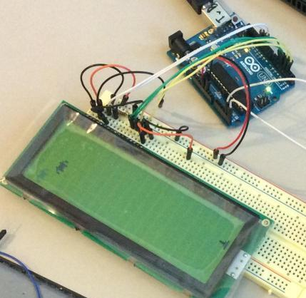
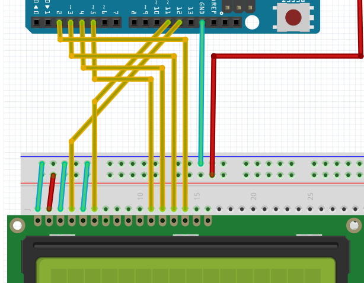

# LCD les 1

Een LCD is een onderdeel om iets te tonen, zoals letters en symbolen. 
LCD betekent 'Liquid Crystal Display', dit is Engels voor 'Vloeibare Kristallen Scherm'



## Aansluiten LCD

Een LCD scherm aansluiten kan op meer manieren:

Manier|Contrast instelbaar?|Met backlight?
---|---|---
1|Nee|Nee
2|Ja|Nee
3|Nee|Ja
4|Ja|Ja

### Manier 1

Dit is de simpelste manier:



Als je de letters niet kunt zien, moet je misschien toch het contrast in kunnen stellen (manier 2), 
of de backlight aansluiten (manier 3), of beide.

### Manier 2

Hier kun je het contrast instellen met een potmeter.


Als je de letters niet kunt zien, moet je toch de backlight aansluiten (manier 4).

### Manier 3

Hier geef je de backlight spanning.


Als je de letters niet kunt zien, moet je toch ook het contrast in kunnen stellen (manier 4).

### Manier 4

Deze manier doet het altijd


## Een LCD programmeren

Er zijn veel voorbeeldprogramma's in de Arduino IDE, onder `File | Examples | LiquidCrystal`. 

### `Hello World`

De gemakkelijkste is `File | Examples | LiquidCrystal | HelloWorld`:

```
#include <LiquidCrystal.h>

LiquidCrystal lcd(12, 11, 5, 4, 3, 2);

void setup() {
  lcd.begin(16, 2);
  lcd.print("hello, world!");
}

void loop() {
  lcd.setCursor(0, 1);
  lcd.print(millis()/1000);
}
```

Hiermee kun je tekst op het scherm krijgen.

### CustomCharacter

Een moeilijkere is `File | Examples | LiquidCrystal | CustomCharacter`:

```
#include <LiquidCrystal.h>

LiquidCrystal lcd(12, 11, 5, 4, 3, 2);

byte heart[8] = {
  0b00000,
  0b01010,
  0b11111,
  0b11111,
  0b11111,
  0b01110,
  0b00100,
  0b00000
};

byte smiley[8] = {
  0b00000,
  0b00000,
  0b01010,
  0b00000,
  0b00000,
  0b10001,
  0b01110,
  0b00000
};


void setup() {
  lcd.createChar(1, heart);
  lcd.createChar(2, smiley);
  lcd.begin(16, 2);
  lcd.print("I "); 
  lcd.write(1);
  lcd.print(" Arduino! ");
  lcd.write(2);

}

void loop() {}
```

Hiermee kun je je eigen figuren op het scherm krijgen.

## Oefeningen

 * Sluit een LCD aan
 * Zet het programma 'Hello World' op de Arduino
   * Wat doet `LiquidCrystal lcd(12, 11, 5, 4, 3, 2)`? Tip: naar welke pinnen gaan je draadjes?
   * Wat doet `lcd.begin(16, 2)`? Tip: hoeveel rechthoekjes zitten er op je LCD?
   * Wat doet `lcd.print("hello, world!")`? Tip: probeer eens `lcd.print("Richel is top")`
   * Wat doet `lcd.setCursor(0, 1)`? Tip: zet het eerste getal eens op `1`, zet het tweede getal maar eens op `0`
   * Wat doet `lcd.print(millis()/1000)`? Tip: doe eens `lcd.print(millis())`
   * Maak zelf een leuke tekst
 * Zet het programma `CustomCharacter` op de Arduino
   * Kijk eens goed naar de nulletjes en eentjes van `byte heart`. 'heart' is Engels voor 'hart'. Wat betekenen die nulletjes en eentjes?
   * Wat doet `lcd.createChar(1, heart)`? Tip: dit werkt samen met `lcd.write(1)`
   * Wat doet `lcd.createChar(2, smiley)`? Tip: dit werkt samen met `lcd.write(2)`
   * Maak zelf iets leuks met een eigen figuurtje