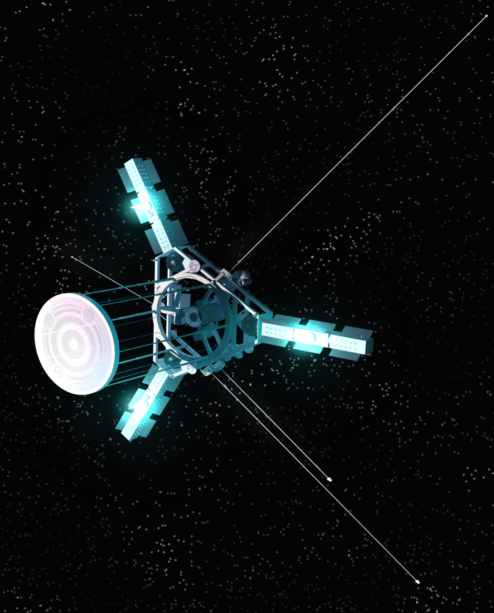
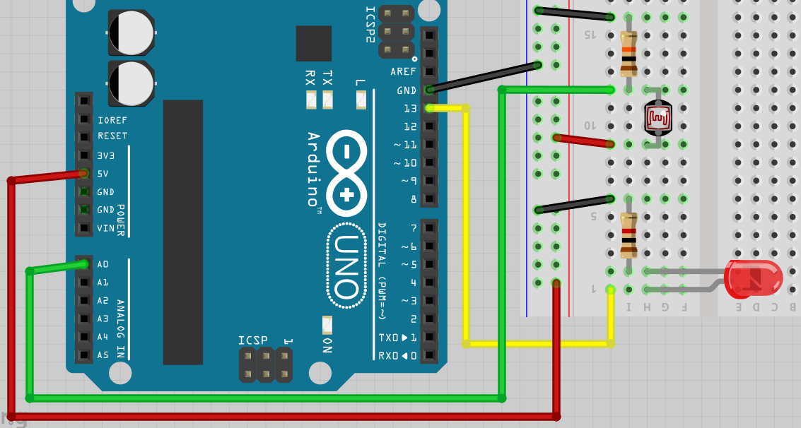

# Laser

In deze les gaan we een laser aansluiten en gebruiken

## Veiligheid


Op de cursus hebben we een categorie 2 laser. Deze is
veilig als je niet expres in de laser kijkt.

 | Kijk nooit in de laser.
:-------------:|:----------------------------------------: 

## Extra opdracht: welke weerstand?

Onze laser heeft 3 volt en 50 milli-Ampere nodig. Een Arduino levert
5 volt. Welk weerstandje moet in serie met de laser staan?

Formules:

```
U: Spanning, in volt
I: Stroom, in Ampere
R: Weerstand, in Ohm

R = U/I
```

## Oplossing: welke weerstand? 

De laser en weerstand samen zullen 5 volt moeten worden.
De laser gebruikt 3 volt, dus de weerstand zal 2 volt geen krijgen.

Door de laser en weerstand gaat dezelfde hoeveelheid stroom.
De weerstand krigt dus een stroom van 50 milli-Ampere.

Omdat `R = U/I`, en `U = 2 V` en `I = 0.050 Ampere`, 
dus `R = 2 / 0.050 = 40 Ohm` 

## Een laser aansluiten

Sluit een laser zo aan:


 | Zorg dat de laser niet ver kan schijnen.
:-------------:|:----------------------------------------: 

## Opdracht

Sluit de laser aan en laat deze knipperen

## Communicatie

In de ruimte worden (ook) lasers gebruikt, om gegevens te versturen.



## Opdracht: ontvanger bouwen

Sluit een tweede Arduino aan met een LDR en rood LEDje. 
Als de laser op de LDR schijnt, moet het LEDje gaan branden.

## Oplossing: ontvanger bouwen



```c++
void setup()
{
  pinMode(A0, INPUT);
  pinMode(13, OUTPUT);
  Serial.begin(9600);  
}

void loop()
{
  const int n = analogRead(A0);
  Serial.println(n);
  digitalWrite(13, n > 150 ? LOW : HIGH);  
  delay(100);
}
```

## Eindopdracht


