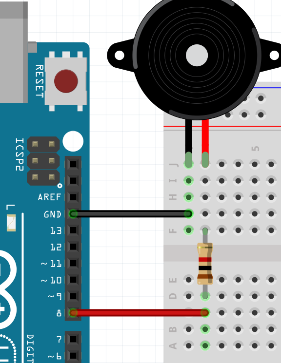

# Piano lessen

De piano is een bekend muziekinstrument.
Je kunt veel liedjes spelen op de piano.
In deze les gaan we pianomuziek laten horen op de Arduino.

## Piezo aansluiten

Om muziek te maken hebben we een piezo (zeg: 'pie-jee-zoo') nodig.
Deze is gemakkelijk aan te sluiten:



Het weerstandje is duizend Ohm, met bandjes bruin-zwart-rood-goud.
Als de piezo te hard staat, kies dan een weerstandje van tienduizend Ohm, 
met bandjes bruin-zwart-oranje-goud.

## Vader Jacob

Hier zie je de bladmuziek van Vader Jacob:


Om deze muziek op de Arduino te zetten, moeten we weten hoe we bladmuziek kunnen lezen.

Hier zie je een plaatje van een piano:


Dit plaatje laat meerdere dingen zien:

 * Waar de toetsen van een piano zitten
 * Welke muzieknoot van bladmuziek bij elke toets hoort
 * Welke frequentie bij elke muzieknoot hoort

De toonhoogte van een muzieknoot wordt bepaalt door de frequentie.
De frequentie van een muzieknoot is hoe snel de lucht trilt.
Hoge tonen hebben een hoge frequentie.
Lage tonen hebben een lage frequentie.

De Arduino werkt met frequenties.

De eerste noot van Vader Jacob is de laagste noot op de piano van het plaatje.
Er staat het getal `131` bij. Om die noot op de Arduino af te spelen:

```
void setup() 
{
  pinMode(8, OUTPUT);
  tone(8, 131, 1000);
  delay(1000);
}

void loop() {}
```

## Erkenningen

 * [C_major_scale_letter_notation.png](C_major_scale_letter_notation.png) by Hyacinth at the English language Wikipedia, CC BY-SA 3.0, https://commons.wikimedia.org/w/index.php?curid=18152026