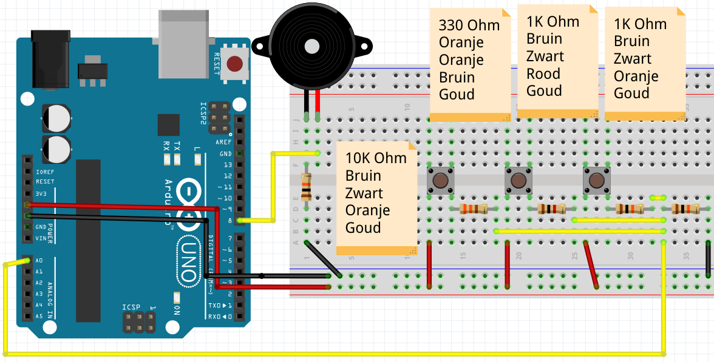

# Piano op een pin

## Piezo aansluiten

## Knop aansluiten

## Tweede knop aansluiten

## Eindopdracht: derde knop aansluiten



```c++
const int speaker_pin = 8;
const int toets_pin = A0;

void setup()
{
  pinMode(speaker_pin, OUTPUT);
  pinMode(toets_pin, INPUT);
  Serial.begin(9600);
}

void loop()
{
  const int waarde = analogRead(toets_pin);
  Serial.println(waarde);
  int toonhoogte = 0;

  if (waarde > 950) 
  {
    Serial.println("C");
    toonhoogte = 131;    
  }
  else if (waarde > 900) 
  {
    Serial.println("D");
    toonhoogte = 147;   
  }
  else if (waarde > 500) 
  {
    Serial.println("E");
    toonhoogte = 165;
  }
  const int toonlengte = 125;
  tone(speaker_pin, toonhoogte, toonlengte);
  delay(toonlengte);
}
```

 1. Houd knop 3 ingedrukt. Het geluid klinkt hakkelig. Hoe kan dat?
 2. Wat gebeurt er als je twee knoppen indrukt?
 3. Een gewone piano heeft 88 toetsen. Kun je een piano op deze manier bouwen met een Arduino Uno?

## Eindopdracht antwoorden

 1. Omdat de Arduino steeds de pin leest. Dit lezen kost tijd. In deze tijd is er geen geluid
 2. Je hoort de laagste toon
 3. Ja, want je hebt maar een pin nodig voor de knopjes, en een pin voor de piezo

