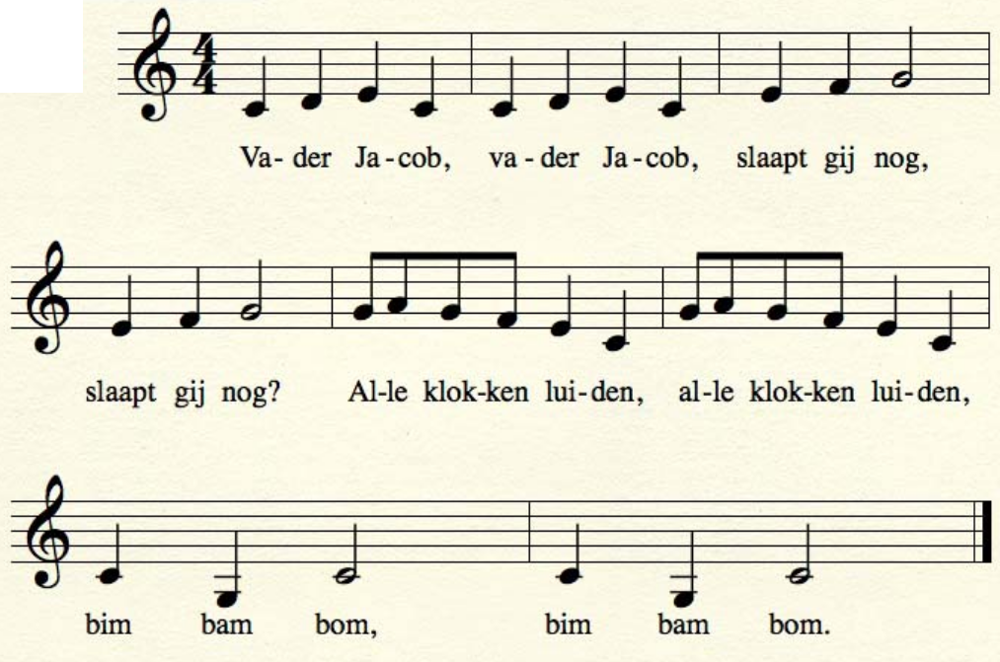
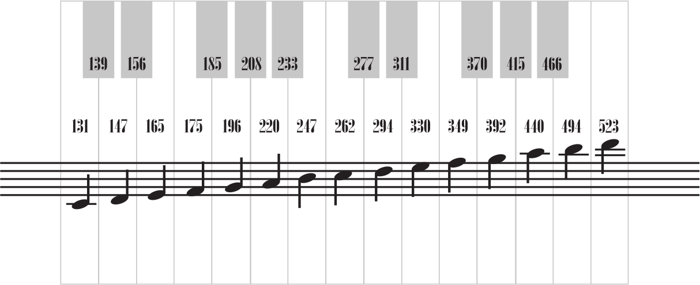
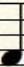
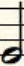
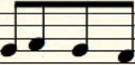

# Vader Jacob met frequenties

Figuur 'De bladmuziek van Vader Jacob' laat de bladmuziek 
van Vader Jacob zien.



Elke noot heeft een hoogte:



Elke noot heeft een lengte:

Plaatje|Naam|Duur in milliseconden
---|---
|Hele noot|250
|Dubbele noot|500
|Halve noot|125

De dubbele noot duurt twee keer zo lang als een hele noot.
De halve noot duurt half zo kart als een hele noot.

Een hele noot hoeft niet 250 milliseconden te duren. 
Een hele noot kan korter duren voor snelle liedjes.
Een hele noot kan langer duren voor langzame liedjes.

Als de hele noot korter wordt, worden de halve en dubbele noten ook korter.
Als de hele noot langer wordt, worden de halve en dubbele noten ook langer.

# Opdracht

Kijk naar de bladmuziek van Vader Jacob.

 1. Welk getal hoort er bij de eerste noot

## Eindopdracht

Zoek de frequenties bij de noten van het liedje vader Jacob.
Zet deze getallen in de code, voorbeeld: 

```
tone(8, 165 , 250);//slaapt
delay(500);
(De duur van de noten of de delaytijd kunnen ook aangepast worden. Probeer maar uit).
```

Hieronder staat code die je kunt aanpassen


```c++
const int speakerpin = 8;

void setup ()
{
  //tone (pinnummer, hertz, toon-duur)
  tone(8,131 ,250);//Va
  delay(500);
  tone(8,147 ,250);//der
  delay(500);
  tone(8,165 ,250);//Ja
  delay(500);
  tone(8,131 ,250);//cob
  delay(500);
  tone(8, ,250);//Va
  delay(500);
  tone(8, ,250);//der
  delay(500);
  tone(8, ,250);//Ja
  delay(500);
  tone(8, ,250);//cob
  delay(500);
  tone(8, ,250);//slaapt
  delay(500);
  tone(8, ,250);//gij
  delay(500);
  tone(8, ,750);//nog
  delay(1000);
  tone(8, ,250);//slaapt
  delay(500);
  tone(8, ,250);//gij
  delay(500);
  tone(8, ,750);//nog
  delay(1000);
  tone(8, ,125);//al-
  delay(500);
  tone(8, ,125);//le
  delay(500);
  tone(8, ,125);//klok-
  delay(500);
  tone(8, ,125);//ken
  delay(500);
  tone(8, ,750);//lui-
  delay(1000);
  tone(8, ,750);//den
  delay(1000);
  tone(8, ,250);//al-
  delay(500);
  tone(8, , 250);//le
  delay(500);
  tone(8, ,250);//klok-
  delay(500);
  tone(8, ,250);//ken
  delay(500);
  tone(8, ,750);//lui-
  delay(1000);
  tone(8, ,750);//den
  delay(1500);
  tone(8, ,700);//bim
  delay(1000);
  tone(8, ,700);//bam
  delay(1000);
  tone(8, ,1300);//bom
  delay(2000);
  tone(8, ,700);//bim
  delay(1000);
  tone(8, ,700);//bam
  delay(1000);
  tone(8, ,1300);//bom
  delay(2000);
}

void loop ()
{

}
```