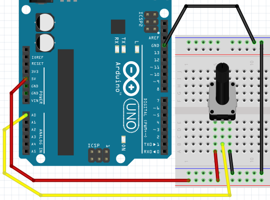

# Potmeter

Met een potmeter kun je een spanning naar de Arduino sturen.
Deze kun je gebruiken als bijvoorbeeld een volumeknop.

In deze les leer je:

 * Wat een potmeter is
 * Hoe je een potmeter gebruikt

## Aansluiten

Eerst sluiten we alleen een Arduino aan:



Ik denk dat dit wel moet lukken :-)

## Code: lezen potmeter met seriele monitor

Met deze code meten we de stand van de potmeter:

```
void setup() 
{
  pinMode(A0, INPUT);
  Serial.begin(9600);
}

void loop()
{
  Serial.println(analogRead(A0));
  delay(100);
}
```

Dit doet de code:

 * In de `setup` functie gebeuren twee dingen
   * `pinMode(A0, INPUT)`: de pin `A0` is een pin die leest, een input
   * `Serial.begin(9600)`: de seriele monitor stuurt 9600 bits ('nullen en enen') per seconde
 * In de `loop` functie gebeuren twee dingen
   * `Serial.println(analogRead(A0))`: lees de pin `A0` uit en schrijf deze naar de seriele monitor
   * `delay(100)`: wacht honderd milliseconden

## Opdrachten

 * 1. Upload het programma. In de Arduino IDE, klik rechtsboven op 'Seriele Monitor'. Wat zie je?
 * 2. Draai de potmeter helemaal naar links (tegen de klok in). Welke waarde zie je op de seriele monitor?
 * 3. Draai de potmeter helemaal naar rechts (met de klok mee). Welke waarde zie je op de seriele monitor?

## Oplossingen

 * 1. Je ziet een getal van nul tot 1024, afhankelijk van de stand van de potmeter
 * 2. Je ziet het getal nul
 * 3. Je ziet het geal 1023

# Aansluiten potmeter met LED

Nu sluiten we ook een LED aan:


Let op:

 * het weerstandje aan de LED is duizend Ohm (bruin-zwart-rood-goud)
 * het LEDje moet op een pin met PWM ('een golfje')

## Reageren op potmeter

Nu gaan we het LEDje laten reageren op de potmeter:

```
void setup() 
{
  pinMode(A0, INPUT);
  pinMode(9, OUTPUT);
}

void loop()
{
  analogWrite(9, analogRead(A0) / 8);
  delay(100);
}
```

Dit doet de code

 * In de `setup` functie gebeuren drie dingen:
   * `pinMode(A0, INPUT)`: de pin `A0` is een pin die leest, een input
   * `pinMode(9, OUTPUT)`: pin `9` is een pin waar stroom uitkomt, een output
 * In de `loop` functie gebeuren twee dingen:
   * `analogWrite(9, analogRead(A0) / 8)`: zet op pin 9 een spanning van
     `analogRead(A0) / 8`. `analogRead(A0) / 8` betekent: de waarde gelezen van A0
     gedeeld door acht (de `/` is een deelstreep).
   * `delay(100)`: wacht honderd milliseconden

## Opdracht

 * Wat gebeurt er als je het getal van de deling verandert?
 * Wat is de beste waarde van het getal voor de deling/

## Oplossingen

 * Bij een hoger getal, gaat het lampje steeds minder hard in volle stand.
   Bij een lager getal dan vier gaat het lampje raar reageren: het lampje gaat eerst harder,
   dan uit en weer harder, etc

