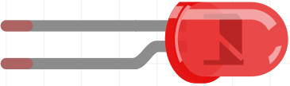
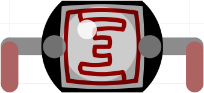
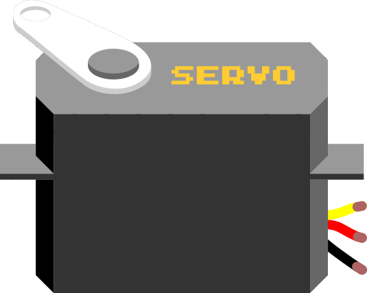
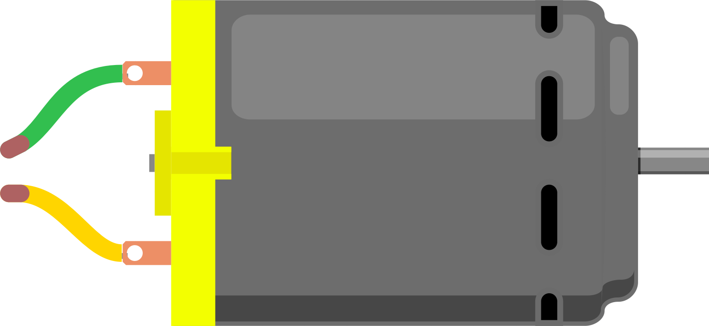
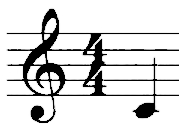

# Lessen

Arduino lessen die je zo kunt doen.

### 1. LED

 * [Les 1a: Blink](1a_Blink/README.md)
 * [Les 1b: Blink Blink Blink](1b_BlinkBlinkBlink/README.md)
 * [Les 1c: Meer Kleur, Fade Met For](1c_MeerKleurFadeMetFor/README.md)
 * [Les 1d: For Nog Een Keer](1d_ForNogEenKeer/README.md) 

### 2. Sensor

 * [Les 2: Knop if else](2_Knop_if_else/README.md) 
 * [Les 4: FSR](4_FSR/README.md) 
 * [Les 9: LDR](9_LDR/README.md) 
 * ([Potmeter](Potmeter/README.md))

### 3. Actuator, laag vermogen

 * [Servo besturen met seriele monitor](ServoSerial/README.md)
 * [Les 3a: Servo motor](3_servo_motor/README.md)
 * [Les 3b: Meer servo motoren](3_servo_motoren/README.md)
 * [Les 4: FSR met servo](4_FSR_met_servo/README.md)
 * [Les 6: Muziek tone](6_muziek_tone/README.md)

### 4. Actuator, hoger vermogen

 * [Les 5: DC motor met transistor](5_dc_motor_met_transistor/README.md)
 * [Les 7: Relais](7_dc_motor_met_relais/README.md)
 * [Les 8: Infrarood sensor obstakel ontwijkend object](8_infrarood_sensor_obstakel_ontwijkend_object/README.md)

## 5. Muziek

 * [Les 17: simpele melodie](17_simpele_melodie/README.md)
 * [Les 18: 7-pin-piano](18_7_pin_piano/README.md)
 * [Les 19: 1-pin-7-parallelle_weerstanden-piano](19_1_pin_7_parallelle_weerstanden_piano/README.md)
 * [Les 20: 1-pin-7-weerstanden-in-serie-piano](20_1_pin_7_weerstanden_in_serie_piano/README.md)

### 6. Theremin

 * Les 21 Theremin met potmeters
 * Les 22 [Theremin met LDR](Theremin_ldr/README.md)
 * Les 23 [Theremin met infrarode afstandssensor](Theremin_infrarood/README.md)
 * Les 24 [Theremin met ultrasone afstandssensor](Theremin_ultrasoon/README.md)

### 7. Capacitieve sensoren

 * [Capacitieve sensor 1: een](CapacitieveSensor1/README.md)
 * [Capacitieve sensor 2: twee losse](CapacitieveSensor2/README.md)
 * [Capacitieve sensor 3: twee gekoppelde](CapacitieveSensor3/README.md)
 * Capacitieve sensor 4: drie gekoppelde voor Arduino Invaders

### 8. Leesbare output

 * [Zeven segmenten display](ZevenSegmentDisplay/README.md)
 * [LCD 1](LCD1/README.md)
 * [LCD 2](LCD2/README.md)
 * [LCD 3](LCD3/README.md)

### 9. Hi-tech

 * [RFID 1](RFID1/README.md)
 * [RFID 2](RFID2/README.md)
 * [ArduinoISP](ArduinoISP/README.md): bootloader branden met de Arduino als ISP
 * [Bare-bone Arduino](BareBoneArduino/README.md): de Arduino zonder printplaat

### 10. Veel output

 * Schuifregister 1: een schuif register
 * Schuifregister 2: twee schuif registers
 * [NeoPixels 1: blink op een LEDje](NeoPixel1/README.md)
 * [NeoPixels 2: ?regenboog op alle LEDjes](NeoPixel2/README.md)

### 11. Besturing op afstand

 * ?

### 12. Internet of Things

 * ?

## Dingen

 * [Les 0: Broodplank](0_Breadboard/README.md)
 * [Blink snelheid](BlinkSnelheid/README.md)
 * Chatroom
 * Kleurensensor
 * Ultrasone afstandssensor
 * Druksensor
 * Reedcontact
 * Alcohol sensor
 * Pulsgever
 * Stappenmotor
 * Laser
 * Nokia5110
 * [Arduino en Processing](Arduino_en_processing/README.md)

## Lesvormen

 * [Stroomdeeltje spelen 1](StroomdeeltjeSpelen1/README.md)
 * Stroomdeeltje spelen 2: weerstanden in parallel en serie
 * Stroomdeeltje spelen 3: spanningsdeler
 * For loop spelen
 * Binair tellen

## Leskaarten

 * [Leskaart 1](Leskaarten/Leskaart1.pdf)
 * [Leskaart 2](Leskaarten/Leskaart2.pdf)

## Andere plekken

 * [YouTube kanaal: BasOnTech](https://www.youtube.com/c/BasOnTechNL)
