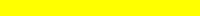
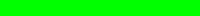
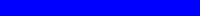
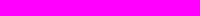

# Lessen

Arduino lessen die je zo kunt doen.

## Normale lessen

Deze lessen doen we als groep aan de grote tafel.
Hiermee kun je stickers verdienen! Lessen met een :star: zijn extra.

### LED

 * [Les 0: Broodplank](0_Breadboard/README.md)
 * [Les 1a: Blink](1a_Blink/README.md)
 * [Les 1b: Blink Blink Blink](1b_BlinkBlinkBlink/README.md)
 * [Les 1c: Meer Kleur, Fade Met For](1c_MeerKleurFadeMetFor/README.md)
 * [Les 1d: For Nog Een Keer](1d_ForNogEenKeer/README.md) 
 * :star: [Les 1e: Zeven segmenten display](1e_zeven_segment_display/README.md)
 * :star: [Blink snelheid](BlinkSnelheid/README.md)
 * :star: :star: [LCD les 1](LCD1/README.md)
 * :star: :star: [LCD les 2](LCD2/README.md)
 * :star: :star: [LCD les 3](LCD3/README.md)

### Sensor

 * [Les 2: Knop if else](2_Knop_if_else/README.md) 
 * [Les 4: FSR](4_FSR/README.md) 
 * [Les 9: LDR](9_LDR/README.md) 
 * :star: [Capacitatieve Sensoren 1](CapacitatieveSensoren1/README.md)
 * :star: [Capacitatieve Sensoren 2](CapacitatieveSensoren2/README.md)
 * :star: :star: [RFID](RFID/README.md)

### Actuator, laag vermogen

 * Les 3a: Servo motor
 * Les 4: FSR met servo
 * Les 3b: Meer servo motoren
 * Les 6: Muziek tone
 * :star: [Piano](Piano/README.md)

### Actuator, hoger vermogen

 * Les 5: DC motor met transistor 
 * Les 7: Relais
 * Les 8: Infrarood sensor obstakel ontwijkend object

## Vervolglessen

Deze lessen kun je zelf doen. 

 * [Arduino en Processing](Arduino_en_processing/README.md)
 * [Processing (op de Dojo GitHub)](https://github.com/richelbilderbeek/Dojo/tree/master/LessenProcessing)

## Electriciteit

Met deze lessen kunnen we electriciteit beter leren begrijpen.

 * [Stroomdeeltje spelen 1](StroomdeeltjeSpelen1/README.md)
 * Stroomdeeltje spelen 2: weerstanden in parallel en serie
 * Stroomdeeltje spelen 3: spanningsdeler
