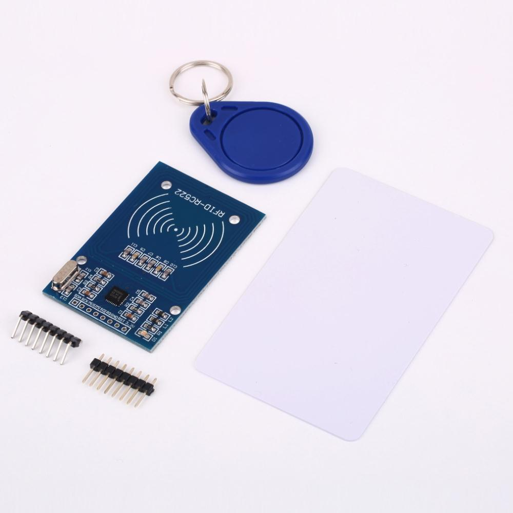
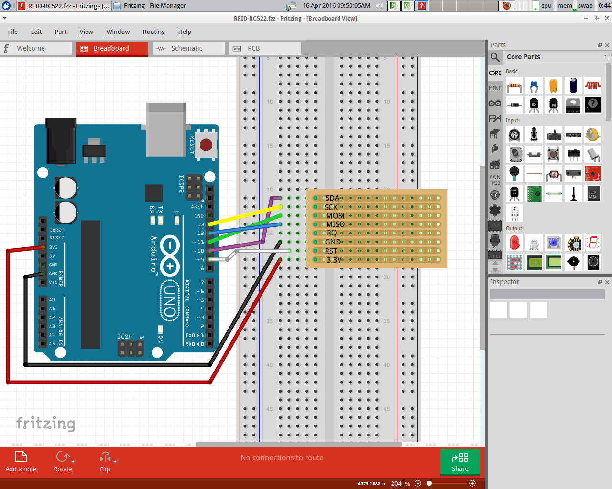

# RFID-RCC522

RFID is een techniek om een pas/hanger/etc te herkennen.

Bijvoorbeeld: het openbaar vervoer werkt met RFID: je OV chipkaart bevat een RFID chip,
de apparaten in de bus bevatten de RFID lezers. Het busbedrijf kan *jou* dus herkennen,
door je OV chipkaart.

## Aansluiten RFID lezer

Gewoon dit schema nabouwen:

## RFID bibliotheek installeren

Merk op: je moet een redelijk nieuwe versie van de Arduino IDE hebben! Anders krijg je 
een foutmelding (`class [iets] not found`).

 * In je browser, ga naar [miguelbalboa zijn rfid GitHub](https://github.com/miguelbalboa/rfid)
 * Op deze GitHub website, klik op 'Download zip'. Nu download je browser een zip bestand
 * In de Arduino IDE, kies 'Add library' en dubbelklik op het gedownloade zip bestand
 * Nu, in de Arduino IDE, staat er bij de `Voorbeelden`/`Examples` het kopje `rfid`
 * Een goed eerste programma is `rfid | dumpInfo` te kiezen, uploaden op je Arduino, en er een tag bij te houden

