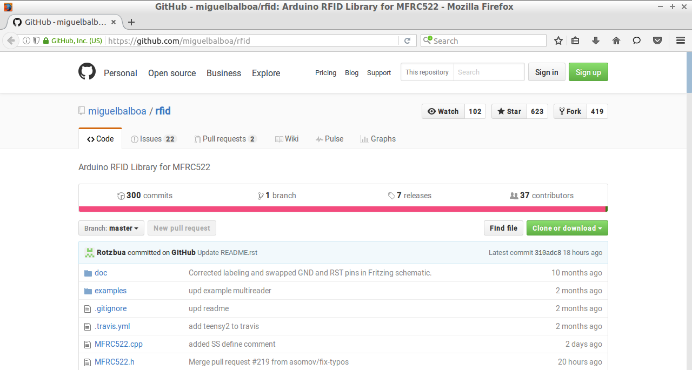
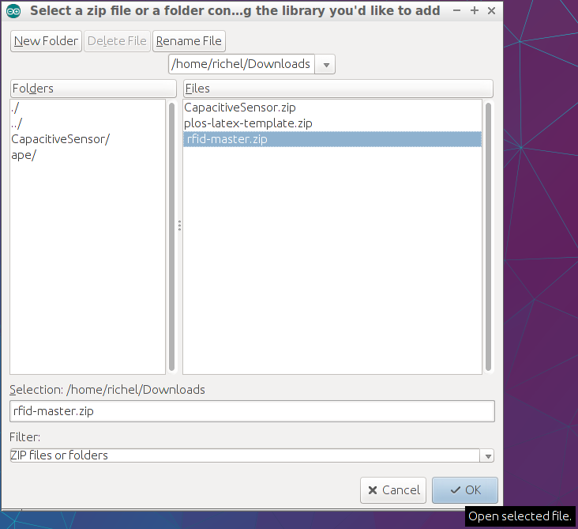

# RFID-RCC522

RFID is een techniek om een pas/hanger/etc te herkennen.

Bijvoorbeeld: het openbaar vervoer werkt met RFID: je OV chipkaart bevat een RFID chip,
de apparaten in de bus bevatten de RFID lezers. Het busbedrijf kan *jou* dus herkennen,
door je OV chipkaart.

## Aansluiten RFID lezer

Gewoon dit schema nabouwen:

## RFID bibliotheek installeren

Merk op: je moet een redelijk nieuwe versie van de Arduino IDE hebben! Anders krijg je 
een foutmelding (`class [iets] not found`).

 * In je browser, ga naar [miguelbalboa zijn rfid GitHub](https://github.com/miguelbalboa/rfid)

 * Op deze GitHub website, klik op 'Download zip'. Nu download je browser een zip bestand

 * In de Arduino IDE, kies 'Add library' en dubbelklik op het gedownloade zip bestand

 * Nu, in de Arduino IDE, staat er bij de `Voorbeelden`/`Examples` het kopje `rfid`
 * Een goed eerste programma is `rfid | dumpInfo` te kiezen, uploaden op je Arduino, en er een tag bij te houden

## Een RFID chip beschrijven

Om iets op een RFID chip te scrijven moet je eerst weten hoe de chip informatie opslaat.

Op een MiFare 1k chip (waarschijnlijk heb je deze) staan 16 sectoren, elke sector heeft 4 blokken van 16 bytes.
 *Wat betekent dat?* Het geheugen van de chip is opgedeeld in 16 stukjes, deze noemen we sectoren en ze zijn genummerd van 0 tot en met 15. Elke sector is weer verdeeld in 4 stukjes, deze noemen we blokken. De blokken worden soms per sector genummerd van 0 tot en met drie, maar soms beginnen we niet opnieuw bij een sector en nummeren we door van 0 tot en met 63. Op elk blok kan je 16 getallen/letter/bytes zetten.
 
 **Let op!** Je kan niet naar elk blok schrijven! Op sommige blokken staat namelijk een sleutel waarmee andere blokken op slot staan. We weten de standaard sleutel, maar als je hem per ongeluk veranderd kan je de kaart niet meer lezen of beschrijven. Ten eerste kan je beter niet op blok 0 schrijven, hier staat informatie van de fabrikant en het UID (Unique ID) van je kaart. Ook het laatste blok van elke sector moet je niet beschrijven. 
 
 **Hoe weet ik of ik op een blok mag scrijven?** 
 
 1. Als het blok 0 van sector 0 is mag je er niet op schrijven.
 2. Tel één bij het nummer van het blok op, en deel dit getal door vier. Als hier een heel getal uit komt (dus geen komma getal) dan mag je er niet naar schrijven.

Om naar een blok te schrijven kan je het voorbeeld `rfid | ReadAndWrite` gebruiken. Als je wilt zien hoe je een kaart kan lezen om bijvoorbeeld een wachtwoord te controleren kan je kijken naar deze code: [RFID-passWord](../../Code/RFID-passWord).

**Hoe zit het nou precies?**

Bytes 0-3 van blok 0 is het UID, voor sommige chips is dit byte 0-7. Het laatste blok van elke sector is de sector trailer, hier staan twee keys en de access bits. Byte 0-5 van de sector trailer vormen key A, bytes 10-15 key B. Welke blokken vergrendeld zijn met welke key en wat je wel/niet met de blokken mag doen wordt bepaald met de access bits (byte 6-9 van de sector trailer). Als je wil weten hoe je de access bits moet zetten om blokken te vergrendelen e.d. lees dan section 8 van het [datasheet](http://www.nxp.com/documents/data_sheet/MF1S50YYX.pdf), hier staat alles wat je zou willen weten over MiFare geheugen.

## Links

 * [Adafruit page about the MiFare card](https://learn.adafruit.com/adafruit-pn532-rfid-nfc/mifare)
 * [MiFare 1k datasheet](http://www.nxp.com/documents/data_sheet/MF1S50YYX.pdf)
