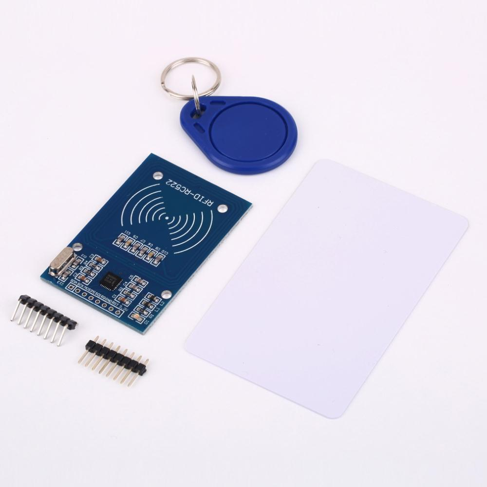
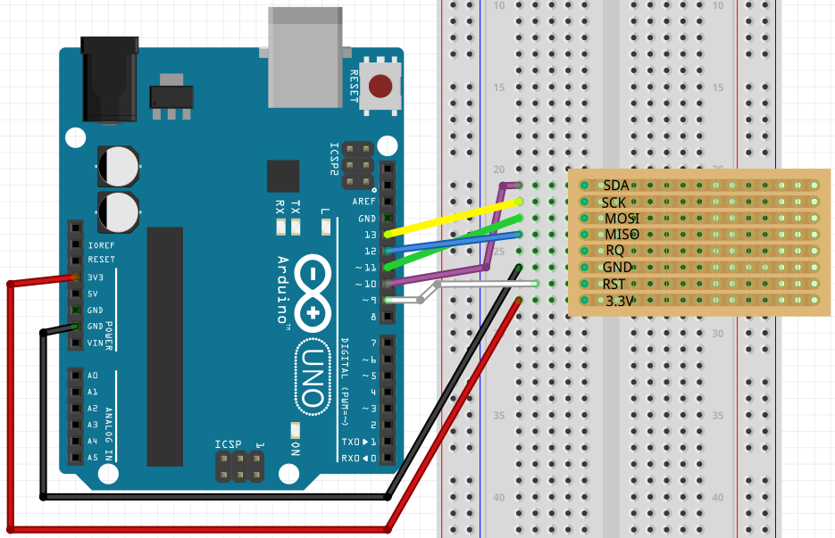
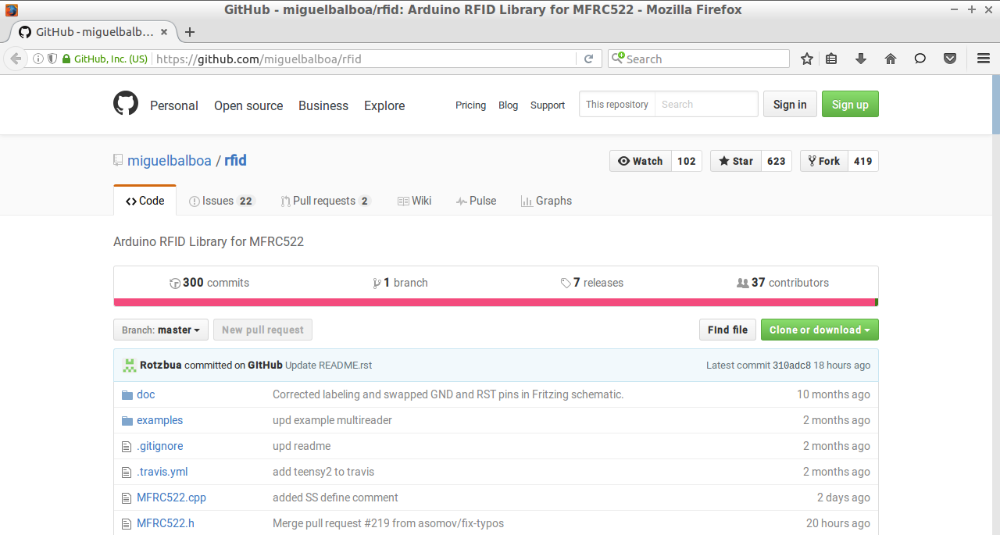
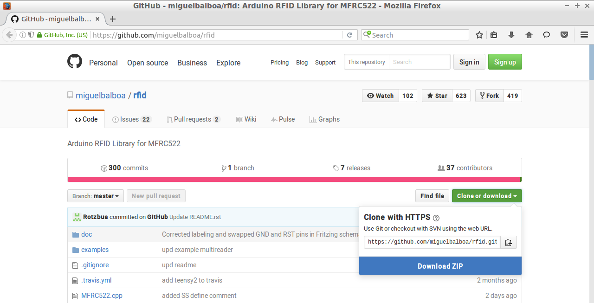
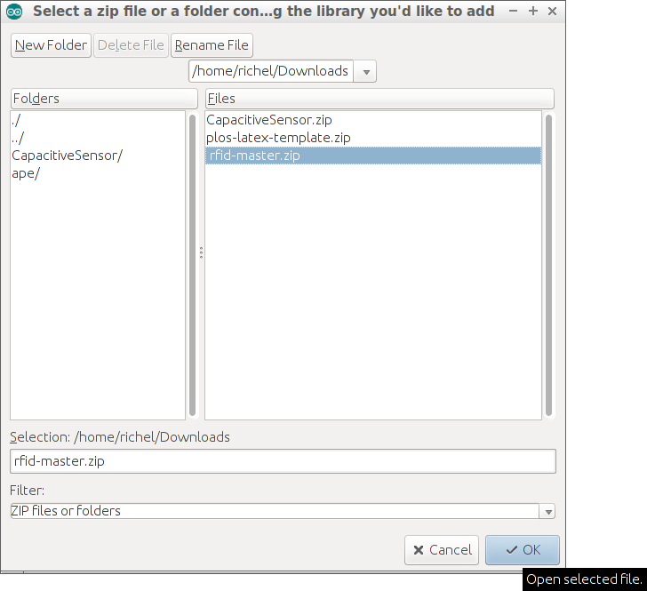

# RFID-RCC522 les 1

RFID is een techniek om een pas/hanger/etc te herkennen.

Bijvoorbeeld: het openbaar vervoer werkt met RFID: je OV chipkaart bevat een RFID chip,
de apparaten in de bus bevatten de RFID lezers. Het busbedrijf kan *jou* dus herkennen,
door je OV chipkaart.



## Aansluiten RFID lezer

Gewoon dit schema nabouwen:



## RFID bibliotheek installeren

Merk op: je moet een redelijk nieuwe versie van de Arduino IDE hebben! Anders krijg je 
een foutmelding (`class [iets] not found`).

 * In je browser, ga naar [miguelbalboa zijn rfid GitHub](https://github.com/miguelbalboa/rfid)



 * Op deze GitHub website, klik op 'Download zip'. Nu download je browser een zip bestand



 * Hernoem dit bestand van `rfid-master.zip` naar `rfid.zip`

 | Arduino kan geen bestanden aan met minstrepen
:-------------:|:----------------------------------------: 

 * In de Arduino IDE, kies 'Add library' en dubbelklik op het gedownloade zip bestand



 * Nu, in de Arduino IDE, staat er bij de `Voorbeelden`/`Examples` het kopje `rfid`

## Opdracht

 * Installeer de RFID bibliotheek. Vraag een volwassenen als je langer dan vijf minuten vast zit

## Eindopdracht

 * Upload het voorbeeld `rfid | dumpInfo` op je Arduino
 * Houd er dan een tag bij. Wat zie je? Welke andere pasjes doen het ook?

## `dumpinfo`

Dit is de code van het voorbeeld `rfid | dumpInfo`. Deze is te downloaden op 
https://github.com/miguelbalboa/rfid/blob/master/examples/DumpInfo/DumpInfo.ino.

```c++
#include <SPI.h>
#include <MFRC522.h>

#define RST_PIN         9          // Configurable, see typical pin layout above
#define SS_PIN          10         // Configurable, see typical pin layout above

MFRC522 mfrc522(SS_PIN, RST_PIN);  // Create MFRC522 instance

void setup() {
	Serial.begin(9600);		// Initialize serial communications with the PC
	while (!Serial);		// Do nothing if no serial port is opened (added for Arduinos based on ATMEGA32U4)
	SPI.begin();			// Init SPI bus
	mfrc522.PCD_Init();		// Init MFRC522
	mfrc522.PCD_DumpVersionToSerial();	// Show details of PCD - MFRC522 Card Reader details
	Serial.println(F("Scan PICC to see UID, SAK, type, and data blocks..."));
}

void loop() {
	// Look for new cards
	if ( ! mfrc522.PICC_IsNewCardPresent()) {
		return;
	}

	// Select one of the cards
	if ( ! mfrc522.PICC_ReadCardSerial()) {
		return;
	}

	// Dump debug info about the card; PICC_HaltA() is automatically called
	mfrc522.PICC_DumpToSerial(&(mfrc522.uid));
}
```

Deze code ziet er anders uit dan je gewend bent. Deze programmeur heeft een
andere stijl dan wij gebruiken in het boek. Toch is deze code net zo goed.

## Links

 * [Adafruit page about the MiFare card](https://learn.adafruit.com/adafruit-pn532-rfid-nfc/mifare)
 * [MiFare 1k datasheet](http://www.nxp.com/documents/data_sheet/MF1S50YYX.pdf)
