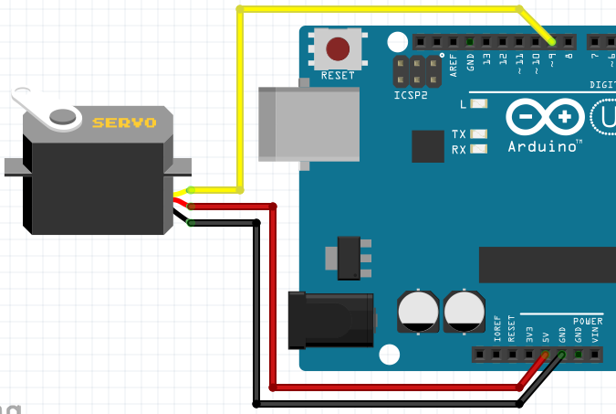
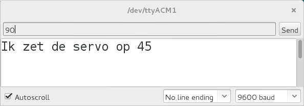

# ServoSerial

Een servo is een motortje die je in een bepaalde hoek kunt zetten.
De meeste servo's kunnen niet rond.
Welke hoeken een servo kan, kun je niet van tevoren weten.
In deze les gaan we de servo motor met de seriele monitor aansturen.
Hiermee kunnen we bepalen welke hoeken een servo aankan.

## Aansluiten

Op het plaatje zie je hoe je een servo aansluit:



De draden van de servo motor hebben misschien een andere kleur dan op het plaatje.
In de tabel kun je zien welke kleur wat is.

Kleur|Moet naar
---|---
Zwart|`GND`
Bruin|`GND`
Rood|`5V`

## Code

Gebruik deze code:

```c++
#include <Servo.h>

Servo mijn_servo;

void setup()
{
  Serial.begin(9600);
  mijn_servo.attach(9);
}

void loop()
{
  if (Serial.available())
  {
    const int getal = Serial.parseInt();
    Serial.print("Ik zet de servo op ");
    Serial.println(getal);
    mijn_servo.write(getal);
    delay(1000);
  }
}
```

In deze code zitten veel nieuwe dingen:

 * `Servo mijn_servo`: we maken een variabele met naam `mijn_servo` van het 
   data type `Servo`
 * `mijn_servo.attach(9)`: de servo staat aangeloten op pin 9
 * `if (Serial.available())`: is er een getal ingetypt?
 * `Serial.parseInt()`: lees het getal dat is ingetypt
 * `const int getal`: de variabele met naam `getal` is een heel getal (`int`) dat
   niet meer veranderd kan worden (`const`)
 * `mijn_servo.write(getal)`: zet de servo op een hoek van `getal` graden

## Getallen naar de Arduino sturen

Als je de code op de Arduino hebben gezet, kun je via de `Serial Monitor`
getallen naar de Arduino sturen. Dit kun je zien op het plaatje



## Eindopdracht

 * Bepaal het laagste en hoogste getal van een servo motor
 * Bereken het verschil tussen het laagste en hoogste getal


