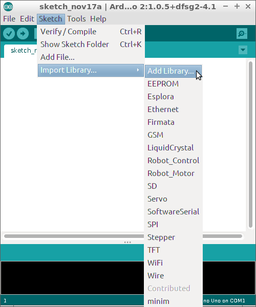
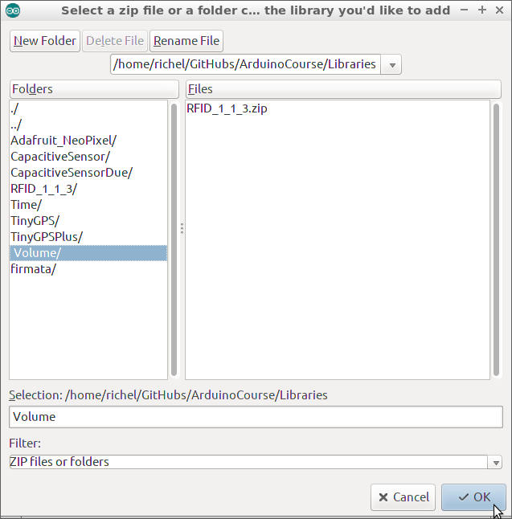
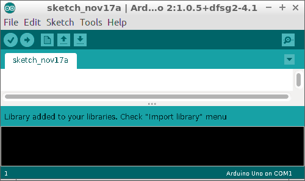
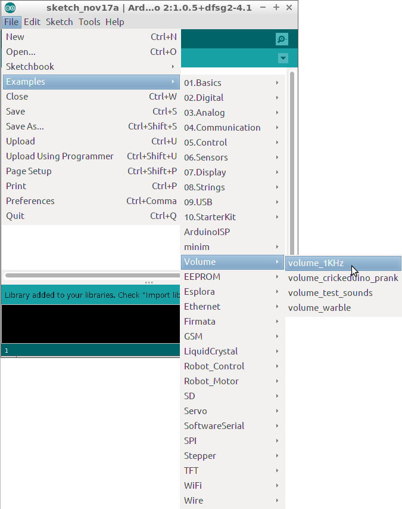
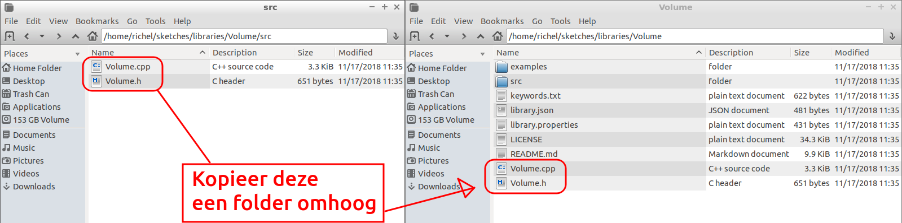

# 'Volume' installeren.

'Volume' is een bibliotheek, te downloaden op:

```
https://github.com/connornishijima/arduino-volume1
```

Een goede versie van 'Volume' staat in de mappen van de Arduino cursus.

Kies 'Sketch | Import Library | Add library':



Kies de 'Volume' map, in de subfolder 'Libraries' van de 'ArduinoCourse' folder:



Onderaan staat nu 'Library added to your libraries'. Gelukt!



Er staan nu voorbeelden on 'Examples | Volume'.



## Errors

```
volume_1KHz.ino:4:50: fatal error: Volume.h: No such file or directory
compilation terminated.
```

Reden is dat het bestand niet gevonden kan worden. 
Kopieer de bestanden van `/home/arduino/sketches/libraries/Volume/src`
een folder omhoog naar `/home/arduino/sketches/libraries/Volume`.



