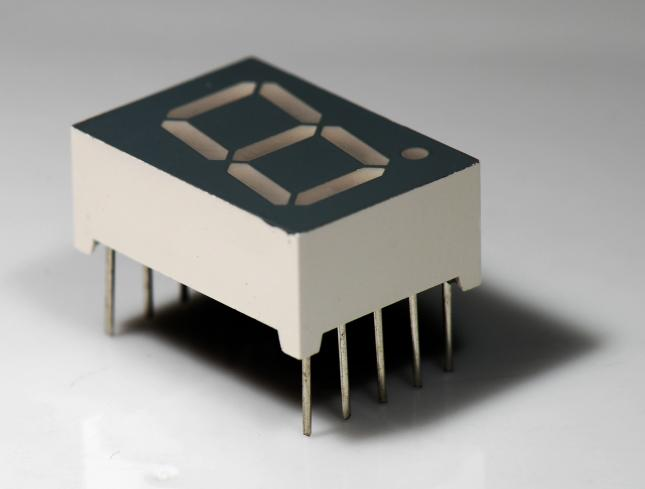

# Extra: Zeven segmenten display

Met een zeven segmenten display kun je cijfers maken:



In deze extra les probeer je een zeven segmenten display te laten werken.

## Wat is een zeven segmenten display?

Zeven segmenten betekent: zeven stukjes.
In dit geval: zeven LEDjes. 
De segmenten hebben elk een eigen letter, maar dit is niet
super belangrijk om nu te weten.


Voor elk LEDje heb je een weerstand nodig van 1000 
Ohm (rood-bruin-zwart-goud), dus je hebt zeven weerstandjes nodig.

## Aansluiten 

Een zeven segmenten display heeft veel pinnetjes.
De belangrijkste pin is voor of `GND` of `5V`. 
Dit is de enige pin die ernaast een stip heeft.
Voor elk LEDje is nog een pin. 
Aan elke LED pin moet een weerstand van 1000 Ohm (bruin-zwart-rood-goud). Soms zijn er ook pinnen die niks doen.

## Programmeren

Programmeren is hetzelde als `les 1b: Blink Blink Blink`. 
Alleen zijn er nu zeven lampjes.

Hier als opfrissing een stukje code om pin 13 te laten knipperen:

```c++
void setup()
{
  pinMode(13, OUTPUT);
}

void setup()
{
  digitalWrite(13, HIGH);
  delay(1000);
  digitalWrite(13, LOW);
  delay(1000);
}
```

## Opdracht

 * Probeer een cijfer of letter te maken.
 * Als dat lukt, laat het display dan tellen of woorden maken