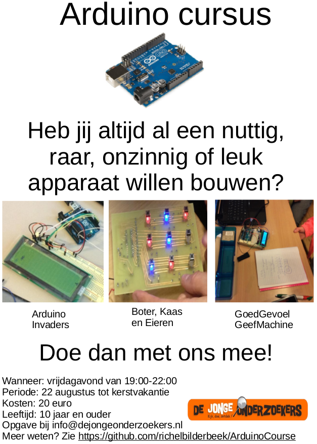

# ArduinoCourse

(English: see below)

Dit is de GitHub van de Nederlandse Arduino cursus gegeven bij De Jonge Onderzoekers te Groningen.

### Over de cursus
 * Wanneer: elke vrijdagavond 
 * Hoe laat: van 19:00-22:00 (pauze van 20:30-21:00)
 * Waar: De Jonge Onderzoekers Groningen (www.djog.nl)
 * Periode: 22 augustus tot kerstvakantie
 * Kosten: 20 euro eenmalig
 * Leeftijd: 10 jaar en ouder
 * Meenemen: Arduino (als je die hebt), laptop (als je die hebt), electronica (als je dat hebt)
 * Wanneer instromen: altijd!

### [inhoudsopgave](TableOfContents.md)
Zie [TableOfContents.md](TableOfContents.md) voor een overzicht van de presentaties en oefeningen.

### Folder structuur van deze GitHub

[TableOfContents.md](TableOfContents.md): [inhoudsopgave](TableOfContents.md) van alle documenten
 * Code: Bevat Arduino code gebruikt in de lessen
 * Docs: De ruwe LyX documenten, inclusief de gebruikte Fritzing schema's and plaatjes
 * Pdfs: PDF documenten, bevat de presentaties en oefeningen

### Ideeen, reacties en/of feedback?
 * Ga naar Issue #12 'Ideeen, reacties en/of feedback' en voeg daar een commentaar toe

### Nieuwsbrief
 * Ga naar Issue #11 'Nieuwsbrief' en 'Watch' deze. Heb je zelf wat te melden, voeg dan daar een commentaar toe

### Projecten

Projecten zijn te vinden onder [Projects.md](Projects.md).

## English

Dutch Arduino course given at De Jonge Onderzoekers Groningen.

* Code: Arduino code
* Docs: Raw LyX documents, with Fritzing schematics and pictures used. 
* Pdfs: PDF documents

### About the course

 * Frequency: Weekly
 * Day: Fridays
 * Time: 19:00-22:00 
 * Location: De Jonge Onderzoekers Groningen (www.djog.nl)
 * Time span: from the 22nd of August to the Christmas holidays
 * Costs: 20 euro, once
 * Age: 10 years old and above
 * What to bring: Arduino (if available), laptop (if available), electronics (if available)
 * When to enter: anytime!

Participants will be assigned to groups of two/three persons of different ages. These groups can and will change, for the benefit of the course as a whole.

