# Voorwoord


Dit is het boek van de Arduino cursus. 
Een Arduino is een machine die je kunt programmeren. 
Dit boek leert je hoe je electronica op
de Arduino aansluit, en hoe je deze programmeert.

## Over dit boek

Dit boek heeft een CC-BY-NC-SA licensie.


(C) Arduino cursus Groningen 2017

Het is nog een beetje een slordig boek.
Er zitten tiepvauten in en de opmaak is ni`et altij`d *even mo*oi.

Daarom staat dit boek op een GitHub.
Om precies te zijn, op 
https://github.com/richelbilderbeek/ArduinoCourse .
Hierdoor kan iedereen die dit boek te slordig vindt
minder slordig maken.
 
# Les 0: Breadboard

Een broodplank (ja, wij noemen dit een broodplank) helpt om
gemakkelijk electrische schakelingen te bouwen.

In deze les leer je:

 * Welke gaatjes van een broodplank verbonden zijn
 * Hoe je dat kunt meten

## Broodplank

Een broodplank ziet er zo uit:

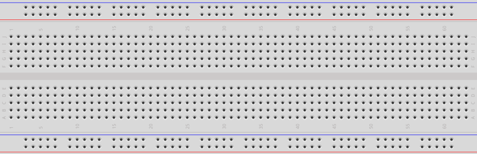

De gaatjes van een broodplank zijn op een bepaalde manier verbonden.
Dit gaan wij meten!

:heavy_exclamation_mark: Let goed op! Je kunt de Arduino hier stuk mee maken :heavy_exclamation_mark:

Maak deze meetopstelling na:

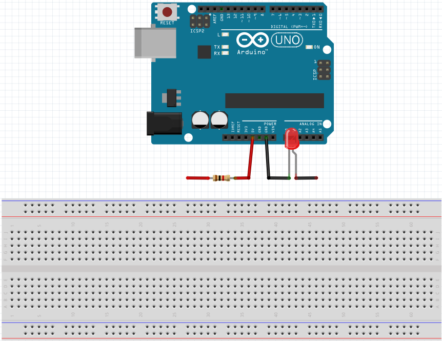

Je hebt nodig:

 * 1x Arduino Uno
 * 1x USB snoer
 * 1x laptop
 * 1x weerstand van 1000 Ohm (bruin-zwart-rood-goud)
 * 1x rood LEDje
 * 2x krokodillebekdraadjes
 * 2x draadbrugjes

Alleen dan:

 * Doe de een kant van de weerstand in het gat met `5V`. Klem een krokodillebek aan het andere pootje
 * Doe het korte pootje van het LEDje in het gat met `GND`. Doe een krokodillebekklem aan het andere pootje
 * Doe een draadbrug aan elke van de vrije krokodillebekken

:heavy_exclamation_mark: Laat een volwassene kijken of je het goed hebt gedaan, voordat je de Arduino spanning geeft :heavy_exclamation_mark:

 * Geef de Arduino spanning met een USB snoer naar een laptop
 * Doe de twee uiteindes van de draadbruggen tegen elkaar. Het lampje moet zeker gaan branden!

Hier zie je een broodplank, waarbij ik sommige gaten gemarkeerd heb:

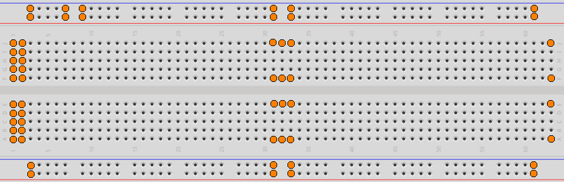

 * Vind uit welke gaten met elkaar verbonden zijn. Doe dit door de draadeindes in verschillende gaten te steken. Hoe zitten de gaten verbonden in een broodplank?


 
# Les 1a: Blink

In deze les gaan we de allergemakkelijkste schakeling maken die er is: Blink!

In deze les leer je:

 * Hoe je een LEDje aansluit
 * Je eerste Arduino programmeercode
 * Hoe je een LEDje laat knipperen

## Een Arduino aansluiten

Sluit een Arduino zo aan:

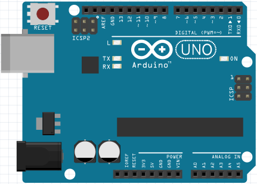

Huh? Er hoeft helemaal niks aangesloten te worden? 

Dat klopt! De Arduino heeft namelijk zelf al een lampje.

Je zult wel een USB kabel in de Arduino en in een laptop moeten doen

## De Arduino IDE opstarten

Om een Arduino te programmeren hebben we een programma nodig.
Dit programma noemen we 'de Arduino IDE' (IDE spreek je uit
als 'ie-dee-ee')

De Arduino IDE staat op alle laptops van de cursus.
Hier zie je het logo van de Arduino IDE:


Je kunt de Arduino IDE ook starten, door:

 * Druk op de Windows toets (linksonder, tussen `Ctrl` en `Alt`)
 * Type `arduino` (kleine letters) en dan Enter

Als het goed is, zie je de Arduino IDE:

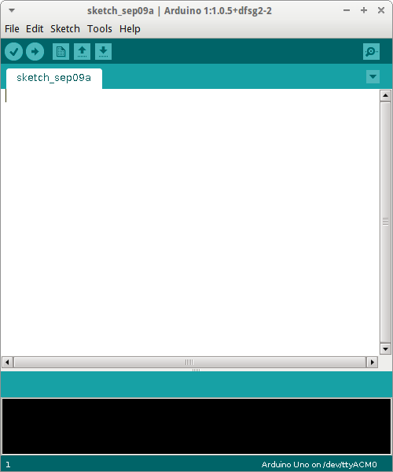

## Ons eerste programma

Dit is (een versie van) de code van `Blink`:

```c++
void setup() 
{
  pinMode(13, OUTPUT);
}

void loop() 
{
  digitalWrite(13, HIGH);
  delay(1000);
  digitalWrite(13, LOW);
  delay(1000);
}
```

Wat de code precies doet, dat leer je later.

Om code te kopieeren gebruik je sneltoetsen:

 * `SHIFT + pijltjes`: selecteren
 * `CTRL + A`: alles selecteren
 * `CTRL + C`: kopieren van selectie
 * `CTRL + X`: knippen van selectie
 * `CTRL + V`: plakken van selectie

 * Kopieer de code naar de Arduino IDE
 * Klip op `Upload`

Als het goed is, gaat er een lampje op de Arduino om de seconde aan en uit.

## Blink

Nu is het tijd Blink aan te sluiten:

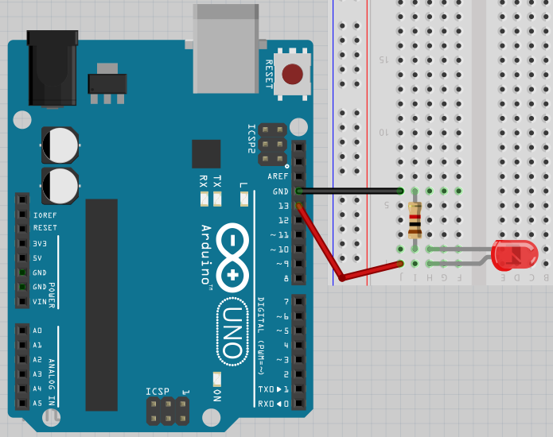

 * Haal de USB snoer uit de computer, zodat de Arduino geen spanning meer heeft
 * Sluit Blink aan zoals op de tekening
 * Zet de spanning weer op de Arduino
 * Als het goed is, knippert het rode LEDje nu mee met het LEDje op de Arduino. Zo nee, draai de rode LED om :smile:

## Code

Hier staat weer de code van Blink:

```c++
void setup() 
{
  pinMode(13, OUTPUT);
}

void loop() 
{
  digitalWrite(13, HIGH);
  delay(1000);
  digitalWrite(13, LOW);
  delay(1000);
}
```

## Vragen en opdrachten

 * Wat doet deze code ook alweer?
 * Kun je het lampje tien keer zo snel laten knipperen? Proberen en kijken! Tip: het lampje gaat aan/uit na duizend milliseconden
 * Kun je het lampje op z'n snelst laten knipperen? Proberen en kijken! Als je iets onverwachts ziet: klopt! Waarom is dat?
 * Haal het draadje uit gat `13` en doe deze in `12`. Verander het programma zo dat het lampje weer knippert
 
# Les 1b: Blink Blink Blink

Deze les heet 'Blink Blink Blink', omdat het [de les Blink](../1a_Blink/README.md) is, maar dan met drie lampjes.

Weet je nog niet hoe je een lampje aansluit? Ga dan naar [les 1a: Blink](../1a_Blink/README.md).

In deze les leer je:

 * Hoe je meerdere LEDjes aansluit
 * Wat een variable is
 * Hoe je een variabele gebruikt
 * Wat een compile error is
 * Hoe je een programma aanpast 

## Waarom variabelen?

Dit is de code van Blink:

```c++
void setup() 
{
  pinMode(13, OUTPUT);
}

void loop() 
{
  digitalWrite(13, HIGH);
  delay(1000);
  digitalWrite(13, LOW);
  delay(1000);
}
```

## Vragen en opdrachten

 * Wat doet deze code ook alweer?


 * Sluit Blink aan (het plaatje hierboven). Upload deze code op je Arduino. Wat zie je gebeuren?
 * Als je het getal `13` ziet, waar denk je dan aan? 
 * Als je het getal `1000` ziet, waar denk je dan aan? 
 * Als je het LEDje op een andere pin wil zetten, op hoeveel plekken moet je de code aanpassen?

## Een variabele

Hier zien we Blink met een variabele:

```c++
int pin_led = 13;

void setup() 
{
  pinMode(pin_led, OUTPUT);
}

void loop() 
{
  digitalWrite(pin_led, HIGH);
  delay(1000);
  digitalWrite(pin_led, LOW);
  delay(1000);
}
```

In de eerste regel zeg je: 
'Lieve Arduino, onthoud een int (dat is een heel getal). 
Ik noem dat hele getal `pin_led`'.
De waarde van `pin_led` is `13`'.

Vanaf nu, als je schrijft `pin_led`, dan vult de Arduino daar `13` in.

## Vragen en opdrachten

 * Upload deze code op je Arduino. Wat zie je gebeuren?
 * Verander de beginwaarde van `pin_led` naar `12`. Het lampje knippert nu niet meer. Pas de bedrading van de machine aan, zodat deze het weer doet
 * Vervang het getal `1000` door een nieuwe variable, `wacht_tijd`. Dit is een int (een heel getal) met de beginwaarde `1000`. 
 * Waarom gebruiken programmeurs variabelen?


## Blink Blink Blink aansluiten

Nu is het tijd 'Blink Blink Blink' aan te sluiten:

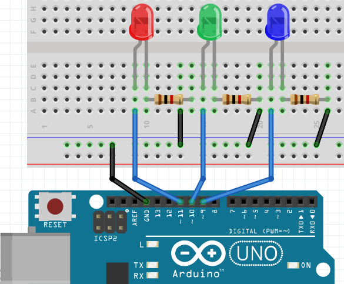

 * Haal de USB snoer uit de computer, zodat de Arduino geen spanning meer heeft
 * Sluit de onderdelen aan zoals op de tekening

## Code

Hier staat een stukje code van 'Blink Blink Blink'. 
Er zitten fouten in!

```c++
int pin_rood = 11;
int pin_groen = 10;

void setup() 
{
  pinMode(pin_rood, OUTPUT);
  pinMode(pin_groen, OUTPUT);
}

void loop() 
{
  digitalWrite(pin_rood, HIGH);
  digitalWrite(pin_gron, HIGH);
  delay(1000);
  digitalWrite(pin_roood, LOW);
  digitalWrite(pin_groen, LOW);
  delay(1000);
}
```

## Vragen en opdrachten

 * Upload deze code naar de Arduino. Welke fouten krijg je?

## Compile error

In de code zijn een aantal variabele namen verkeerd geschreven. Dat kun je
ook zien in de rode letters:

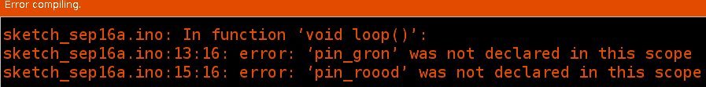

Deze fout wordt een compile error ('kompaail error') genoemd. 
'compile' is Engels voor 'samenbinden'.
'error' is Engels voor 'fout'.
De compiler ('kompaailer') is een programma dat programmeercode omzet naar machinetaal.
De compiler leest erg precies.
De compiler heeft ook altijd gelijk.

Terug naar onze compile error:


De compiler laat zien in welke regels de fout(en) zitten.
In dit geval in regels 13 en 15.
Je hoeft niet te tellen welke regels zit zijn:
de Arduino IDE laat dit altijd zien:

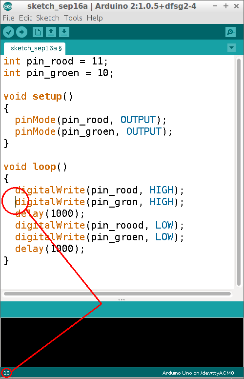

Nu weten we *waar* de fout is, nu weten we nog niet *wat* de fout is.

```c++
'pin_gron' was not declared in this scope
```

Dit kan je vertalen naar:

```
Lieve programmeur, ik weet niet wat 'pin_gron' is
```

De compiler heeft gelijk: bovenaan de code hebben we het pinnummer
van de groen led ook anders genoemd!

## Vragen en opdrachten

 * Repareer de code
 * Laat de lampjes omstebeurt om de seconde knipperen, zonder dat beide lampjes uit staan
 * Laat de lampjes omstebeurt om de seconde knipperen, met steeds een second ertussen dat de lampjes uit staan
 * Maak een derde variabele, een heel getal met de naam `pin_blauw`. Laat nu de drie LEDjes knipperen:
    * Alledrie tegelijk
    * Om de beurt, waarbij er altijd een lampje brand
    * Om de beurt en terug (volgorde: 1-2-3-2), waarbij er altijd een lampje brand. Dit wordt het Nightrider patroon genoemd
 * Tijd over? Sluit een vierde LED aan


 
# Les 1c: Meer Kleur Fade Met For

Soms denk je 'Kan dit slimmer?'. Een for-loop is een manier om iets slimmer te doen!

## Aansluiten

Sluit onderstaand schema aan:


Let op:

 * De langste pin van een RGB LED moet naar GND
 * Elke andere pin van een RGB LED moet een weerstandje krijgen van 1000 Ohm (bruin-zwart-rood-goud)
 * De pinnen van de LED moeten naar een pin waar een golfje (`~`) voor staat, want alleen deze pinnen kunnen dimmen
 
## Code

In deze code staat een for loop:

```c++
int pin_rood = 9;

void setup()
{
  pinMode(pin_rood, OUTPUT);
}

void loop()
{
  for (int i=0; i<256; ++i)
  {
    analogWrite(pin_rood, i);
    delay(30);
  }
}
```

Zet deze code op je Arduino.

 * Wat doet de code?

In deze code zit een for-loop. 
Een for-loop heeft drie gedeelten, gescheiden door puntkomma's.

In het eerste gedeelte gebeurt de *initializatie*.
In het tweede gedeelte, staat de *test*.
In het derde gedeelte, staat de *post-conditie*.

Dat zijn moeilijke woorden. Hier gaan we zien wat er gebeurt:

 * Verander alleen het eerste gedeelte naar `int i = 127`. Wat zie je?
 * Verander alleen het tweede gedeelte naar `i<128`. Wat zie je?
 * Verander alleen de eerste twee gedeeltes naar `int i=127; i<128`. Wat zie je?
 * Verander alleen het derde gedeelte naar `i+=2`. Wat zie je?

Dus:

 * Wat doen de drie gedeeltes van een for-loop?

## Waarom for-loops?

Stel, je wilt bovenstaande code zonder for-loop doen,
dan ziet dat er zo uit:

```c++
analogWrite(9, 0); delay(30);
analogWrite(9, 1); delay(30);
analogWrite(9, 2); delay(30);
analogWrite(9, 3); delay(30);
analogWrite(9, 4); delay(30);
//...
analogWrite(9, 251); delay(30);
analogWrite(9, 252); delay(30);
analogWrite(9, 253); delay(30);
analogWrite(9, 254); delay(30);
analogWrite(9, 255); delay(30);
```

Dat is nogal veel code! En veel gekopieer!

For-loops helpen je om code met een patroon korter op te schrijven.

## Drie keer fade aan

We gaan nu de code uitbreiden met meer kleuren!

 * Laat eerst het rode LEDje aanfaden, dan het groene LEDje
 * Laat eerst het rode LEDje aanfaden, dan het groene LEDje, dan het blauwe LEDje

## Fade uit

Een Arduino kan prima rekenen:

```c++
int pin_rood = 9;

void setup()
{
  pinMode(pin_rood, OUTPUT);
}

void loop()
{
  for (int i=0; i<256; ++i)
  {
    analogWrite(pin_rood, 255 - i);
    delay(30);
  }
}
```

 * Wat doet deze code?
 * Laat nu het rode LEDje aan en uitgaan
 * Laat nu het rode LEDje, dan het groene, dan het blauwe aan en uitgaan

## Regenboog

Hier zie je hoe een regenboog werkt:

 

 * Laat de RGB LED een regenboog nadoen


 
# Les 1d: For nog een keer

## For loop nog een keer

For loops zijn handig om code korter op te schrijven:

```c++
pinMode(2, OUTPUT);
pinMode(3, OUTPUT);
pinMode(4, OUTPUT);
pinMode(5, OUTPUT);
pinMode(6, OUTPUT);
pinMode(7, OUTPUT);
```

Hier staat een for-loop die hetzelfde doet:

```c++
for (int pin=2; pin<8; ++pin)
{
  pinMode(pin, OUTPUT);
}
```

## Bouwen

Bouw eerst dit stroomschema:


Nu kun je de opdrachten gaan doen!

## Nadenken

Denk na over de volgende stukjes code.

### Opdracht 1

Maak deze code korter met een for-loop:

```c++
digitalWrite(2, HIGH);
digitalWrite(3, HIGH);
digitalWrite(4, HIGH);
digitalWrite(5, HIGH);
digitalWrite(6, HIGH);
digitalWrite(7, HIGH);
```

### Oplossing 1

Er moet een getal gaan lopen van twee tot en met zeven. Of:
van twee tot acht. Dit getal moet lopen van twee tot acht
in stapjes van een. Laten we dit getal `i` noemen.

Pin `i` moet `HIGH` gezet worden met `digitalWrite`.

Dat gaat zo:

```c++
for (int i=2; i<8; ++i)
{
  digitalWrite(i, HIGH);
}
```

### Opdracht 2

Maak deze code korter met een for-loop:

```c++
digitalWrite(2, LOW);
digitalWrite(3, LOW);
digitalWrite(4, LOW);
digitalWrite(5, LOW);
digitalWrite(6, LOW);
digitalWrite(7, LOW);
```

### Oplossing 2

Er moet een getal gaan lopen van twee tot en met zeven. Of:
van twee tot acht. Dit getal moet lopen van twee tot acht
in stapjes van een. Laten we dit getal `i` noemen.

Pin `i` moet `LOW` gezet worden met `digitalWrite`.

Dat gaat zo:

```c++
for (int i=2; i<8; ++i)
{
  digitalWrite(i, LOW);
}
```

### Opdracht 3

Maak deze code korter met een for-loop:

```c++
digitalWrite(2, LOW);
delay(100);
digitalWrite(3, LOW);
delay(100);
digitalWrite(4, LOW);
delay(100);
digitalWrite(5, LOW);
delay(100);
digitalWrite(6, LOW);
delay(100);
digitalWrite(7, LOW);
delay(100);
```

### Oplossing 3

Er moet een getal gaan lopen van twee tot en met zeven. Of:
van twee tot acht. Dit getal moet lopen van twee tot acht
in stapjes van een. Laten we dit getal `i` noemen.

Pin `i` moet `LOW` gezet worden met `digitalWrite`. Daarna
moet er altijd honderd milliseconden gewacht worden.

Dat gaat zo:

```c++
for (int i=2; i<8; ++i)
{
  digitalWrite(i, LOW);
  delay(100);
}
```

## Omlaag tellen

Meestal gaan `for` loops omhoog.
Maar soms wil je dat deze *omlaag* telt.
Dat kan op meer manieren.
Wij gebruiken de manier waarbij een `for`
loop omhoog blijft tellen. 
De `for` loop telt omhoog, maar we gebruiken
de `i` in een min som.

Bijvoorbeeld deze code:

```c++
digitalWrite(3, HIGH);
digitalWrite(2, HIGH);
digitalWrite(1, HIGH);
digitalWrite(0, HIGH);
```

Hiervan maken we:

```c++
for (int i=0; i<4; ++i)
{
  digitalWrite(3 - i, HIGH);
}
```

We laten `i` lopen van nul tot vier in stapjes van een.
De pin die we aan doen is `3 - i`. De uitkomsten zijn dan:

 * `3 - 0 = 3`
 * `3 - 1 = 2`
 * `3 - 2 = 1`
 * `3 - 3 = 0`

En dat is precies wat we wilden!

### Opdracht 4

Maak deze code korter met een for-loop:

```c++
digitalWrite(7, LOW);
delay(100);
digitalWrite(6, LOW);
delay(100);
digitalWrite(5, LOW);
delay(100);
digitalWrite(4, LOW);
delay(100);
digitalWrite(3, LOW);
delay(100);
digitalWrite(2, LOW);
delay(100);
```

### Oplossing 3

Er moet een getal gaan lopen van zeven tot en met twee. 
Dit kunnen we doen door eerst `7 - 0`, dan `7 - 1`, dan `7 - 2` te doen.
Het getal dat eraf moet loopt van nul tot zes, in stapjes van een. 
Laten we dit getal `7 - i` noemen.

Pin `i` moet `LOW` gezet worden met `digitalWrite`. Daarna
moet er altijd honderd milliseconden gewacht worden.

Dat gaat zo:

```c++
for (int i=0; i<6; ++i)
{
  digitalWrite(7 - i, LOW);
  delay(100);
}
```

### Opdracht 5

Maak deze code korter met twee for-loops:

```c++
digitalWrite(2, HIGH);
delay(100);
digitalWrite(3, HIGH);
delay(100);
digitalWrite(4, HIGH);
delay(100);
digitalWrite(5, HIGH);
delay(100);
digitalWrite(6, HIGH);
delay(100);
digitalWrite(7, HIGH);
delay(100);
digitalWrite(7, LOW);
delay(100);
digitalWrite(6, LOW);
delay(100);
digitalWrite(5, LOW);
delay(100);
digitalWrite(4, LOW);
delay(100);
digitalWrite(3, LOW);
delay(100);
digitalWrite(2, LOW);
delay(100);
```

### Oplossing 5

Nu moeten er twee `for` loops na elkaar komen.

```c++
for (int i=2; i<8; ++i)
{
  digitalWrite(i, HIGH);
  delay(100);
}
for (int i=0; i<6; ++i)
{
  digitalWrite(8-i, HIGH);
  delay(100);
}
```

## Programmeren

Een leerling heeft deze code geschreven:

```c++
void setup()
{
  pinMode(2, OUTPUT);
  pinMode(3, OUTPUT);
  pinMode(4, OUTPUT);
  pinMode(5, OUTPUT);
  pinMode(6, OUTPUT);
  pinMode(7, OUTPUT);
}

void loop()
{
  digitalWrite(2, HIGH);
  delay(100);
  digitalWrite(3, HIGH);
  delay(100);
  digitalWrite(4, HIGH);
  delay(100);
  digitalWrite(5, HIGH);
  delay(100);
  digitalWrite(6, HIGH);
  delay(100);
  digitalWrite(7, HIGH);
  delay(100);
  digitalWrite(2, LOW);
  delay(100);
  digitalWrite(3, LOW);
  delay(100);
  digitalWrite(4, LOW);
  delay(100);
  digitalWrite(5, LOW);
  delay(100);
  digitalWrite(6, LOW);
  delay(100);
  digitalWrite(7, LOW);
  delay(100);
}
```

 * Kopieer deze code en kijk wat er gebeurt
 * Maak de code korter. Tip: gebruik drie for-loops

## Eindopdracht

Maak nu een op-en-neer-gaand patroon in de LEDjes:

 * `*`
 * `**`
 * `***`
 * `****`
 * `*****`
 * `******`
 * `******`
 * `*****`
 * `****`
 * `***`
 * `**`
 * `*`
 
# Extra: Zeven segmenten display

Met een zeven segmenten display kun je cijfers maken:

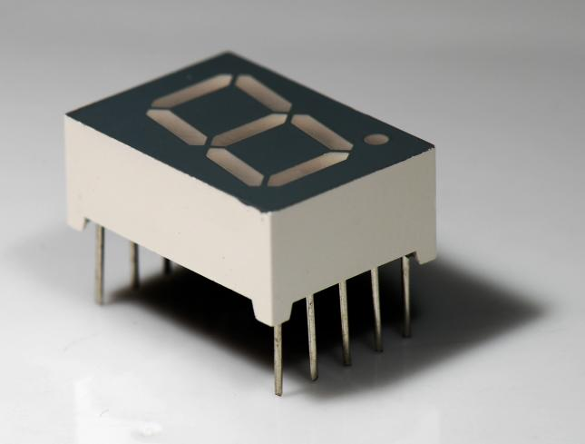

In deze extra les probeer je een zeven segmenten display te laten werken.

## Wat is een zeven segmenten display?

Zeven segmenten betekent: zeven stukjes.
In dit geval: zeven LEDjes. 
De segmenten hebben elk een eigen letter, maar dit is niet
super belangrijk om nu te weten.

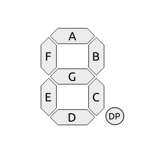

Voor elk LEDje heb je een weerstand nodig van 1000 
Ohm (rood-bruin-zwart-goud), dus je hebt zeven weerstandjes nodig.

## Aansluiten 

Een zeven segmenten display heeft veel pinnetjes.
De belangrijkste pin is voor of `GND` of `5V`. 
Dit is de enige pin die ernaast een stip heeft.
Voor elk LEDje is nog een pin. 
Aan elke LED pin moet een weerstand van 1000
Ohm (bruin-zwart-rood-goud). Soms zijn er ook pinnen die niks doen.

## Programmeren

Programmeren is hetzelde als `les 1b: Blink Blink Blink`. 
Alleen zijn er nu zeven lampjes.

Hier als opfrissing een stukje code om pin 13 te laten knipperen:

```c++
void setup()
{
  pinMode(13, OUTPUT);
}

void setup()
{
  digitalWrite(13, HIGH);
  delay(1000);
  digitalWrite(13, LOW);
  delay(1000);
}
```

## Opdracht

 * Probeer een cijfer of letter te maken.
 * Als dat lukt, laat het display dan tellen of woorden maken 
