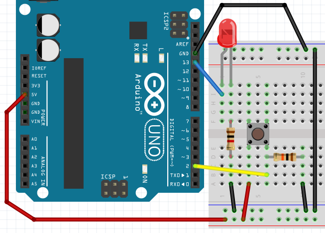
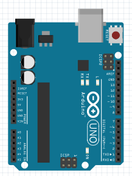
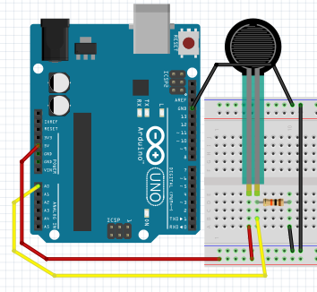
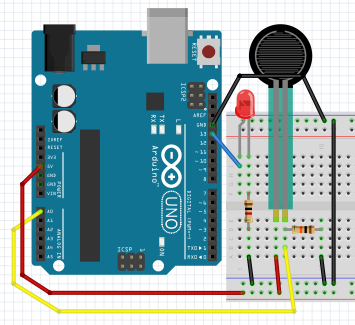

# Voorwoord


Dit is het boek van de Arduino cursus. 
Een Arduino is een machine die je kunt programmeren. 
Dit boek leert je hoe je electronica op
de Arduino aansluit, en hoe je deze programmeert.

## Over dit boek

Dit boek heeft een CC-BY-NC-SA licensie.


(C) Arduino cursus Groningen 2017

Het is nog een beetje een slordig boek.
Er zitten tiepvauten in en de opmaak is ni`et altij`d *even mo*oi.

Daarom staat dit boek op een GitHub.
Om precies te zijn, op 
https://github.com/richelbilderbeek/ArduinoCourse .
Hierdoor kan iedereen die dit boek te slordig vindt
minder slordig maken.
 
# 2. Knop if ... else


## Aansluiten



Let op, er zijn twee verschillende weerstanden:

 * Duizend Ohm, bruin-zwart-rood-goud
 * Tienduizend Ohm, bruin-zwart-oranje-goud

## Code

Hier is code om het lampje aan te laten gaan,
als de knop wordt ingedrukt:

```c++
void setup() 
{
  pinMode(13, OUTPUT);
  pinMode( 2, INPUT );
}

void loop()
{
  digitalWrite(13, digitalRead(2));
}
```

Merk op:

 * Pin `2` is een pin waar electriciteit in gaat. 
   Dat moet je in de `setup` functie zeggen
 * Met `digitalRead(2)` lees je pin `2` uit. Hier komt
   `HIGH` of `LOW` uit

## Vragen

 * 1. Als je de knop indrukt, gaat de lamp dan uit of aan?
 * 2. Er is een regel `pinMode( 2, INPUT )`. Waarom staat er een spatie voor de `2`? Mag die spatie weg?

## Oplossingen

 * 1. De knop gaat dan aan
 * 2. Er staat een spatie, omdat dit mooier eruit ziet met de regel erboven. De spatie mag weg. 

## if

Soms wil je kunnen zeggen: 'Lieve Arduino, als
er iets gebeurt, doe dan iets'. Dit doe je met een
`if`-statement. `if` is Engels voor 'als'

Hieronder staat code, dat als er spanning staat op pin 2,
pin 11 spanning krijgt:

```c++
if (digitalRead(2) == HIGH)
{
  digitalWrite(11, HIGH);
}
```

Je kunt ook zeggen wat de Arduino *anders* moet doen.

Hieronder staat code, dat als er spanning staat op pin 2,
pin 11 spanning krijgt, en dat *anders* pin 12 spanning krijgt:

```c++
if (digitalRead(2) == HIGH)
{
  digitalWrite(11, HIGH);
}
else
{
  digitalWrite(12, HIGH);
}
```

## Opdracht

Maak de code zo, dat:

 * als je op de knop drukt, dat het lampje aan gaat 
 * als je op de knop niet indrukt, dat het lampje uit gaat
 * vergeet niet: zet er een vertraging in van tien milliseconden 

## Oplossing

```c++
void setup() 
{
  pinMode(13, OUTPUT);
  pinMode( 2, INPUT );
}

void loop()
{
  if (digitalRead(2) == HIGH)
  {
    digitalWrite(13, HIGH);
  }
  else
  {
    digitalWrite(13, LOW);
  }
  delay(10);
}
```

## Opdracht 'Knop met twee LEDjes'

Sluit een tweede LEDje aan. Maak de code zo, dat:

 * als je op de knop drukt, dat het eerste lampje aan gaat en het tweede LEDje uit 
 * als je op de knop niet indrukt, dat het eerste lampje uit gaat en het tweede LEDje uit

## Oplossing 'Knop met twee LEDjes'

Figuur `Oplossing van 'Knop met twee LEDjes'` laat zien hoe je dit aan moet sluiten.


Dit is de code:

```c++
void setup() 
{
  pinMode(13, OUTPUT);
  pinMode(12, OUTPUT);
  pinMode( 2, INPUT );
}

void loop()
{
  if (digitalRead(2) == HIGH)
  {
    digitalWrite(12, LOW );
    digitalWrite(13, HIGH);
  }
  else
  {
    digitalWrite(12, HIGH);
    digitalWrite(13, LOW );
  }
  delay(10);
}
```

## Eindopdracht

Sluit een tweede knop aan. Maak de code zo, dat

 * als je op de eerste knop drukt, dat het eerste lampje aan gaat
 * als je de eerste knop niet indrukt, dat het eerste lampje uit gaat
 * als je op de tweede knop drukt, dat het tweede lampje uit gaat
 * als je de tweede knop niet indrukt, dat het tweede lampje aan gaat


 
# 4. FSR

Met een FSR kun je kracht meten. FSR betekent 'Force Sensitive Resitor'.
Dit is Engels voor 'kracht gevoelige weerstand'.

In deze les leer je:

 * Wat de seriele monitor is
 * Hoe je een FSR gebruikt

## Seriele monitor

Met de seriele monitor kunnen we de Arduino laten praten.
Of precies: dat deze tekst naar de seriele monitor stuurt.
De seriele monitor laat deze tekst op je computer zien.

### Alleen Arduino aansluiten

Eerst sluiten we alleen een Arduino aan:



Ik denk dat dit wel moet lukken :-)

### Code: seriele monitor

```c++
void setup() 
{
  Serial.begin(9600);
}

void loop()
{
  Serial.println("Hallo");
  delay(1000);
}
```

Dit doet de code:

 * In de `setup` functie gebeurt een ding:
   * `Serial.begin(9600)`: de seriele monitor stuurt 9600 bits ('nullen en enen') per seconde
 * In de `loop` functie gebeuren twee dingen:
   * `Serial.println("Hallo")`: de tekst 'Hallo' wordt naar de seriele monitor gestuurd
   * `delay(1000)`: wacht duizend milliseconden

### Opdrachten


 * 1. Upload het programma. In de Arduino IDE, klik rechtsboven op 'Seriele Monitor'. Wat zie je?
 * 2. Kun je de tekst veranderen naar 'Hallo Richel' (of je eigen naam?)
 * 3. Verander `Serial.println` naar `Serial.print`. Wat zie je?
 * 4. Verander de tekst `Serial.begin(9600)` naar `Serial.begin(4800)`. Wat zie je? Waarom?

### Oplossingen

 * 1. De seriele monitor laat elke second een extra regel zien, met de tekst 'Hallo'
 * 2. Verander de regel `Serial.println("Hallo");` naar `Serial.println("Hallo Richel");`
 * 3. De woorden komen na elkaar, in plaats van onder elkaar
 * 4. Nu laat de seriele monitor onleesbare tekst zien. Dit komt omdat de Arduino langzamer tekst
      stuur naar je computer (4800), dan je computer de tekst leest (9600)

## Aansluiten FSR zonder LED

Eerst sluiten we alleen een FSR aan:



Tip: is er geen FSR, gebruik dan een LDR

Let op, het weerstandje is tienduizend Ohm (bruin-zwart-oranje-goud).

## Code: lezen FSR met seriele monitor

Met deze code meten we de waarde van de FSR:

```c++
void setup() 
{
  pinMode(A0, INPUT);
  Serial.begin(9600);
}

void loop()
{
  Serial.println(analogRead(A0));
  delay(100);
}
```

Dit doet de code:

 * In de `setup` functie gebeuren twee dingen
   * `pinMode(A0, INPUT)`: de pin `A0` is een pin die leest, een input
   * `Serial.begin(9600)`: de seriele monitor stuurt 9600 bits ('nullen en enen') per seconde
 * In de `loop` functie gebeuren twee dingen
   * `Serial.println(analogRead(A0))`: lees de pin `A0` uit en schrijf deze naar de seriele monitor
   * `delay(100)`: wacht honderd milliseconden

## Opdrachten

 * 1. Upload het programma. In de Arduino IDE, klik rechtsboven op 'Seriele Monitor'. Wat zie je?
 * 2. Druk de FSR in met je vingers (of, met een LDR: houd je vinger boven de LDR) 
      terwijl je de seriele monitor bekijkt. Wat zie je?
 * 3. Verander `Serial.println` naar `Serial.print`. Wat zie je?
 * 4. Verander de tekst `Serial.begin(9600)` naar `Serial.begin(4800)`. Wat zie je? Waarom?
 * 5. Haal de draad naar `A0` weg. Ja, haal de draad tussen `A0` en de LDR weg. 
      Kijk op de seriele monitor. Wat zie je?

## Oplossingen

 * 1. Je ziet een getal van nul tot 1024, afhankelijk van de waarde van de FSR
 * 2. Je zit de getallen veranderen
 * 3. Alle getallen komen na elkaar
 * 4. Nu laat de seriele monitor onleesbare tekst zien. Dit komt omdat de Arduino langzamer tekst
      stuur naar je computer (4800), dan je computer de tekst leest (9600)
 * 5. Nu zie je het getal willekeurig veranderen. Dit wordt een zwevende input genoemd

## Aansluiten FSR met LED

Nu sluiten we ook een LED aan:



Let op:

 * het weerstandje aan de LED is duizend Ohm (bruin-zwart-rood-goud).
 * het weerstandje aan de FSR is tienduizend Ohm (bruin-zwart-oranje-goud).

### Reageren op FSR

Nu gaan we het LEDje laten reageren op de LED:

```c++
void setup() 
{
  pinMode(A0, INPUT);
  pinMode(13, OUTPUT);
}

void loop()
{
  if (analogRead(A0) < 512)
  {
    digitalWrite(13, HIGH);
  }
  else
  {
    digitalWrite(13, LOW);
  }
  delay(100);
}
```

Dit doet de code

 * In de `setup` functie gebeuren drie dingen:
   * `pinMode(A0, INPUT)`: de pin `A0` is een pin die leest, een input
   * `pinMode(13, OUTPUT)`: pin `13` is een pin waar stroom uitkomt, een output
 * In de `loop` functie gebeuren twee dingen:
   * Er zit een `if` statement in: als `analogRead(A0)` kleiner (`<`) is dan 512, wordt
     er spanning op pin `13` gezet (`digitalWrite(13, HIGH)`). Anders, wordt de spanning
     van pin `13` afgehaald (`digitalWrite(13, LOW)`)
   * `delay(100)`: wacht honderd milliseconden

### Opdracht

 * Wat gebeurt er als je `512` hoger zet? Wat gebeurt er als je `512` lager zet?
 * Zorg dat de seriele monitor ook `A0` meet en laat zien. Welk getal meet de FSR 
   in rust?
 * Zorg dat de seriele monitor het woord `AAN` laat zien als de LED aan gaat, en het
   woord `UIT` als de LED uit wordt gezet

### Oplossingen

 * Als `512` wordt veranderd naar een te hoog getal, is het lampje altijd aan, hoe hard/zacht je ook drukt.
   Als `512` wordt veranderd naar een te hoog getal, is het lampje altijd uit, hoe hard/zacht je ook drukt
 * Hiervoor gebruik je de code van de vorige opdracht: voeg in de `setup` function toe `Serial.begin(9600);`,
   in de `loop` functie voeg je `Serial.println(analogRead(A0));` toe. De waarde die je gaat zien is
   afhankelijk van de weerstand, FSR en situatie
 * Dit kan door `Serial.println("AAN");` in het eerste gedeelte van het `if` statement te zetten. 
   Zet `Serial.println("UIT");` in het tweede gedeelte van het `if` statement. 

```c++
void setup() 
{
  pinMode(A0, INPUT);
  pinMode(13, OUTPUT);
  Serial.begin(9600);
}

void loop()
{
  Serial.println(analogRead(A0));
  if (analogRead(A0) < 512)
  {
    digitalWrite(13, HIGH);
    Serial.println("AAN");
  }
  else
  {
    digitalWrite(13, LOW);
    Serial.println("UIT");
  }
  delay(100);
}
```

### Opdracht

 * Sluit een extra LEDje aan. Als de FSR in rust is, moet er geen LEDje branden. Als je de FSR zacht indrukt,
   gaat er een LEDje branden. Als je de FSR hard indrukt twee. Tip: gebruik twee `if` statements

### Oplossing

De getallen in de `if` statement moeten goed ingesteld worden.

```c++
void setup() 
{
  pinMode(A0, INPUT);
  pinMode(12, OUTPUT);
  pinMode(13, OUTPUT);
  Serial.begin(9600);
}

void loop()
{
  Serial.println(analogRead(A0));
  if (analogRead(A0) < 256)
  {
    digitalWrite(13, HIGH);
  }
  if (analogRead(A0) < 512)
  {
    digitalWrite(12, HIGH);
  }
  delay(100);
}
```

### Opdracht

Je kunt een LEDje ook laten reageren op een FSR door deze te faden/dimmer

 * 1. Met welk commando deed je dat ook alweer?
 * 2. Kan dat met elke pin? Zo nee, met welke wel/niet?
 * 3. Wat is de hoogste waarde waarmee je een LEDje kunt laten branden? 
 * 4. Wat is de hoogste waarde die de FSR kan meten?
 * 5. Stel je wil een LED laten branden afhankelijk van een FSR waarde. Hoe zou je dit kunnen doen?
 * 6. Hoe laat je code een deling doen?
 * 7. Laat de LED branden afhankelijk van de FSR waarde

### Oplossingen

 * 1. Een LEDje kun je laten faden met `analogWrite`, bijvoorbeeld `analogWrite(11, 255);`
 * 2. Je kunt een LEDje alleen laten dimmen met PWM pinnen. Dit zijn de pinnen met een golfje
   (`~`) naast hun getal. Op de Arduino Uno zijn dit de pinnen 3, 5, 6, 9, 10 en 11
 * 3. Met `analogWrite` kun je maximaal 255 geven, bijvoorbeeld `analogWrite(11, 255);`
 * 4. Met `analogRead` kun je maximaal 1023 meten
 * 5. Je leest een waarde, deelt deze door vier (1024 gedeeld door 256 is vier) en laat de LED zo hard branden
 * 6. Met de deelstreep, `/`. 
 * 7. Zie hieronder. Vergeet niet een LEDje op pin 11 te zetten

```c++
void setup() 
{
  pinMode(A0, INPUT);
  pinMode(11, OUTPUT);
  Serial.begin(9600);
}

void loop()
{
  analogWrite(11, analogRead(A0) / 4);
  delay(100);
}
```

## Eindopdracht

 * Sluit vier LEDjes aan: een witte, een rode, een gele en een groene 
 * Als de FSR in rust is, moet er geen LEDje branden. 
 * Als je de FSR zacht indrukt gaat het groene LEDje branden
 * Als je de FSR harder indrukt gaan de groene en gele LEDjes branden
 * Als je de FSR hard indrukt gaan de groene, gele en rode LEDjes branden
 * Het witte LEDje gaat harder en zachter branden afhankelijk van de FSR

Als je geen wit LEDje hebt, gebruik dan een andere kleur.
 
# 9. LDR

Met een LDR kun je licht meten. LDR betekent 'Light Dependent Resistor'.
Dit is Engels voor 'licht-afhankelijk weerstand'.

In deze les leer je:

 * Wat de seriele monitor is
 * Hoe je een LDR gebruikt

## Alleen Arduino aansluiten

Eerst sluiten we alleen een Arduino aan:


Ik denk dat dit wel moet lukken :-)

## Code: seriele monitor

```c++
void setup() 
{
  Serial.begin(9600);
}

void loop()
{
  Serial.println("Hallo");
  delay(1000);
}
```

Dit doet de code

 * In de `setup` functie gebeurt een ding:
   * `Serial.begin(9600)`: de seriele monitor stuurt 9600 bits ('nullen en enen') per seconde
 * In de `loop` functie gebeuren twee dingen:
   * `Serial.println("Hallo")`: de tekst 'Hallo' wordt naar de seriele monitor gestuurd
   * `delay(1000)`: wacht duizend milliseconden

### Opdrachten


 1. Upload het programma. In de Arduino IDE, klik rechtsboven op 'Seriele Monitor'. Wat zie je?
 2. Kun je de tekst veranderen naar 'Hallo Richel' (of je eigen naam?)
 3. Verander `Serial.println` naar `Serial.print`. Wat zie je?
 4. Verander de tekst `Serial.begin(9600)` naar `Serial.begin(4800)`. Wat zie je? Waarom?

### Oplossingen

 1. De seriele monitor laat elke second een extra regel zien, met de tekst 'Hallo'
 2. Verander de regel `Serial.println("Hallo");` naar `Serial.println("Hallo Richel");`
 3. De woorden komen na elkaar, in plaats van onder elkaar
 4. Nu laat de seriele monitor onleesbare tekst zien. Dit komt omdat de Arduino langzamer tekst
      stuur naar je computer (4800), dan je computer de tekst leest (9600)

## Aansluiten LDR zonder LED

Eerst sluiten we alleen een LDR aan:


Let op, het weerstandje is tienduizend Ohm (bruin-zwart-oranje-goud).

### Code: lezen FSR met seriele monitor

Met deze code meten we de waarde van de LDR:

```c++
void setup() 
{
  pinMode(A0, INPUT);
  Serial.begin(9600);
}

void loop()
{
  Serial.println(analogRead(A0));
  delay(100);
}
```

Dit doet de code

 * In de `setup` functie gebeuren twee dingen
   * `pinMode(A0, INPUT)`: de pin `A0` is een pin die leest, een input
   * `Serial.begin(9600)`: de seriele monitor stuurt 9600 bits ('nullen en enen') per seconde
 * In de `loop` functie gebeuren twee dingen
   * `Serial.println(analogRead(A0))`: lees de pin `A0` uit en schrijf deze naar de seriele monitor
   * `delay(100)`: wacht honderd milliseconden

### Opdrachten

 1. Upload het programma. In de Arduino IDE, klik rechtsboven op 'Seriele Monitor'. Wat zie je?
 2. Houd je vinger boven de LDR terwijl je de seriele monitor bekijkt. Wat zie je?
 3. Verander `Serial.println` naar `Serial.print`. Wat zie je?
 4. Verander de tekst `Serial.begin(9600)` naar `Serial.begin(4800)`. Wat zie je? Waarom?
 5. Haal de draad naar `A0` weg. Ja, haal de draad tussen `A0` en de LDR weg. 
      Kijk op de seriele monitor. Wat zie je?

### Oplossingen

 1. Je ziet een getal van nul tot 1024, afhankelijk van de waarde van de LDR
 2. Je zit de getallen veranderen
 3. Alle getallen komen na elkaar
 4. Nu laat de seriele monitor onleesbare tekst zien. Dit komt omdat de Arduino langzamer tekst
    stuur naar je computer (4800), dan je computer de tekst leest (9600)
 5. Nu zie je het getal willekeurig veranderen. Dit wordt een zwevende input genoemd

## Aansluiten LDR met LED

Nu sluiten we ook een LED aan:


Let op:

 * het weerstandje aan de LED is duizend Ohm (bruin-zwart-rood-goud).
 * het weerstandje aan de LDR is tienduizend Ohm (bruin-zwart-oranje-goud).

### Reageren op LDR

Nu gaan we het LEDje laten reageren op de LDR:

```c++
void setup() 
{
  pinMode(A0, INPUT);
  pinMode(13, OUTPUT);
}

void loop()
{
  if (analogRead(A0) < 512)
  {
    digitalWrite(13, HIGH);
  }
  else
  {
    digitalWrite(13, LOW);
  }
  delay(100);
}
```

Dit doet de code

 * In de `setup` functie gebeuren drie dingen:
   * `pinMode(A0, INPUT)`: de pin `A0` is een pin die leest, een input
   * `pinMode(13, OUTPUT)`: pin `13` is een pin waar stroom uitkomt, een output
 * In de `loop` functie gebeuren twee dingen:
   * Er zit een `if` statement in: als `analogRead(A0)` kleiner (`<`) is dan 512, wordt
     er spanning op pin `13` gezet (`digitalWrite(13, HIGH)`). Anders, wordt de spanning
     van pin `13` afgehaald (`digitalWrite(13, LOW)`)
   * `delay(100)`: wacht honderd milliseconden

### Opdracht

 * Wat gebeurt er als je `512` hoger zet? Wat gebeurt er als je `512` lager zet?
 * Zorg dat de seriele monitor ook `A0` meet en laat zien. Welk getal meet de FSR 
   in rust?
 * Zorg dat de seriele monitor het woord `AAN` laat zien als de LED aan gaat, en het
   woord `UIT` als de LED uit wordt gezet

### Oplossingen

 * Als `512` wordt veranderd naar een te hoog getal, is het lampje altijd aan, hoe hard/zacht je ook drukt.
   Als `512` wordt veranderd naar een te hoog getal, is het lampje altijd uit, hoe hard/zacht je ook drukt
 * Hiervoor gebruik je de code van de vorige opdracht: voeg in de `setup` function toe `Serial.begin(9600);`,
   in de `loop` functie voeg je `Serial.println(analogRead(A0));` toe. De waarde die je gaat zien is
   afhankelijk van de weerstand, LDR en hoeveelheid licht
 * Dit kan door `Serial.println("AAN");` in het eerste gedeelte van het `if` statement te zetten. 
   Zet `Serial.println("UIT");` in het tweede gedeelte van het `if` statement. 

```c++
void setup() 
{
  pinMode(A0, INPUT);
  pinMode(13, OUTPUT);
  Serial.begin(9600);
}

void loop()
{
  Serial.println(analogRead(A0));
  if (analogRead(A0) < 512)
  {
    digitalWrite(13, HIGH);
    Serial.println("AAN");
  }
  else
  {
    digitalWrite(13, LOW);
    Serial.println("UIT");
  }
  delay(100);
}
```

### Opdracht

 * Sluit een extra LEDje aan. Als de LDR in normaal licht is, moet er geen LEDje branden. 
   Als je de LDR een beetje donkerder maakt met je hand, gaat er een LEDje branden. 
   Als je de LDR helemaal donker maakt twee. Tip: gebruik twee `if` statements

### Oplossing

De getallen in de `if` statement moeten goed ingesteld worden.

```c++
void setup() 
{
  pinMode(A0, INPUT);
  pinMode(12, OUTPUT);
  pinMode(13, OUTPUT);
  Serial.begin(9600);
}

void loop()
{
  Serial.println(analogRead(A0));
  if (analogRead(A0) < 256)
  {
    digitalWrite(13, HIGH);
  }
  if (analogRead(A0) < 512)
  {
    digitalWrite(12, HIGH);
  }
  delay(100);
}
```

## Eindopdracht

 * Sluit drie LEDjes aan: een rode, gele en groene 
 * Als de LDR in het licht is, moet er geen LEDje branden. 
 * Als je de LDR een beetje verduisterd wordt, gaat het groene LEDje branden
 * Als je de FSR meer verduisterd wordt, gaan de groene en gele LEDjes branden
 * Als je de FSR helemaal verduisterd wordt, gaan alle LEDjes branden
 
# Capacitatieve sensoren

Als je wilt dat je Arduino reageert op aanraking,
kun je een drukknop gebruiken. Maar misschien zoek
je wel iets (nog) simpelers. Dan maak je een
capacitatieve sensor, met twee weerstandjes.

## Stroomschema


Om een capacitatieve sensor te maken heb je twee
weerstandjes nodig:

 * Duizend Ohm (bruin, zwart, rood, goud)
 * Een miljoen Ohm (bruin, zwart, groen, goud)

Tussen de twee weerstanden in kun je drukken en dan 
merkt de Arduino dat. Op het stroomschema staat er
een weerstand van nul Ohm getekent.

## Voorbereiden

Om de code te kunnen laten werken, heb je een bibliotheek nodig.
In het Engels heet dat een bibliotheek een 'library'.
De bibliotheek die je nodig hebt heet 'CapacitiveSensor'.
Je kunt de bibliotheek vinden door te Googlen op `Arduino Capacitive Sensing Library`.
De pagina die je nodig hebt is van [Arduino Playground](http://playground.arduino.cc/Main/CapacitiveSensor?from=Main.CapSense). 

 * Download de bibliotheek. Dit is een `.zip` bestand. Bij mij heet deze `arduino-libraries-CapacitiveSensor-0.5-0-g7684dff.zip`, maar het kan ook iets anders zijn
 * Ga naar de Downloads folder
 * Pak het bestand uit: klik op het bestand met de recht muisknop en kies 'Alles uitpakken' 
   (of iets dergelijks). Je krijgt een dan folder met een naam als 
   `arduino-libraries-CapacitiveSensor-0.5-0-g7684dff`
 * Verander de naam van de folder naar `CapacitiveSensor`
 * Klik in de Arduino IDE op `Sketch | Import Library | Add Library`


 * Klik op de *folder* en op OK


 * Nu is de bibliotheek geinstalleerd:


## Code

Als de bibliotheek is geinstalleerd, kunnen we een capacitatieve sensor maken:

```c++
#include <CapacitiveSensor.h>

const int pin_sensor = 2;
const int pin_hulp   = 4;
const int pin_led    = 13;

CapacitiveSensor mijn_cap_sensor = CapacitiveSensor(pin_hulp,pin_sensor);        

void setup()                    
{
  pinMode(pin_led,OUTPUT);
  Serial.begin(9600);
}

void loop()                    
{
  //Hoe hoger 'samples', hoe nauwkeuriger de sensor meet
  const int samples = 30;

  //Meet de waarde van de sensor
  const int waarde = mijn_cap_sensor.capacitiveSensor(samples);

  //Laat de waarde zien in de Serial Monitor
  Serial.println(waarde);

  //De drempelwaarde bepaalt wanneer het programma denkt dat je de sensor aanraakt
  // - te laag: dan zal het programma vaker denken dat je de sensor aanraakt, terwijl je dat niet doet
  // - te hoog: dan zal het programma minder vaak denken dat je de sensor aanraakt, terwijl je dat wel doet
  const int drempelwaarde = 100;
  
  //Als je de sensor aanraakt, gaat het LEDje op pin 'pin_led' branden
  digitalWrite(pin_led,waarde >= drempelwaarde ? HIGH : LOW);

  delay(100);
}
```

Dit is wat alles betekent:

 * `const int pin_sensor = 2`: Hiermee zeg je: 'Lieve Arduino, onthoudt een heel getal (`int`). Ik noem dat hele getal `pin_sensor`. De begin waarde van `pin_sensor` is twee. `pin_sensor` kan niet veranderen (`const`)'
 * `const int pin_hulp = 4`: Hiermee zeg je: 'Lieve Arduino, onthoudt een heel getal (`int`). Ik noem dat hele getal `pin_hulp`. De begin waarde van `pin_hulp` is vier. `pin_hulp` kan niet veranderen (`const`)'
 * `const int pin_led = 13`: Hiermee zeg je: 'Lieve Arduino, onthoudt een heel getal (`int`). Ik noem dat hele getal `pin_led`. De begin waarde van `pin_led` is dertien. `pin_led` kan niet veranderen (`const`)'
 * `CapacitiveSensor mijn_cap_sensor = CapacitiveSensor(pin_hulp,pin_sensor)`: Hiermee zeg je: 'Lieve Arduino, onthoudt een CapacitiveSensor. Ik noem die CapacitiveSensor `mijn_cap_sensor`. De begin waarde van `mijn_cap_sensor` is `CapacitiveSensor(pin_hulp,pin_sensor)`'.
 * `void setup() {}`: de `setup` function zorgt ervoor dat alles tussen de accolades (`{` en `}`) een keer gedaan wordt
 * `pinMode(pin_led, OUTPUT)`: 'Lieve Arduino, het soort pin (`pinMode`) dat `pin_led` is, is een uitgang (`OUTPUT`)'	
 * `Serial.begin(9600)`: 'Lieve Arduino, praat met een snelheid van 9600 tekens per seconde met de seriele monitor'
 * `void loop() {}`: de `function` function zorgt ervoor dat alles tussen de accolades (`{` en `}`) de rest van de tijd herhaald wordt
 * `const int samples = 30`: Hiermee zeg je: 'Lieve Arduino, onthoudt een heel getal (`int`). Ik noem dat hele getal `samples`. De begin waarde van `samples` is dertig. `samples` kan niet veranderen (`const`)'
 * `const int waarde = mijn_cap_sensor.capacitiveSensor(samples)`: Hiermee zeg je: 'Lieve Arduino, onthoudt een heel getal (`int`). Ik noem dat hele getal `waarde`. De begin waarde van `waarde` is wat je leest uit de capacitatieve sensort (`mijn_cap_sensor.capacitiveSensor(samples)`). `waarde` kan niet veranderen (`const`)'
 * `Serial.println(waarde)`: 'Lieve Arduino, laat de waarde van `waarde` op de seriele monitor zien'
 * `const int drempelwaarde = 100`: Hiermee zeg je: 'Lieve Arduino, onthoudt een heel getal (`int`). Ik noem dat hele getal `drempelwaarde`. De begin waarde van `drempelwaarde` is honderd. `drempelwaarde` kan niet veranderen (`const`)'
 * `digitalWrite(pin_led,waarde >= drempelwaarde ? HIGH : LOW)`: 'Lieve Arduino, schrijf een `HIGH` of `LOW` (`digitalWrite`) naar de pin `pin_led`. Als `waarde` groter of gelijk is (`>=`) als  `drempelwaarde`, dan is dat `HIGH`, anders is het `LOW`'
 * `delay(100)`: 'Lieve Arduino, je mag honderd milliseconden wachten'

## Vragen

 * Bouw het schema en opload de code. Test de machine. Wat doet de machine?
 * In de code, verander de waarde van `drempelwaarde`. Wat gebeurt er?
 * In de code, verander de waarde van `samples`. Wat gebeurt er?
 * Vervang de weerstand van een miljoen Ohm door een weerstand van tien miljoen Ohm (bruin, zwart, blauw, goud). Wat doet de machine anders? Wat is nu een goede waarde voor `drempelwaarde` en `samples`?
 * Haal de adapter uit je laptop. Wat doet de machine?

## Eindopdracht

 * Gebruik een capacitatieve sensor om een LED aan te sturen

 
# Capacitatieve sensoren les 2

Als je meerdere capacitatieve sensoren aan wilt sluiten,
kun je twee pinnen per sensor gebruiken.

In deze les gaan we dat doen.

## Stroomschema


Dit is bijna hetzelfde als de vorige les,
alleen nu met twee capacitatieve sensoren.

## Code

Als de bibliotheek is geinstalleerd, kunnen we een capacitatieve sensor maken:

```c++
#include <CapacitiveSensor.h>

const int pin_sensor_1 = 2;
const int pin_hulp_1   = 4;
const int pin_sensor_2 = 6;
const int pin_hulp_2   = 8;
const int pin_led      = 13;

CapacitiveSensor mijn_cap_sensor_1 = CapacitiveSensor(pin_hulp_1,pin_sensor_1);        
CapacitiveSensor mijn_cap_sensor_2 = CapacitiveSensor(pin_hulp_2,pin_sensor_2);        

void setup()                    
{
  pinMode(pin_led,OUTPUT);
  Serial.begin(9600);
}

void loop()                    
{
  //Hoe hoger 'samples', hoe nauwkeuriger de sensor meet
  const int samples = 30;

  //Meet de waarde van de sensors
  const int waarde_1 = mijn_cap_sensor_1.capacitiveSensor(samples);
  const int waarde_2 = mijn_cap_sensor_2.capacitiveSensor(samples);

  //Laat de waarde zien in de Serial Monitor
  Serial.println(waarde_1);
  Serial.println(waarde_2);

  //De drempelwaarde bepaalt wanneer het programma denkt dat je de sensor aanraakt
  // - te laag: dan zal het programma vaker denken dat je de sensor aanraakt, terwijl je dat niet doet
  // - te hoog: dan zal het programma minder vaak denken dat je de sensor aanraakt, terwijl je dat wel doet
  const int drempelwaarde = 100;
  
  //Als je de sensor aanraakt, gaat het LEDje op pin 'pin_led' branden
  const bool is_hoog_1 = waarde_1 >= drempelwaarde; 
  const bool is_hoog_2 = waarde_2 >= drempelwaarde; 
  digitalWrite(pin_led,is_hoog_1 && is_hoog_2 ? HIGH : LOW);

  delay(100);
}
```

Dit is wat alles betekent:

 * `const int pin_sensor_1 = 2`: Hiermee zeg je: 'Lieve Arduino, onthoudt een heel getal (`int`). Ik noem dat hele getal `pin_sensor_1`. De begin waarde van `pin_sensor_1` is twee. `pin_sensor_1` kan niet veranderen (`const`)'
 * `const int pin_hulp_1 = 4`: Hiermee zeg je: 'Lieve Arduino, onthoudt een heel getal (`int`). Ik noem dat hele getal `pin_hulp_1`. De begin waarde van `pin_hulp_1` is vier. `pin_hulp_1` kan niet veranderen (`const`)'
 * `const int pin_sensor_2 = 6`: Hiermee zeg je: 'Lieve Arduino, onthoudt een heel getal (`int`). Ik noem dat hele getal `pin_sensor_2`. De begin waarde van `pin_sensor_2` is zes. `pin_sensor_2` kan niet veranderen (`const`)'
 * `const int pin_hulp_2 = 4`: Hiermee zeg je: 'Lieve Arduino, onthoudt een heel getal (`int`). Ik noem dat hele getal `pin_hulp_2`. De begin waarde van `pin_hulp_2` is acht. `pin_hulp_2` kan niet veranderen (`const`)'
 * `const int pin_led = 13`: Hiermee zeg je: 'Lieve Arduino, onthoudt een heel getal (`int`). Ik noem dat hele getal `pin_led`. De begin waarde van `pin_led` is dertien. `pin_led` kan niet veranderen (`const`)'
 * `CapacitiveSensor mijn_cap_sensor_1 = CapacitiveSensor(pin_hulp_1,pin_sensor_1)`: Hiermee zeg je: 'Lieve Arduino, onthoudt een CapacitiveSensor. Ik noem die CapacitiveSensor `mijn_cap_sensor_1`. De begin waarde van `mijn_cap_sensor` is `CapacitiveSensor(pin_hulp_1,pin_sensor_1)`'.
 * `CapacitiveSensor mijn_cap_sensor_2 = CapacitiveSensor(pin_hulp_2,pin_sensor_2)`: Hiermee zeg je: 'Lieve Arduino, onthoudt een CapacitiveSensor. Ik noem die CapacitiveSensor `mijn_cap_sensor_2`. De begin waarde van `mijn_cap_sensor_2` is `CapacitiveSensor(pin_hulp_2,pin_sensor_2)`'.
 * `void setup() {}`: de `setup` function zorgt ervoor dat alles tussen de accolades (`{` en `}`) een keer gedaan wordt
 * `pinMode(pin_led, OUTPUT)`: 'Lieve Arduino, het soort pin (`pinMode`) dat `pin_led` is, is een uitgang (`OUTPUT`)'	
 * `Serial.begin(9600)`: 'Lieve Arduino, praat met een snelheid van 9600 tekens per seconde met de seriele monitor'
 * `void loop() {}`: de `function` function zorgt ervoor dat alles tussen de accolades (`{` en `}`) de rest van de tijd herhaald wordt
 * `const int samples = 30`: Hiermee zeg je: 'Lieve Arduino, onthoudt een heel getal (`int`). Ik noem dat hele getal `samples`. De begin waarde van `samples` is dertig. `samples` kan niet veranderen (`const`)'
 * `const int waarde_1 = mijn_cap_sensor_1.capacitiveSensor(samples)`: Hiermee zeg je: 'Lieve Arduino, onthoudt een heel getal (`int`). Ik noem dat hele getal `waarde_1`. De begin waarde van `waarde_1` is wat je leest uit de eerste capacitatieve sensor (`mijn_cap_sensor_1.capacitiveSensor(samples)`). `waarde_1` kan niet veranderen (`const`)'
 * `const int waarde_2 = mijn_cap_sensor_2.capacitiveSensor(samples)`: Hiermee zeg je: 'Lieve Arduino, onthoudt een heel getal (`int`). Ik noem dat hele getal `waarde_2`. De begin waarde van `waarde_2` is wat je leest uit de tweede capacitatieve sensor (`mijn_cap_sensor_2.capacitiveSensor(samples)`). `waarde_2` kan niet veranderen (`const`)'
 * `Serial.println(waarde_1)`: 'Lieve Arduino, laat de waarde van `waarde_1` op de seriele monitor zien'
 * `Serial.println(waarde_2)`: 'Lieve Arduino, laat de waarde van `waarde_2` op de seriele monitor zien'
 * `const int drempelwaarde = 100`: Hiermee zeg je: 'Lieve Arduino, onthoudt een heel getal (`int`). Ik noem dat hele getal `drempelwaarde`. De begin waarde van `drempelwaarde` is honderd. `drempelwaarde` kan niet veranderen (`const`)'
 * `const bool is_hoog_1 = waarde_1 >= drempelwaarde`: 'Lieve Arduino, onthoudt een boolean (`bool`). Ik noem die boolean `is_hoog_1`. De beginwaarde van `is_hoog_1` is de uitkomst van de test `waarde_1 >= drempelwaarde`'. `is_hoog_1` kan niet veranderen (`const`)'
 * `const bool is_hoog_2 = waarde_2 >= drempelwaarde`: 'Lieve Arduino, onthoudt een boolean (`bool`). Ik noem die boolean `is_hoog_2`. De beginwaarde van `is_hoog_2` is de uitkomst van de test `waarde_2 >= drempelwaarde`'. `is_hoog_2` kan niet veranderen (`const`)'
 * `digitalWrite(pin_led,is_hoog_1 && is_hoog_2 ? HIGH : LOW)`: 'Lieve Arduino, schrijf een `HIGH` of `LOW` (`digitalWrite`) naar de pin `pin_led`. Als beide `is_hoog_1` en `is_hoog_2 waar zijn (`is_hoog_1 && is_hoog_2`), dan is dat `HIGH`, anders is het `LOW`'
 * `delay(100)`: 'Lieve Arduino, je mag honderd milliseconden wachten'

## Vragen

 * Bouw het schema en opload de code. Test de machine. Wat doet de machine?
 * In de code, verander de waarde van `drempelwaarde`. Wat gebeurt er?
 * In de code, verander de waarde van `samples`. Wat gebeurt er?
 * Vervang de weerstand van een miljoen Ohm door een weerstand van tien miljoen Ohm (bruin, zwart, blauw, goud). Wat doet de machine anders? Wat is nu een goede waarde voor `drempelwaarde` en `samples`?
 * Haal de adapter uit je laptop. Wat doet de machine?

## Eindopdracht

 * Gebruik twee capacitatieve sensoren om twee LEDjes aan te sturen
 * De eerste LED gaat aan als je de eerste capacitatieve sensor aanraakt
 * De tweede LED gaat uit als je de tweede capacitatieve sensor aanraakt
 
# Capacitatieve sensoren les 3

Als je meerdere capacitatieve sensoren aan wilt sluiten,
kun je twee pinnen per sensor gebruiken.

In deze les gaan we dat doen.

## Stroomschema


Om een capacitatieve sensor te maken heb je twee
weerstandjes nodig:

 * Duizend Ohm (bruin, zwart, rood, goud)
 * Een miljoen Ohm (bruin, zwart, groen, goud)

Tussen de twee weerstanden in kun je drukken en dan 
merkt de Arduino dat. Op het stroomschema staat er
een weerstand van nul Ohm getekent.

## Code

Als de bibliotheek is geinstalleerd, kunnen we een capacitatieve sensor maken:

```c++
#include <CapacitiveSensor.h>

const int pin_sensor_1 = 2;
const int pin_hulp     = 4;
const int pin_sensor_2 = 6;
const int pin_led      = 13;

CapacitiveSensor mijn_cap_sensor_1 = CapacitiveSensor(pin_hulp,pin_sensor_1);        
CapacitiveSensor mijn_cap_sensor_2 = CapacitiveSensor(pin_hulp,pin_sensor_2);        

void setup()                    
{
  pinMode(pin_led,OUTPUT);
  Serial.begin(9600);
}

void loop()                    
{
  //Hoe hoger 'samples', hoe nauwkeuriger de sensor meet
  const int samples = 30;

  //Meet de waarde van de sensors
  const int waarde_1 = mijn_cap_sensor_1.capacitiveSensor(samples);
  const int waarde_2 = mijn_cap_sensor_2.capacitiveSensor(samples);

  //Laat de waarde zien in de Serial Monitor
  Serial.println(waarde_1);
  Serial.println(waarde_2);

  //De drempelwaarde bepaalt wanneer het programma denkt dat je de sensor aanraakt
  // - te laag: dan zal het programma vaker denken dat je de sensor aanraakt, terwijl je dat niet doet
  // - te hoog: dan zal het programma minder vaak denken dat je de sensor aanraakt, terwijl je dat wel doet
  const int drempelwaarde = 100;
  
  //Als je de sensor aanraakt, gaat het LEDje op pin 'pin_led' branden
  const bool is_hoog_1 = waarde_1 >= drempelwaarde; 
  const bool is_hoog_2 = waarde_2 >= drempelwaarde; 
  digitalWrite(pin_led,is_hoog_1 && is_hoog_2 ? HIGH : LOW);

  delay(100);
}
```

Dit is wat alles betekent:

 * `const int pin_sensor_1 = 2`: Hiermee zeg je: 'Lieve Arduino, onthoudt een heel getal (`int`). Ik noem dat hele getal `pin_sensor_1`. De begin waarde van `pin_sensor_1` is twee. `pin_sensor_1` kan niet veranderen (`const`)'
 * `const int pin_hulp = 4`: Hiermee zeg je: 'Lieve Arduino, onthoudt een heel getal (`int`). Ik noem dat hele getal `pin_hulp`. De begin waarde van `pin_hulp` is vier. `pin_hulp` kan niet veranderen (`const`)'
 * `const int pin_sensor_2 = 6`: Hiermee zeg je: 'Lieve Arduino, onthoudt een heel getal (`int`). Ik noem dat hele getal `pin_sensor_2`. De begin waarde van `pin_sensor_2` is zes. `pin_sensor_2` kan niet veranderen (`const`)'
 * `const int pin_led = 13`: Hiermee zeg je: 'Lieve Arduino, onthoudt een heel getal (`int`). Ik noem dat hele getal `pin_led`. De begin waarde van `pin_led` is dertien. `pin_led` kan niet veranderen (`const`)'
 * `CapacitiveSensor mijn_cap_sensor_1 = CapacitiveSensor(pin_hulp_1,pin_sensor_1)`: Hiermee zeg je: 'Lieve Arduino, onthoudt een CapacitiveSensor. Ik noem die CapacitiveSensor `mijn_cap_sensor_1`. De begin waarde van `mijn_cap_sensor` is `CapacitiveSensor(pin_hulp,pin_sensor_1)`'.
 * `CapacitiveSensor mijn_cap_sensor_2 = CapacitiveSensor(pin_hulp_2,pin_sensor_2)`: Hiermee zeg je: 'Lieve Arduino, onthoudt een CapacitiveSensor. Ik noem die CapacitiveSensor `mijn_cap_sensor_2`. De begin waarde van `mijn_cap_sensor_2` is `CapacitiveSensor(pin_hulp,pin_sensor_2)`'.
 * `void setup() {}`: de `setup` function zorgt ervoor dat alles tussen de accolades (`{` en `}`) een keer gedaan wordt
 * `pinMode(pin_led, OUTPUT)`: 'Lieve Arduino, het soort pin (`pinMode`) dat `pin_led` is, is een uitgang (`OUTPUT`)'	
 * `Serial.begin(9600)`: 'Lieve Arduino, praat met een snelheid van 9600 tekens per seconde met de seriele monitor'
 * `void loop() {}`: de `function` function zorgt ervoor dat alles tussen de accolades (`{` en `}`) de rest van de tijd herhaald wordt
 * `const int samples = 30`: Hiermee zeg je: 'Lieve Arduino, onthoudt een heel getal (`int`). Ik noem dat hele getal `samples`. De begin waarde van `samples` is dertig. `samples` kan niet veranderen (`const`)'
 * `const int waarde_1 = mijn_cap_sensor_1.capacitiveSensor(samples)`: Hiermee zeg je: 'Lieve Arduino, onthoudt een heel getal (`int`). Ik noem dat hele getal `waarde_1`. De begin waarde van `waarde_1` is wat je leest uit de eerste capacitatieve sensor (`mijn_cap_sensor_1.capacitiveSensor(samples)`). `waarde_1` kan niet veranderen (`const`)'
 * `const int waarde_2 = mijn_cap_sensor_2.capacitiveSensor(samples)`: Hiermee zeg je: 'Lieve Arduino, onthoudt een heel getal (`int`). Ik noem dat hele getal `waarde_2`. De begin waarde van `waarde_2` is wat je leest uit de tweede capacitatieve sensor (`mijn_cap_sensor_2.capacitiveSensor(samples)`). `waarde_2` kan niet veranderen (`const`)'
 * `Serial.println(waarde_1)`: 'Lieve Arduino, laat de waarde van `waarde_1` op de seriele monitor zien'
 * `Serial.println(waarde_2)`: 'Lieve Arduino, laat de waarde van `waarde_2` op de seriele monitor zien'
 * `const int drempelwaarde = 100`: Hiermee zeg je: 'Lieve Arduino, onthoudt een heel getal (`int`). Ik noem dat hele getal `drempelwaarde`. De begin waarde van `drempelwaarde` is honderd. `drempelwaarde` kan niet veranderen (`const`)'
 * `const bool is_hoog_1 = waarde_1 >= drempelwaarde`: 'Lieve Arduino, onthoudt een boolean (`bool`). Ik noem die boolean `is_hoog_1`. De beginwaarde van `is_hoog_1` is de uitkomst van de test `waarde_1 >= drempelwaarde`'. `is_hoog_1` kan niet veranderen (`const`)'
 * `const bool is_hoog_2 = waarde_2 >= drempelwaarde`: 'Lieve Arduino, onthoudt een boolean (`bool`). Ik noem die boolean `is_hoog_2`. De beginwaarde van `is_hoog_2` is de uitkomst van de test `waarde_2 >= drempelwaarde`'. `is_hoog_2` kan niet veranderen (`const`)'
 * `digitalWrite(pin_led,is_hoog_1 && is_hoog_2 ? HIGH : LOW)`: 'Lieve Arduino, schrijf een `HIGH` of `LOW` (`digitalWrite`) naar de pin `pin_led`. Als beide `is_hoog_1` en `is_hoog_2 waar zijn (`is_hoog_1 && is_hoog_2`), dan is dat `HIGH`, anders is het `LOW`'
 * `delay(100)`: 'Lieve Arduino, je mag honderd milliseconden wachten'

## Vragen

 * Bouw het schema en opload de code. Test de machine. Wat doet de machine?
 * In de code, verander de waarde van `drempelwaarde`. Wat gebeurt er?
 * In de code, verander de waarde van `samples`. Wat gebeurt er?
 * Vervang de weerstand van een miljoen Ohm door een weerstand van tien miljoen Ohm (bruin, zwart, blauw, goud). Wat doet de machine anders? Wat is nu een goede waarde voor `drempelwaarde` en `samples`?
 * Haal de adapter uit je laptop. Wat doet de machine?

## Eindopdracht

 * Gebruik twee capacitatieve sensoren om twee LEDjes aan te sturen
 * De eerste LED gaat aan als je de eerste capacitatieve sensor aanraakt
 * De tweede LED gaat uit als je de tweede capacitatieve sensor aanraakt
 
# RFID-RCC522 les 1

RFID is een techniek om een pas/hanger/etc te herkennen.

Bijvoorbeeld: het openbaar vervoer werkt met RFID: je OV chipkaart bevat een RFID chip,
de apparaten in de bus bevatten de RFID lezers. Het busbedrijf kan *jou* dus herkennen,
door je OV chipkaart.


## Aansluiten RFID lezer

Gewoon dit schema nabouwen:


## RFID bibliotheek installeren

Merk op: je moet een redelijk nieuwe versie van de Arduino IDE hebben! Anders krijg je 
een foutmelding (`class [iets] not found`).

 * In je browser, ga naar [miguelbalboa zijn rfid GitHub](https://github.com/miguelbalboa/rfid)


 * Op deze GitHub website, klik op 'Download zip'. Nu download je browser een zip bestand


 * In de Arduino IDE, kies 'Add library' en dubbelklik op het gedownloade zip bestand


 * Nu, in de Arduino IDE, staat er bij de `Voorbeelden`/`Examples` het kopje `rfid`

## Opdracht

 * Installeer de RFID bibliotheek. Vraag een volwassenen als je langer dan vijf minuten vast zit

## Eindopdracht

 * Upload het voorbeeld `rfid | dumpInfo` op je Arduino
 * Houd er dan een tag bij. Wat zie je? Welke andere pasjes doen het ook?

## `dumpinfo`

Dit is de code van het voorbeeld `rfid | dumpInfo`. Deze is te downloaden op 
https://github.com/miguelbalboa/rfid/blob/master/examples/DumpInfo/DumpInfo.ino.

```c++
#include <SPI.h>
#include <MFRC522.h>

#define RST_PIN         9          // Configurable, see typical pin layout above
#define SS_PIN          10         // Configurable, see typical pin layout above

MFRC522 mfrc522(SS_PIN, RST_PIN);  // Create MFRC522 instance

void setup() {
	Serial.begin(9600);		// Initialize serial communications with the PC
	while (!Serial);		// Do nothing if no serial port is opened (added for Arduinos based on ATMEGA32U4)
	SPI.begin();			// Init SPI bus
	mfrc522.PCD_Init();		// Init MFRC522
	mfrc522.PCD_DumpVersionToSerial();	// Show details of PCD - MFRC522 Card Reader details
	Serial.println(F("Scan PICC to see UID, SAK, type, and data blocks..."));
}

void loop() {
	// Look for new cards
	if ( ! mfrc522.PICC_IsNewCardPresent()) {
		return;
	}

	// Select one of the cards
	if ( ! mfrc522.PICC_ReadCardSerial()) {
		return;
	}

	// Dump debug info about the card; PICC_HaltA() is automatically called
	mfrc522.PICC_DumpToSerial(&(mfrc522.uid));
}
```

Deze code ziet er anders uit dan je gewend bent. Deze programmeur heeft een
andere stijl dan wij gebruiken in het boek. Toch is deze code net zo goed.

## Links

 * [Adafruit page about the MiFare card](https://learn.adafruit.com/adafruit-pn532-rfid-nfc/mifare)
 * [MiFare 1k datasheet](http://www.nxp.com/documents/data_sheet/MF1S50YYX.pdf)
 
# RFID-RCC522 les 2

## Aansluiten RFID lezer

Gewoon dit schema nabouwen:


## Een RFID chip beschrijven

Om iets op een RFID chip te scrijven moet je eerst weten hoe de chip informatie opslaat.

Op een MiFare 1k chip (waarschijnlijk heb je deze) staan 16 sectoren, elke sector heeft 4 blokken van 16 bytes.
 *Wat betekent dat?* Het geheugen van de chip is opgedeeld in 16 stukjes, deze noemen we sectoren en ze zijn genummerd van 0 tot en met 15. Elke sector is weer verdeeld in 4 stukjes, deze noemen we blokken. De blokken worden soms per sector genummerd van 0 tot en met drie, maar soms beginnen we niet opnieuw bij een sector en nummeren we door van 0 tot en met 63. Op elk blok kan je 16 getallen/letter/bytes zetten.
 
 **Let op!** Je kan niet naar elk blok schrijven! Op sommige blokken staat namelijk een sleutel waarmee andere blokken op slot staan. We weten de standaard sleutel, maar als je hem per ongeluk veranderd kan je de kaart niet meer lezen of beschrijven. Ten eerste kan je beter niet op blok 0 schrijven, hier staat informatie van de fabrikant en het UID (Unique ID) van je kaart. Ook het laatste blok van elke sector moet je niet beschrijven. 
 
 **Hoe weet ik of ik op een blok mag scrijven?** 
 
 1. Als het blok 0 van sector 0 is mag je er niet op schrijven.
 2. Tel één bij het nummer van het blok op, en deel dit getal door vier. Als hier een heel getal uit komt (dus geen komma getal) dan mag je er niet naar schrijven.

Om naar een blok te schrijven kan je het voorbeeld `rfid | ReadAndWrite` gebruiken. Als je wilt zien hoe je een kaart kan lezen om bijvoorbeeld een wachtwoord te controleren kan je kijken naar deze code: [RFID-passWord](../../Code/RFID-passWord).

**Hoe zit het nou precies?**

Bytes 0-3 van blok 0 is het UID, voor sommige chips is dit byte 0-7. Het laatste blok van elke sector is de sector trailer, hier staan twee keys en de access bits. Byte 0-5 van de sector trailer vormen key A, bytes 10-15 key B. Welke blokken vergrendeld zijn met welke key en wat je wel/niet met de blokken mag doen wordt bepaald met de access bits (byte 6-9 van de sector trailer). Als je wil weten hoe je de access bits moet zetten om blokken te vergrendelen e.d. lees dan section 8 van het [datasheet](http://www.nxp.com/documents/data_sheet/MF1S50YYX.pdf), hier staat alles wat je zou willen weten over MiFare geheugen.

## Opdracht

 * Zet je naam op een RFID chip

## Eindopdracht

 * Maak twee RFID passen met verschillende namen
 * Als de eene pas herkent wordt, gaat een groen LEDje branden
 * Als elke andere pas herkent wordt, gaat een rood LEDje branden

## Links

 * [Adafruit page about the MiFare card](https://learn.adafruit.com/adafruit-pn532-rfid-nfc/mifare)
 * [MiFare 1k datasheet](http://www.nxp.com/documents/data_sheet/MF1S50YYX.pdf)
 
