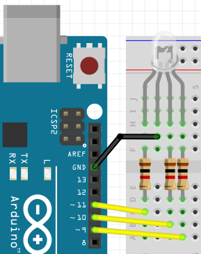
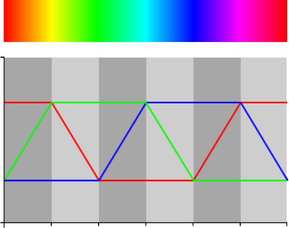

# Les 1c: Meer Kleur Fade Met For

Soms denk je 'Kan dit slimmer?'. Een for-loop is een manier om iets slimmer te doen!

## Aansluiten

Sluit onderstaand schema aan:



Let op:

 * De langste pin van een RGB LED moet naar GND
 * Elke andere pin van een RGB LED moet een weerstandje krijgen van 1000 Ohm (bruin-zwart-rood-goud)
 * De pinnen van de LED moeten naar een pin waar een golfje (`~`) voor staat, want alleen deze pinnen kunnen dimmen
 
## Code

In deze code staat een for loop:

```c++
int pin_rood = 9;

void setup()
{
  pinMode(pin_rood, OUTPUT);
}

void loop()
{
  for (int i=0; i<256; ++i)
  {
    analogWrite(pin_rood, i);
    delay(30);
  }
}
```

Zet deze code op je Arduino.

 * Wat doet de code?

In deze code zit een for-loop. 
Een for-loop heeft drie gedeelten, gescheiden door puntkomma's.

In het eerste gedeelte gebeurt de *initializatie*.
In het tweede gedeelte, staat de *test*.
In het derde gedeelte, staat de *post-conditie*.

Dat zijn moeilijke woorden. Hier gaan we zien wat er gebeurt:

 * Verander alleen het eerste gedeelte naar `int i = 127`. Wat zie je?
 * Verander alleen het tweede gedeelte naar `i<128`. Wat zie je?
 * Verander alleen de eerste twee gedeeltes naar `int i=127; i<128`. Wat zie je?
 * Verander alleen het derde gedeelte naar `i+=2`. Wat zie je?

Dus:

 * Wat doen de drie gedeeltes van een for-loop?

## Waarom for-loops?

Stel, je wilt bovenstaande code zonder for-loop doen,
dan ziet dat er zo uit:

```c++
analogWrite(9, 0); delay(30);
analogWrite(9, 1); delay(30);
analogWrite(9, 2); delay(30);
analogWrite(9, 3); delay(30);
analogWrite(9, 4); delay(30);
//...
analogWrite(9, 251); delay(30);
analogWrite(9, 252); delay(30);
analogWrite(9, 253); delay(30);
analogWrite(9, 254); delay(30);
analogWrite(9, 255); delay(30);
```

Dat is nogal veel code! En veel gekopieer!

For-loops helpen je om code met een patroon korter op te schrijven.

## Drie keer fade aan

We gaan nu de code uitbreiden met meer kleuren!

 * Laat eerst het rode LEDje aanfaden, dan het groene LEDje
 * Laat eerst het rode LEDje aanfaden, dan het groene LEDje, dan het blauwe LEDje

## Fade uit

Een Arduino kan prima rekenen:

```c++
int pin_rood = 9;

void setup()
{
  pinMode(pin_rood, OUTPUT);
}

void loop()
{
  for (int i=0; i<256; ++i)
  {
    analogWrite(pin_rood, 255 - i);
    delay(30);
  }
}
```

 * Wat doet deze code?
 * Laat nu het rode LEDje aan en uitgaan
 * Laat nu het rode LEDje, dan het groene, dan het blauwe aan en uitgaan

## Regenboog

Hier zie je hoe een regenboog werkt:

 

 * Laat de RGB LED een regenboog nadoen


