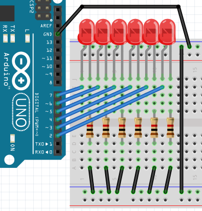

# For nog een keer


## For loop nog een keer

For loops zijn handig om code korter op te schrijven:

```
pinMode(2, OUTPUT);
pinMode(3, OUTPUT);
pinMode(4, OUTPUT);
pinMode(5, OUTPUT);
pinMode(6, OUTPUT);
pinMode(7, OUTPUT);
```

Hier staat een for-loop die hetzelfde doet:

```
for (int pin=2; pin<8; ++pin)
{
  pinMode(pin, OUTPUT);
}
```

## Bouwen

Bouw eerst dit stroomschema:



Nu kun je de opdrachten gaan doen!

## Nadenken

Denk na over de volgende stukje code

### Opdracht 1

Maak deze code korter met een for-loop:

```
digitalWrite(2, HIGH);
digitalWrite(3, HIGH);
digitalWrite(4, HIGH);
digitalWrite(5, HIGH);
digitalWrite(6, HIGH);
digitalWrite(7, HIGH);
```

### Opdracht 2

Maak deze code korter met een for-loop:

```
digitalWrite(2, LOW);
digitalWrite(3, LOW);
digitalWrite(4, LOW);
digitalWrite(5, LOW);
digitalWrite(6, LOW);
digitalWrite(7, LOW);
```

### Opdracht 3

Maak deze code korter met een for-loop:

```
digitalWrite(2, LOW);
delay(100);
digitalWrite(3, LOW);
delay(100);
digitalWrite(4, LOW);
delay(100);
digitalWrite(5, LOW);
delay(100);
digitalWrite(6, LOW);
delay(100);
digitalWrite(7, LOW);
delay(100);
```

### Opdracht 4

Maak deze code korter met een for-loop:

```
digitalWrite(7, LOW);
delay(100);
digitalWrite(6, LOW);
delay(100);
digitalWrite(5, LOW);
delay(100);
digitalWrite(4, LOW);
delay(100);
digitalWrite(3, LOW);
delay(100);
digitalWrite(2, LOW);
delay(100);
```

### Opdracht 5

Maak deze code korter met twee for-loops:

```
digitalWrite(2, HIGH);
delay(100);
digitalWrite(3, HIGH);
delay(100);
digitalWrite(4, HIGH);
delay(100);
digitalWrite(5, HIGH);
delay(100);
digitalWrite(6, HIGH);
delay(100);
digitalWrite(7, HIGH);
delay(100);
digitalWrite(7, LOW);
delay(100);
digitalWrite(6, LOW);
delay(100);
digitalWrite(5, LOW);
delay(100);
digitalWrite(4, LOW);
delay(100);
digitalWrite(3, LOW);
delay(100);
digitalWrite(2, LOW);
delay(100);
```

## Programmeren

Een leerling heeft deze code geschreven:

```
void setup()
{
  pinMode(2, OUTPUT);
  pinMode(3, OUTPUT);
  pinMode(4, OUTPUT);
  pinMode(5, OUTPUT);
  pinMode(6, OUTPUT);
  pinMode(7, OUTPUT);
}

void loop()
{
  digitalWrite(2, HIGH);
  delay(100);
  digitalWrite(3, HIGH);
  delay(100);
  digitalWrite(4, HIGH);
  delay(100);
  digitalWrite(5, HIGH);
  delay(100);
  digitalWrite(6, HIGH);
  delay(100);
  digitalWrite(7, HIGH);
  delay(100);
  digitalWrite(2, LOW);
  delay(100);
  digitalWrite(3, LOW);
  delay(100);
  digitalWrite(4, LOW);
  delay(100);
  digitalWrite(5, LOW);
  delay(100);
  digitalWrite(6, LOW);
  delay(100);
  digitalWrite(7, LOW);
  delay(100);
}
```

 * Kopieer deze code en kijk wat er gebeurt
 * Maak de code korter. Tip: gebruik drie for-loops

## Eindopdracht

Maak nu een op-en-neer-gaand patroon:

 * `*`
 * `**`
 * `***`
 * `****`
 * `*****`
 * `******`
 * `******`
 * `*****`
 * `****`
 * `***`
 * `**`
 * `*`
