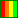

Inhoudsopgave
=============

(English: see below)

Beginners: begin bij LED.

Niveaus:
 * : makkelijkst
 * : normaal
 * : moeilijker
 * : moeilijkst

## 595 chip

 *  Digital -> Output -> Timer: 595 chip, 7-segment display, 2 drukknoppen

## 7-segment display

 *  Digital -> Output -> 7Segment_direct: aansluiten van een 7-segment display
 *  Digital -> Output -> Timer: 595 chip, 7-segment display, 2 drukknoppen

## Aanraakschakelaar

 *   Analog -> Input -> Touchswitch: twee transistoren met een aanraakschakelaar

## analogRead

 *   [analogRead en de spanningsdeler](Pdfs/ArduinoCourseAnalogRead.pdf)
 *   [Hoe lees ik input?](Pdfs/ArduinoCourseReadInput.pdf)

## Arduino

 *   [Wat is Arduino?](Pdfs/ArduinoCourseWhatIsArduino.pdf)

## Breadboard

 *   [Kortsluiting en breadboard](Pdfs/ArduinoCourseShortCircuit.pdf)

## C++

 *   [C++ basis: variabelen, conversie, if, for, testen](Pdfs/ArduinoCourseCpp01.pdf)
 *   Examples -> 0.5 Control -> IfStatementConditional
 *   Examples -> 0.5 Control -> switchCase
 *   Examples -> 0.5 Control -> switchCase2
 *   Examples -> 0.5 Control -> whileStatementConditional
 *  Examples -> 0.5 Control -> ForLoopIteration
 *  Examples -> 0.5 Control -> Arrays

## DC motor

Zie Gelijkspanningsmotor

## Drukknop

 *   [Hoe lees ik input?](Pdfs/ArduinoCourseReadInput.pdf)
 *   [Dag 2 oefeneningen](Pdfs/ArduinoCourseDay02_Exercises.pdf)

 *   Digital -> Input -> Button: een drukknop met een LEDje
 *   Digital -> Output -> Traffic light: twee verkeerslichten met een drukknop
 *  Digital -> Output -> Timer: 595 chip, 7-segment display, 2 drukknoppen

## Gelijkspanningsmotor

 *  [Hoe sluit ik een gelijkspanningsmotor aan?](Pdfs/ArduinoCourseConnectDcMotor.pdf)

## Kleurensensor

 *  [Project: Kleurensensor](Pdfs/ArduinoCourseProjectColorSensor.pdf)

## Kortsluiting

 *   [Kortsluiting en breadboard](Pdfs/ArduinoCourseShortCircuit.pdf)

## Krachtsensor

 *   Analog -> Input -> AnalogInputFSR: een krachtsensor en LEDje

## Kwikschakelaar

 *   Digital -> Input -> TiltSwitch: een kwikschakelaar

## LCD display

 *  [Hoe sluit ik een LCD scherm aan?](Pdfs/ArduinoCourseConnectLcd.pdf)
 *   Light -> LCD -> LiquidCrystalDisplay: LCD scherm met potmeter

## LED

 *   [Hoe sluit ik een LED aan?](Pdfs/ArduinoCourseConnectLed.pdf)
 *   [Oefening: hoe sluit ik een LED aan?](Pdfs/ArduinoCourseConnectLedExercise.pdf)

 *   [Hoe schakel ik een LED?](Pdfs/ArduinoCourseSwitchLed.pdf)
 *   [Oefening: hoe schakel ik een LED?](Pdfs/ArduinoCourseSwitchLedExercise.pdf)

 *   Digital -> Output -> Blink: een LEDje
 *   Digital -> Output -> Loop: zes LEDjes

## LED matrix, 5x8

 *  Digital -> Output -> LED-Matrix_simple: aansluiten van een 5x8 LED matrix

## Infrarood sensor

 *   Analog -> Input -> Parking-Assistant: twee IR sensors, 10 LEDjes 

## Lichtsensor

 *   [Hoe lees ik een sensor?](Pdfs/ArduinoCourseReadSensor.pdf)

 *   Analog -> Input -> Photocell: een lichtsensor die een LED laat reageren

## Piezo

 *   Analog -> Input -> Knock: een piezo die reageert op kloppen
 *   Analog -> Output -> Melody: een piezo die een muziekje gaat afspelen
 *   Analog -> Output -> Window_Alarm: raamalarm met een piezo en Reed contact

## Potmeter

 *   [Hoe sluit ik een potmeter aan?](Pdfs/ArduinoCourseConnectPotMeter.pdf)

 *   Analog -> Input -> AnalogInputPot: een potmeter en LEDje
 *   Analog -> Output -> AnalogInputPot: een potmeter en LEDje
 *   Light -> LCD -> LiquidCrystalDisplay: LCD scherm met potmeter

## Projecten

 *  [Project: Kleurensensor](Pdfs/ArduinoCourseProjectColorSensor.pdf)

## Pull-down weerstand

 *   [Hoe lees ik input?](Pdfs/ArduinoCourseReadInput.pdf)
 *   [Hoe lees ik een sensor?](Pdfs/ArduinoCourseReadSensor.pdf)

## Reedcontact

 *   Analog -> Output -> Window_Alarm: raamalarm met een piezo en Reedcontact

## RGB LED

 *   Analog -> Output -> RGB_LED: RGB LED
 *  Analog -> Output -> Mood-Light: super flux (?) RGB LED

## Servo

 *   Motion -> Motors -> Servo: een servo motor met een potmeter

## Shift register

 *  Digital -> Output -> Shift_Register: Met een shift register 8 LEDjes aansturen met 3 Arduino pinnen
 *  Digital -> Output -> Shift_Register_2x: Met twee shift registers 16 LEDjes aansturen met 3 Arduino pinnen

## Temperatuursensor

 *  Analog -> Input -> TemperatureSensorLM35: de LM35 temperatuursensor en meerdere LEDjes

## Thermistor

 *   Analog -> Input -> AnalogInputThermistor: een thermistor en LEDje

## Timer

 *  Digital -> Output -> Timer: 595 chip, 7-segment display, 2 drukknoppen

## Transistor

 *   Analog -> Input -> Touchswitch: twee transistoren met een aanraakschakelaar

## Werkwijze

 *   [Werkwijze](Pdfs/ArduinoCourseMindset.pdf)

## Zonnemotor

 *  [Zonnemotor](Pdfs/ArduinoCourseSolarMotor.pdf)

## Zwevende input

 *   [Hoe lees ik input?](Pdfs/ArduinoCourseReadInput.pdf)

Table Of Contents
=================

Too bad, this is in Dutch only, as the students are Dutch.